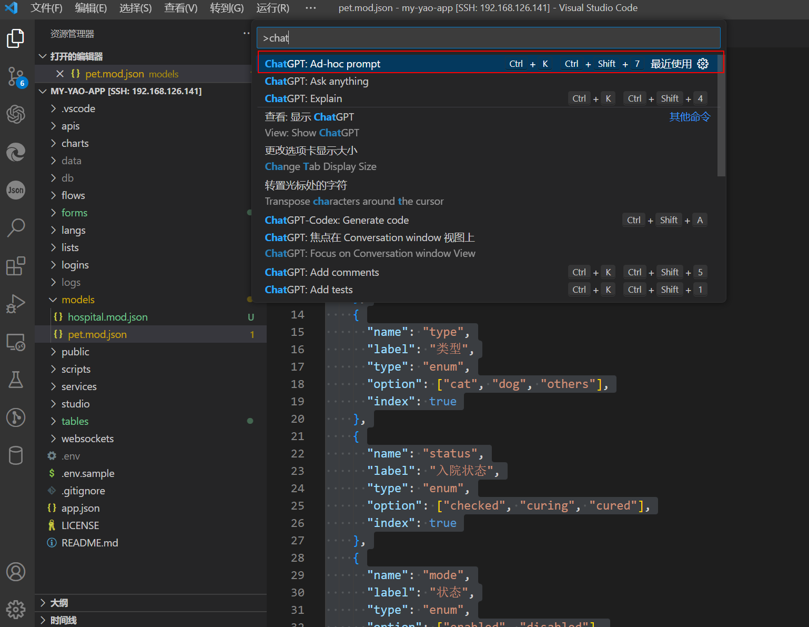
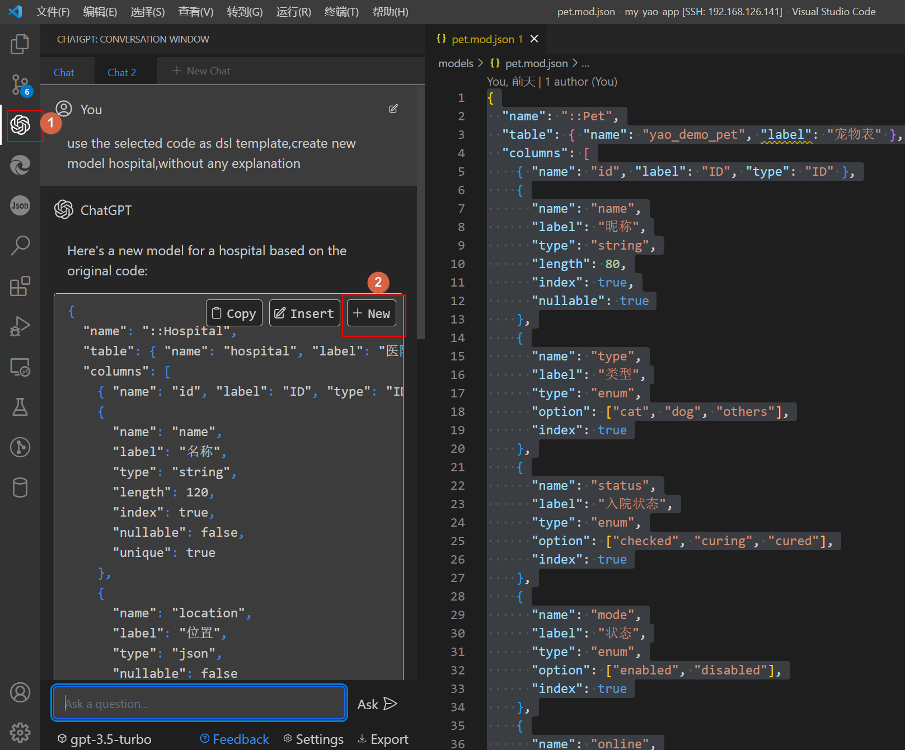

# 使用`VSCODE`编辑器的插件快速开发`Yao`模型


AI时代已经到来~,`yao`通过这种元数据配置编程理念恰好适合ChatGPT来搞。之前有写过另外一笔记[使用`ChatGPT`开发`Yao`应用](%E4%BD%BF%E7%94%A8ChatGPT%E5%BC%80%E5%8F%91YAO%E5%BA%94%E7%94%A8.md)。使用上还是不太方便，需要手动复制大段的文字到聊天框。处理后再还需要复制一次。借助`vscode`编辑器的`ChatGPT`插件，开发起来会更加方便。

在起飞之前首先需要作些准备工作：

- 准备好你的网络，需要能访问`OPENAI`网站的接口，这个是首要条件。
- `0.10.3`版本的`Yao`应用程序。
- 宇宙最强的的编辑器`Vscode`。


## Yao开发环境准备

### 安装`0.10.3`开发版本的`Yao`

在以下地址下载开发版本 0.10.3 开发版本，根据自己的电脑 OS，打开对应的 URL，找到一个最新的 release

Linux:

https://github.com/YaoApp/yao/actions/workflows/release-linux.yml

示例:

https://github.com/YaoApp/yao/actions/runs/4321507316

MacOS:

https://github.com/YaoApp/yao/actions/workflows/release-macos.yml

示例：

https://github.com/YaoApp/yao/actions/runs/4321507798


程序的安装比较简单，把`Yao`执行程序解压后放到任何可以执行的目录即可，比如`Linux`操作系统中的`/usr/bin/`目录。

### 使用`YAO-init-0.10.3`项目模板

这里提供了一个`YAO`应用程序模板。这个模板特别针对`0.10.3`进行了优化。自带了`vscode`智能提示与`studio`初始化脚本。

```sh
git clone --depth 1 https://github.com/wwsheng009/yao-init-0.10.3.git my-yao-app

cd my-yao-app

yao start
```

在浏览器上打开网址`http://127.0.0.1:5099`进行数据库连接配置。

### `vscode`插件配置

`vscode`市场中与ChatGPT有关的插件有很多，选一款支持能支持自动导入选中代码的插件。这样就不需要复制代码了。

- `vscode`市场里找一个支持`ChatGPT`的插件。这里是我使用的一款[ChatGPT - Genie AI](https://marketplace.visualstudio.com/items?itemName=genieai.chatgpt-vscode)

- 插件一般都需要配置`openai key`,根据提示在设置里设置`key`

- `vscode`打开项目`my-yao-app`，并打开项目自带的示例模型文件`/my-yao-app/models/pet.mod.json`

- 选中模型文件中的所有内容，并按快捷键`F1`打开`vscode`的命令提示框。输入提示词`use the selected code as dsl template,create new model hospital,without any explanation`.AI会使用你选中的代码作为模型，生成新的模型。当然你可以根据你的需求调整提示词。



- 生成的代码会在编辑器的右边，复制生成的内容创建新的模型定义文件。需要把文件保存到目录`models`中，并且后缀名需要是`mod.json`。比如这里保存文件为：`/my-yao-app/models/hospital.mod.json`.




- 生成的文件基本上是可以满足要求的，有些字段显示黄色，说明这个字段不符合`Yao`的`DSL`语法。删除或是忽略即可。`yao-init`项目已经配置好了[编辑器`vscode`智能提示](../%E7%BC%96%E8%BE%91%E5%99%A8vscode%E6%99%BA%E8%83%BD%E6%8F%90%E7%A4%BA.md)

- 除了生成一个完整的模型，你还可以让`ChatGPT`参考现有的字段定义生成新的字段，这需要发挥你的聪明才智了。

## Yao应用执行。 

最后执行以下命令更新数据数据库

```sh
yao migrate
```

使用`Studio`脚本生成`table/form`定义文件。Studio脚本的更多使用方法参考：[自动生成table_form定义文件](../Studio/%E8%87%AA%E5%8A%A8%E7%94%9F%E6%88%90table_form%E5%AE%9A%E4%B9%89%E6%96%87%E4%BB%B6.md)
```sh
yao studio run init.CreateTableAndForm hospital

```

成功后的提示
```sh
Studio Run: init.CreateTableAndForm
args[0]: hospital
"已生成最小化配置Table:"
"tables/hospital.tab.json"
"需要生成全配置Table,请再执行一次命令"
"已生成最小化配置Form:"
"forms/hospital.form.json"
"需要生成全配置Form,请再执行一次"
--------------------------------------
init.CreateTableAndForm Response
--------------------------------------
null
--------------------------------------
✨DONE✨
```

如果没有启动yao，现在执行命令
```sh
yao start
```

浏览器访问：`http://127.0.0.1:5099/admin/login/admin`

用户名: xiang@iqka.com
密码: A123456p+

登录后你就能访问以下地址：

`http://http://127.0.0.1:5099/admin/x/Table/hospital`


## 恭喜你成功创建了一个新的`CURD`程序