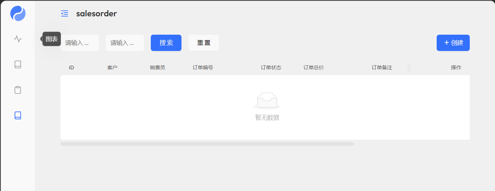
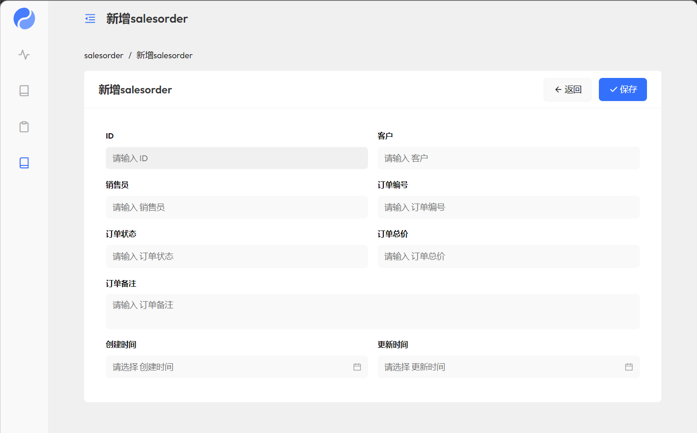

# 使用`ChatGPT`开发`Yao`应用

`Yao`是一个不错的低代码开发平台。使用`YAO`能快速的开发出一套`CURD`的管理平台。结合最近大火的`ChatGPT`,更是事半功倍。

以下是一个使用`ChatGPT`来生成模型，`Yao Studio`脚本生成管理界面的大概流程。你所需要作的就是敲些命令，复制粘贴代码，就能弄一个管理后台。

## Step1 下载 YAO-init 项目模板并成功执行

本项目提供了一个`YAO`应用程序模板。这个模板特别针对`0.10.3`进行了优化。请根据模板目录中的说明文档配置好开发环境。操作说明：[YAO 初始化程序模板](https://github.com/wwsheng009/yao-init)。如果你能成功的运行此项目，可以进行下一步。如果失败，说明你的电脑环境未准备好，请排查问题原因。

```sh
git clone https://github.com/wwsheng009/yao-init.git

cd yao-init

yao start
```

**注**：如果你登录出现空白页或是其它异常，请检查是否使用了`Yao`自带的初始化模板。

## Step2 使用 ChatGPT 生成模型定义

这里提供了一个[ChatGPT 的提示词模板](./Prompts/model_with_relations.md)，复制提示词模板中的所有内容到`ChatGPT`，让`ChatGPT`生成模型定义。

大家可以根据需要训练出更好的`ChatGPT`模板。

把生成的模型定义复制到`/yao-init/models`目录，比如[`/yao-init/models/salesorder.mod.json`](./examples/salesorder/salesorder.mod.json)

执行命令`yao migrate`更新数据库表结构，请确保提示`更新表结构成功`。

```sh
更新表结构 model: salesorder (sales_orders)     SUCCESS
更新表结构 model: xiang.user (xiang_user)       SUCCESS
更新表结构 model: xiang.menu (xiang_menu)       SUCCESS
更新表结构 model: pet (yao_demo_pet)    SUCCESS

```

请确保有以下的输出，如果没有，请检查模型定义是否正确，可以根据日志文件找到失败原因。

```sh
更新表结构 model: salesorder (sales_orders)     SUCCESS
```

## Step3 生成模型对应的`Table/Form`定义文件

`yao-init`项目模板中已经提供了`Studio`初始化脚本。使用以下的命令可以使用最小化配置与全部默认配置。

最小化配置的意思是生成的配置文件中只包含最基本的配置信息，详细信息会由`Yao`框架自动的在运行时自动生成。

- 优点是当你在开发阶段，对模型的修改能实时在管理界面上预览。
- 缺点是最小化配置的`Form`没有保存按钮，所以建议新手最好执行两步，生成全部配置文件。

全部默认配置是指当前模型的所有的配置会固化在配置文件里。

- 优点是能对`Table/Form`进行精细化调整。
- 缺点是如果模型调整后需要手工调整配置文件。

### Step3.1 生成最小化配置

```sh
yao studio run init.CreateTable salesorder
```

成功后会生成以下文件`tables/salesorder.tab.json`。

**注意**，如果运行命令之前已经存在同名的文件，不会覆盖，只会生成全量配置文件。

```sh
yao studio run init.CreateForm salesorder
```

成功后会生成以下文件`forms/salesorder.form.json`。

**注意**，如果运行命令之前已经存在同名的文件，不会覆盖，只会生成全量配置文件。

### Step3.2 生成全部配置文件

如果需要生成全部配置的默认配置，请再执行以下两个命令，会生成额外的两个文件

```sh
yao studio run init.CreateTable salesorder
yao studio run init.CreateForm salesorder
```

成功后会生成以下文件,再根据自己的需求进行额外的界面调整。

- `forms/salesorder.form.default.json`
- `tables/salesorder.tab.default.json`

确认没有问题后，需要手动复制内容到以下文件，或是直接重命文件名，这里脚本没有自动覆盖原文件。

- `forms/salesorder.form.default.json` => `forms/salesorder.form.json`
- `tables/salesorder.tab.default.json` => `tables/salesorder.tab.json`

新的 `Table` 访问地址: http://127.0.0.1:5099/admin/x/Table/salesorder

新的 `Form` 访问地址: http://127.0.0.1:5099/admin/x/Form/salesorder/0/edit

效果：

Table:

Form:


### Step4 修改菜单配置文件

如果需要加入菜单，需要如下的操作。

修改菜单配置文件:`/yao-init/flows/app/menu.flow.json`,增加以下配置

```json
{
  "output": {
    "items": [
      {
        "icon": "icon-book",
        "name": "表单",
        "path": "/x/Table/salesorder"
      }
    ]
  }
}
```

重新登录 YAO 管理端,菜单才会生效。

http://127.0.0.1:5099/admin/login/admin

### Step5 学习如何使用处理器与组件

以上生成的代码已经有了最基础的 CURD 功能。如果还需要进一步学习，请访问`YAO`官方网站。

https://yaoapps.com/doc

https://yaoapps.com/components
