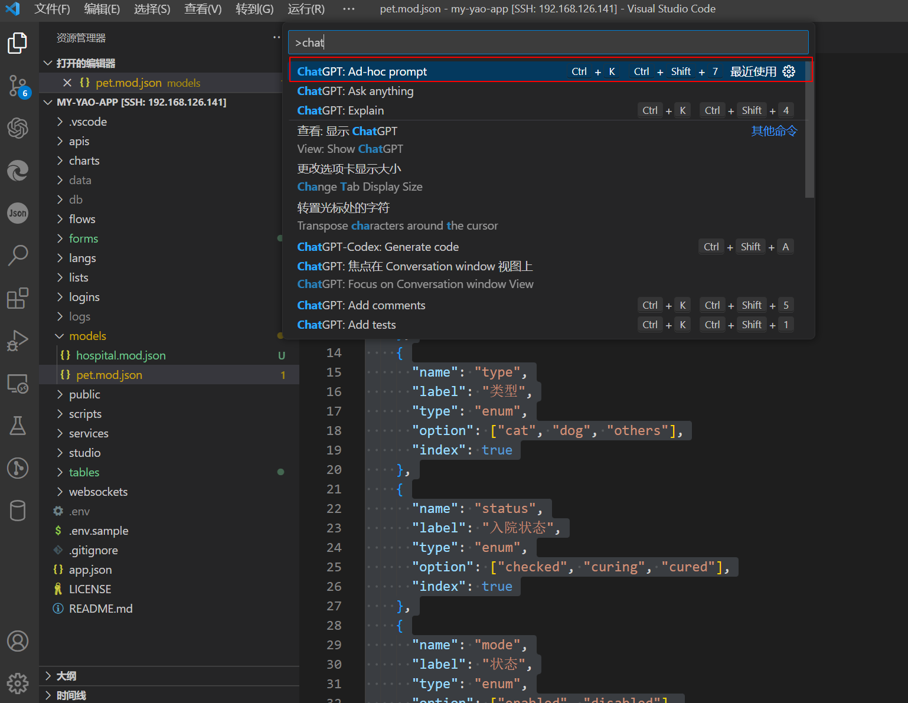
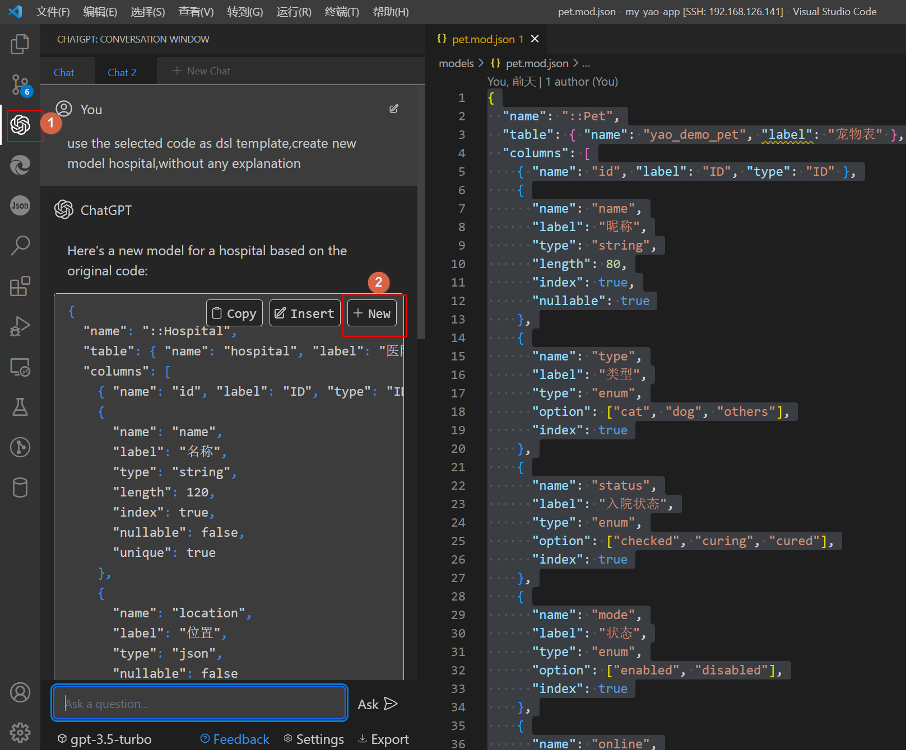

# 使用`VSCODE`编辑器的插件快速开发`Yao`模型

AI 时代已经到来~,`yao`通过这种元数据配置编程理念恰好适合 AI 来搞。之前有写过另外一笔记[使用`AI`开发`Yao`应用](./使用AI开发YAO应用.md)。使用上还是不太方便，需要手动复制大段的文字到聊天框。处理后再还需要复制一次。借助`vscode`编辑器的`AI`插件，开发起来会更加方便。

在起飞之前首先需要作些准备工作：

- 准备好你的网络，需要能访问`AI`网站的接口，这个是首要条件。
- 开发版本的`Yao`应用程序。
- 宇宙最强的的编辑器`Vscode`。

## Yao 开发环境准备

### 安装开发版本的`Yao`

根据你的操作系统，从以下地址下载最新的开发版本：

- **Linux 用户**：

  - 下载地址：[Linux Release](https://github.com/YaoApp/yao/actions/workflows/release-linux.yml)
  - 在 Actions 页面找到最新的成功构建

- **MacOS 用户**：

  - 下载地址：[MacOS Release](https://github.com/YaoApp/yao/actions/workflows/release-macos.yml)
  - 在 Actions 页面找到最新的成功构建

- **Windows 用户**：
  - 可以使用 WSL2 安装 Linux 版本

安装步骤：

1. 下载并解压 Yao 执行程序
2. 将程序放置在系统 PATH 环境变量包含的目录中（如 Linux 的`/usr/bin/`）
3. 确保文件具有可执行权限

### 使用`YAO-init`项目模板

这里提供了一个`YAO`应用程序模板。自带了`vscode`智能提示与`studio`初始化脚本。

```sh
git clone --depth 1 https://github.com/wwsheng009/yao-init.git my-yao-app

cd my-yao-app

yao start
```

在浏览器上打开网址`http://127.0.0.1:5099`进行数据库连接配置。

### `vscode`插件配置

在使用`AI`插件之前，需要先配置好编辑器的智能提示功能，请参考[编辑器vscode智能提示](../Studio/编辑器vscode智能提示.md)

`vscode`市场中与 AI 有关的插件有很多，选一款支持能支持自动导入选中代码的插件。这样就不需要复制代码了。

- 插件一般都需要配置`openai key`,根据提示在设置里设置`key`

- `vscode`打开项目`my-yao-app`，并打开项目自带的示例模型文件`/my-yao-app/models/pet.mod.json`

- 选中模型文件中的所有内容，并按快捷键`F1`打开`vscode`的命令提示框。输入提示词`use the selected code as dsl template,create new model hospital,without any explanation`.AI 会使用你选中的代码作为模型，生成新的模型。当然你可以根据你的需求调整提示词。



- 生成的代码会在编辑器的右边，复制生成的内容创建新的模型定义文件。需要把文件保存到目录`models`中，并且后缀名需要是`mod.json`。比如这里保存文件为：`/my-yao-app/models/hospital.mod.json`.



- 生成的文件基本上是可以满足要求的，有些字段显示黄色，说明这个字段不符合`Yao`的`DSL`语法。删除或是忽略即可。

- 除了生成一个完整的模型，你还可以让`AI`参考现有的字段定义生成新的字段，这需要发挥你的聪明才智了。

## Yao 应用执行。

最后执行以下命令更新数据数据库

```sh
yao migrate
```

### 启动并访问应用

1. 如果没有启动 yao，执行以下命令：

```sh
yao start
```

2. 使用浏览器访问管理界面：

   - 访问地址：`http://127.0.0.1:5099/admin/login/admin`
   - 默认用户名：`xiang@iqka.com`
   - 默认密码：`A123456p+`

## 进阶使用技巧

### 优化界面配置

你可以使用以下提示词让 AI 帮助优化界面：

```sh
# 优化表格显示
optimize the table configuration with:
- Add search fields
- Add filters
- Customize column display

# 优化表单布局
optimize the form configuration with:
- Organize fields into groups
- Add validations
- Improve layout
```

### 添加自定义功能

可以让 AI 帮助添加更多功能：

```sh
# 添加自定义按钮
add a custom action button that:
[描述按钮功能]

# 添加数据处理脚本
create a process script that:
[描述处理逻辑]
```

## 恭喜你成功创建了一个新的`CRUD`程序！
