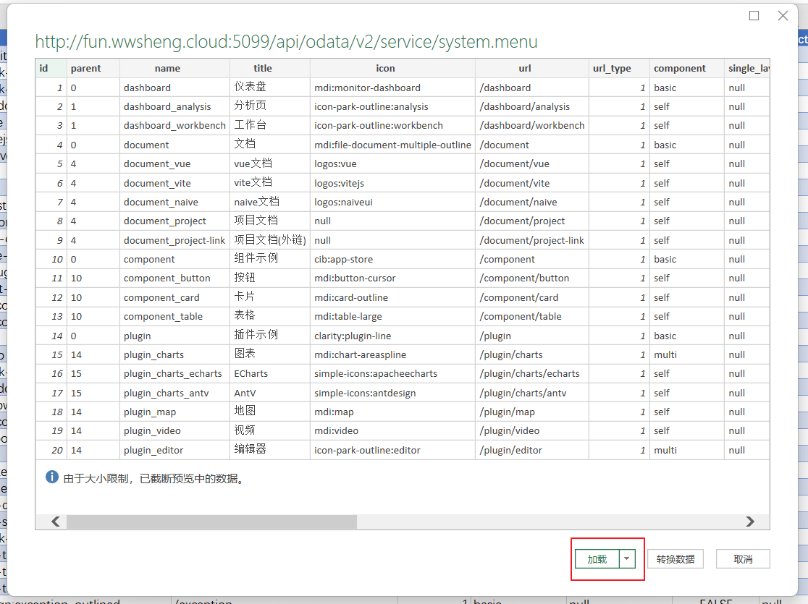

# Yao Odata Excel 同步接口

相比于其它的从数据库导出数据方法相比，使用 odata 接口有很多好处：不需要重新导出数据，只需要刷新即可。

可以直接在 excel 中进行图表设计，数据源可以实时刷新。

odata-api 接口作为 Amis-yao-admin 项目的一部分，安装好项目后，就直接可以使用了。
以下是在 EXCEL 中的操作步骤。

在 Excel 中的数据页签找到新建查询菜单，找到从其它源->从 OData 源。

在弹出对话框中输入网址，网址由两部分组成：

`http://<host>:<port>/api/odata/v2/service/<model_id>`

第一部分：API 地址，`http://localhost:5099/api/odata/v2/service/`

第二部分：模型标识，比如 system.menu
`http://localhost:5099/api/odata/v2/service/system.menu`

比如这个站点的测试地址是：http://fun.wwsheng.cloud:5099/api/odata/v2/service/system.menu

由于 API 接口作了身份检查，所以第一次连接会失败，这时需要点击取消

回到数据菜单，找到数据源设置

选择刚才连接的地址，选中，并点击下面的编辑权限设置。

点击基本菜单。输入用户名密码，比如这里输入 yao 的默认用户名密码，再保存。
用户名：
xiang@iqka.com
密码：
A123456p+

再重新设置一次数据源

输入数据源，点击确定，这次不会再有提示。

成功看到系统的预览数据，点击加载后会直接加载到 excel sheet 中。

数据的刷新，重加载，只要在 excel sheet 上右键菜单上点击刷新即可拉取最新的数据。

针对一个接口，用户登录验证只需要操作一次即可。

## odata 查询语法

参数`$metadata`，读取模型元数据信息

`http://localhost:5099/api/odata/v2/service/admin.user?$metadata`

参数`$count`统计模型的数据的数量

`http://localhost:5099/api/odata/v2/service/admin.user?$count`

参数`$top`,限制数量，默认是 100。

`http://localhost:5099/api/odata/v2/service/admin.user?$top=100000`

参数`$skip`,跳过数量，与`$top`配合进行分页数据读取。

`http://localhost:5099/api/odata/v2/service/admin.user?$top=100&$skip=10`

参数`$select`限制需要读取的字段，如果有多个字段，使用逗号隔开。

`http://localhost:5099/api/odata/v2/service/admin.user?$select=email,name`

参数`$orderby`控制字段排序
`http://localhost:5099/api/odata/v2/service/admin.user?$orderby=email,name`

参数`$filter`控制数据筛选条件
`http://localhost:5099/api/odata/v2/service/admin.user?$filter=grade lt 10.00`

操作符可选：`["eq", "ne", "gt", "ge", "lt", "le", "has"]`

同时可以有多个条件,使用`and/or`进行分隔，and 是同时满足两个条件，or 是满足一个条件即可。

`http://localhost:5099/api/odata/v2/service/admin.user?$filter=grade lt 10.00 or email eq ets@qq.com`

`http://localhost:5099/api/odata/v2/service/admin.user?$filter=name eq 'admin' and email eq 'ets@qq.com'`
