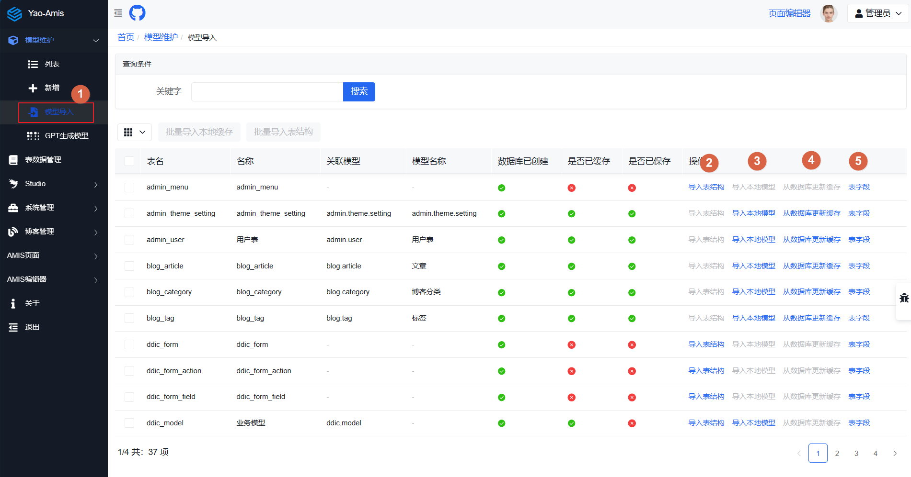

# 模型管理

这个项目的核心就是模型管理，也是元数据管理。

由模型配置驱动数据库，生成接口，还有界面配置。

在这个项目中，单独使用两个表来保存模型的元数据，ddic_model 与 ddic_model_column。

## 模型创建

模型创建有多种方式：

- 手动创建
- 导入模型

### 手动创建

使用管理员账号登录系统后，在管理端的右边找到模型维护下面的创建入口。

- 在模型标识中输入模型名称
- 在字段列表中创建模型的字段定义
- 最后保存模型

在创建列的过程中除了手动一个个的创建外，还可以根据 json 数据导入列定义。

在弹出的对话框中，输入 json 数据，选择 json 类型，点击检查。在后端会解析 json 数据格式，并生成模型字段定义。当然这个会有一定的误差，可以根据实际情况再进行调整。

点击确认后会把字段列表插入模型中。

### 自动创建

除了手动创建后，还可以把数据库中的表结构导入到系统或是，导入 yao 的 json 模型定义。

在导航栏中找到模型导入口，点击进去可以看到数据库中的表列表与模型列表。

可以有以下的操作：

- 导入表结构，这里的表结构是指数据库表的结构，如果已经存在很表的结构，可以使用这个选项。这里导入会覆盖现在有的模型定义，表的定义信息一般会少于模型定义的信息，只建议在系统初始化时使用。

- 导入本地模型，模型是指在 yao 应用目录 models 目录下创建的模型定义文件。

另外在模型列表中，也可以直接导入 yao 模型源代码，或是一键导入本地模型。"导入系统模型"也是建议有系统初始化时使用。

## 模型更新

在模型更新界面，可以调整与模型相关的所有信息：

- 模型关联表
- 模型字段定义
- 模型关联关系

在更多按钮中可以配置更详细的内容。

**注意**：

- 在保存模型时，可以选择强制更新，这个选项会删除库表，重新创建表，会丢失数据。

- 模型更新不会直接更新本地模型定义文件，只会更新数据库表的定义与内存的定义。如果需要更新本地文件，最好是通过"查看代码"，把模型定义复制到本地文件。因为如果直接更新本地文件可能会破坏系统文件。
