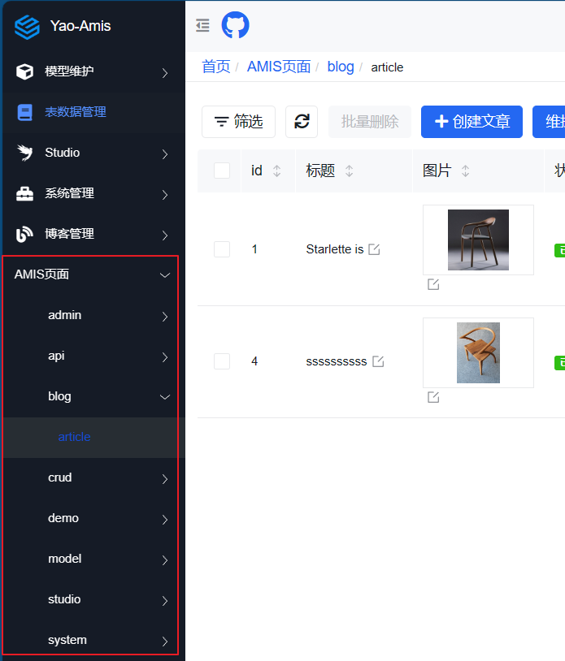

# 代码生成

在上一步中的数据维护是一个统一的入口，相当于直接维护数据表。事实上的情况会比这个复杂，而且自动生成的界面也不能涵盖所有的控件。

另外一个处理方法是，根据模型生成的这些界面代码进一步的加工。

操作步骤：

- 在 Studio 菜单中找到代码生成入口

- 选择模型
- 选择模板，这里的模板可以定制更多
- 配置字段，可以进一步的配置字段，也可以过滤不需要的字段
- 提交，生成代码

比如这里的模板 "增删除改查-所有" 就是上一步数据维护中的页面配置源代码。

可以根据实际的需要进一步的调整页面配置。

把源代码复制出来，保存成一个 amis 的配置文件,比如是"demo.json"，放在`/data/pages`目录后，再刷新页面就可以直接使用了。

右边的"AMIS 页面"菜单就是映射到应用目录下的`/data/pages`目录。

