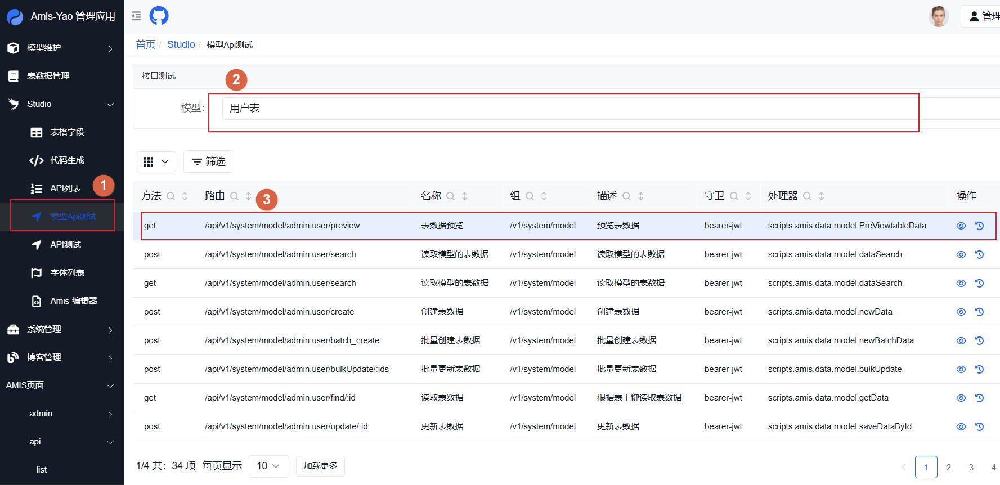
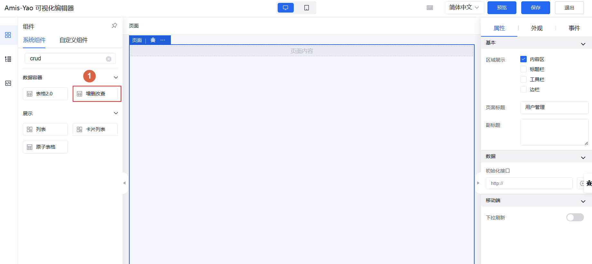
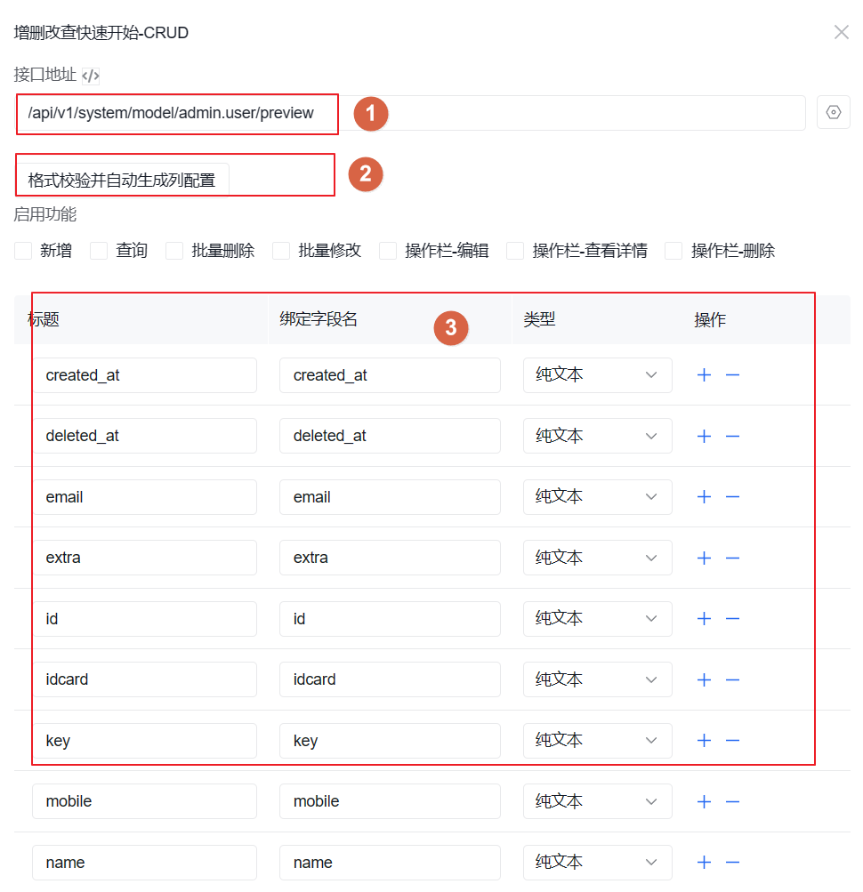
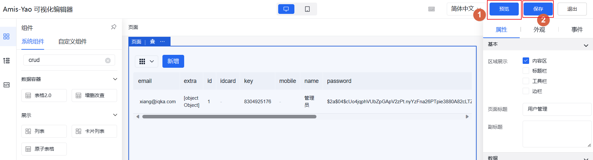
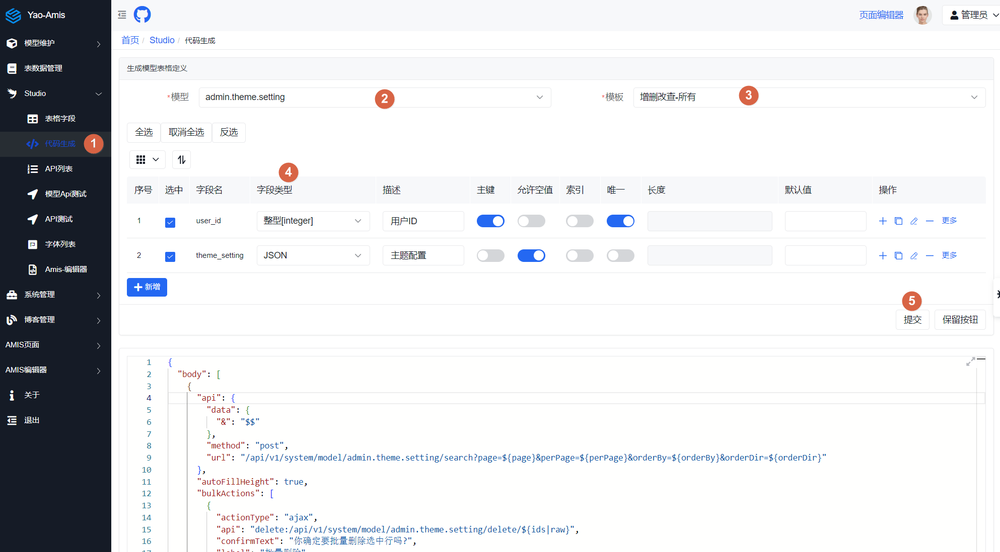

# 页面编辑器

Amis 项目已经提供了一个 demo 的编辑器应用，用户可以使用编辑器进行图形化的页面设计。

本项目在 amis 编辑器的项目的基础上作了一些增强。

- 把编辑器接口调用集成到 yao-admin 中，用户可以在编辑器调用所有的 yao 后端接口。

- 在编辑器上创建的页面保存到 yao-admin 后端。即创建好页面后可以直接在 yao-admin 中使用。

## 安装

页面编辑器的项目作为 yao-admin 项目的可选项，需要额外的安装。

项目地址：[amis-editor-yao](https://github.com/wwsheng009/amis-editor-yao)

**注意，不要使用 yarn 或是 pnpm**

```sh
npm i

# 开发
npm run dev

# 发布
npm run build
```

项目支持开发时或是发布后使用，项目编译好后把`amis-editor`目录放在 yao-admin 的 public 目录下即可。

## 登录

通过网站`http://localhost:5099/amis-editor/#/`访问页面编辑器。

如果不是通过 yao-admin 调用访问需要登录认证。

## 使用

### 使用场景一

生成模型的 crud 页面。

先在 yao-admin 中创建模型。模型创建后就可以看到模型相关的 api 列表。

在 api 列表中，有一个特别的接口。`/api/v1/system/model/<model_id>/preview`,比如`/api/v1/system/model/admin.user/preview`

这个接口专门用于在 amis 设计器里生成 crud 页面，如果表里没有数据，会生成一条模拟数据。在这里复制 api 接口地址。



创建一个空白的页面，拖入增删改查组件



在弹出的页面上输入刚才的接口地址

点击"格式校验并自动生成列配置"，会自动生成 crud 字段配置。再根据实际情况调整各个字段配置。



最后进行预览，保存页面。



保存的页面会保存在 amis-yao 应用的后端`/data/amis_editor`目录下。

如果 yao-admin 使用的超级管理员登录。可以右边的菜单上"AMIS 编辑器"下面看到创建的页面。

最后调整 crud 组件的 url 接口配置，替换成实际的接口。

### 使用场景二

基于 yao-admin 管理端生成的页面，再进一步的作调整。

使用代码生成功能，生成 amis 页面源代码。复制到页面编辑器的源代码区域。再根据实际需求进行修正，调整。



## 建议

在不熟悉 amis 的组件或是 api 的情况下，可以使用页面编辑器进行页面创建。熟悉后，直接编辑页面文件反而会更快。
