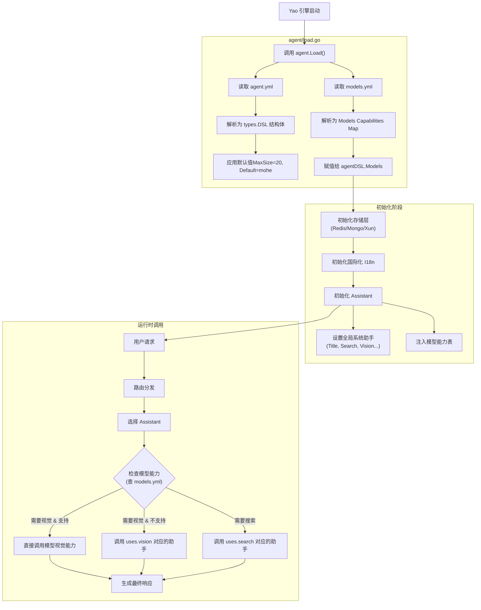
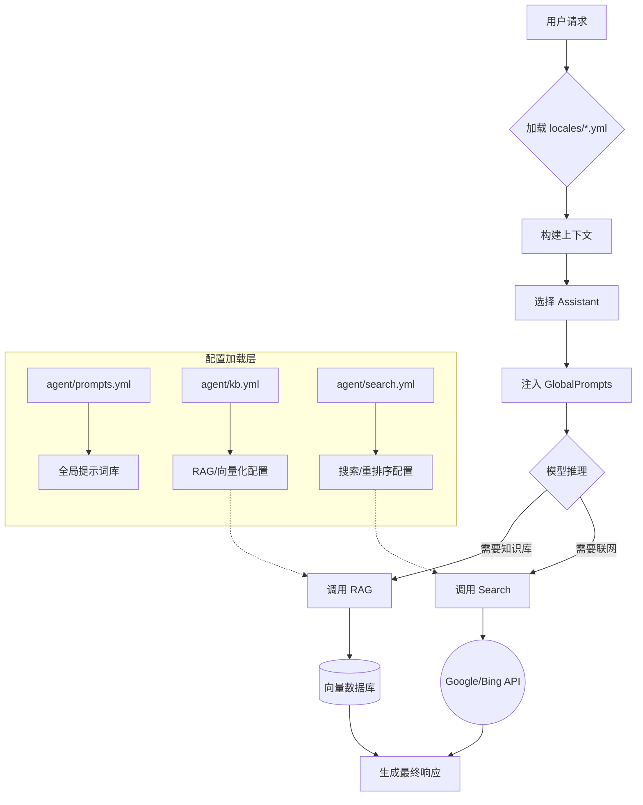

# Agent配置文件的深度技术分析、代码映射及加载流程图解。

---

### 1. `agent.yml`: AI 代理系统的全局编排

此文件定义了 Yao 引擎中 AI 助手的**默认行为**、**系统级职能分配**以及**会话存储策略**。在 Go 代码中，它直接映射到 `agent/types/types.go` 中的 `DSL` 结构体。

#### 配置详解与源码映射

```yaml
# agent/agent.yml

# 1. 默认与系统助手配置 (对应 Go 结构体: agent.types.Uses)
uses:
  # 默认使用的 Assistant ID。当 API 调用未指定助手时，使用此值。
  # 源码逻辑: agent/load.go -> defaultAssistant()
  default: 'yaobots'

  # 系统级职能分配：Yao 引擎内部有一套自动化流程（如生成会话标题、优化提示词），
  # 这里指定了具体由哪个 Assistant 来承担这些工作。
  title: 'workers.system.title' # 用于生成会话标题
  prompt: 'workers.system.prompt' # 用于优化用户 Prompt
  vision: 'workers.system.vision' # 用于处理视觉任务（如图片描述）
  search: 'workers.system.search' # 用于执行联网搜索任务
  fetch: 'workers.system.fetch' # 用于抓取网页内容

# 2. 会话存储配置 (对应 Go 结构体: agent.store.types.Setting)
store:
  max_size: 20 # 上下文窗口限制。仅保留最近 20 条对话记录传给 LLM。
  expiration: '90d' # 会话过期时间。

# 3. 缓存配置
cache: '__yao.agent.cache' # 指定使用的 Cache 实例名称。
```

**技术解读：**

- **`uses` 机制**：这是 Yao 引擎实现 AI 流程自动化的关键。例如，当用户上传一张图片时，引擎会查找 `uses.vision` 指定的 Assistant，利用它来生成图片描述，从而让不支持视觉的原生模型也能“看懂”图片。
- **`store` 机制**：在 `agent/assistant/history.go` 中，引擎会根据 `max_size` 对聊天记录进行滑动窗口截断，确保 Token 开销可控。

---

### 2. `models.yml`: 模型能力注册表

此文件充当**能力描述符（Capabilities Descriptor）**。它不定义模型的 API Key（那是 Connector 的工作），而是告诉 Yao 引擎每个特定模型（Model ID）支持哪些特性。

在 Go 代码中，这被解析为 `map[string]openai.Capabilities`。

#### 配置详解与源码映射

```yaml
# agent/models.yml

# 模型 ID (必须与 Connector 或 API 调用中使用的模型名称一致)
claude.sonnet-4_0:
  # 视觉能力配置
  # "claude": 启用针对 Claude 格式的图片编码（base64）。
  # true: 启用通用视觉支持。
  # false: 不支持视觉。
  vision: 'claude'

  # 工具调用能力 (Function Calling)
  tool_calls: true

  # 音频处理能力
  audio: false

  # 推理能力 (Chain of Thought / Reasoning)
  # true: 引擎会尝试解析模型的思考过程。
  reasoning: false

  # 是否支持流式输出
  streaming: true

  # 是否支持 JSON Mode 输出约束
  json: true

  # 是否多模态 (同时支持文本、图片等)
  multimodal: true

openai.gpt-5:
  vision: true
  tool_calls: true
  reasoning: true # 标记支持推理，引擎在处理响应时会寻找 reasoning_content
```

**技术解读：**

- **适配器模式**：Yao 引擎内部使用了适配器模式（见 `agent/llm/adapters/` 目录）。`models.yml` 中的配置决定了引擎加载哪个适配器。例如，如果 `vision` 为 `true`，引擎会在构建请求时包含图像数据；如果 `tool_calls` 为 `true`，引擎会将定义的 MCP 工具转换为 OpenAI 兼容的工具格式发送给模型。
- **推理支持**：`reasoning: true` 尤为重要（如 DeepSeek R1 或 GPT-o1），它告诉引擎需要处理并可能分离显示模型的思维链（Chain of Thought）数据。

---

### 3. 加载与运行流程图

为了更清晰地展示这些配置是如何被加载和使用的，我为你绘制了以下的架构流程图：



### 4. 总结与建议

1. **配置优先级**：`agent.yml` 是全局配置。具体的 Assistant（在 `assistants/` 目录下定义的 `.yao` 文件）可以覆盖部分设置，但在系统级任务（如自动起名）上，引擎会依赖 `agent.yml` 中 `uses` 的定义。
2. **模型扩展**：如果你接入了一个新的模型（例如本地部署的 Ollama 模型），你**必须**在 `models.yml` 中添加对应的条目，并准确描述其能力（是否支持 vision, tools 等）。否则，Yao 引擎可能无法正确构造请求体，或者无法正确解析工具调用的响应。
3. **调试**：如果发现模型无法调用工具或无法识别图片，首先检查 `models.yml` 中该模型的 `tool_calls` 和 `vision` 字段是否已设置为 `true`。

### 1. `locales/` 目录: 全局提示词国际化

**文件:** `locales/en-us.yml`, `locales/zh-cn.yml` (已上传)

这些文件是 Yao Agent 系统的**全局语言包**。它们不仅用于界面翻译，更关键的是用于**Prompt（提示词）的动态替换**。

#### 核心机制

Yao 引擎在初始化时（`agent/load.go` -> `initGlobalI18n`），会将这些文件加载到内存中的 `__global__` 命名空间。

- **配置示例 (推断)**:

```yaml
# locales/zh-cn.yml
Role: '你是一个专业的AI助手'
Format: '请以JSON格式输出'
```

- **使用方法**:
  在任何 Assistant 的 `prompts` 中，你可以使用 `$I18N.Key` 语法。

```yaml
# assistants/demo.yml
prompts:
  - role: system
    content: '{{$I18N.Role}}, {{$I18N.Format}}'
```

- **引擎处理**: 运行时，引擎会根据当前请求的语言环境（`Accept-Language` 或显式指定），自动将 `{{$I18N.Role}}` 替换为对应的中文或英文文本。

---

### 2. `prompts.yml`: 全局提示词库 (Global Prompts Registry)

**对应源码:** `agent/types/types.go` -> `DSL.GlobalPrompts`

此文件用于定义**可复用**的系统级 Prompt 片段。这符合 "Don't Repeat Yourself" (DRY) 原则，避免在每个 Assistant 中重复编写相同的指令（如安全规范、输出格式）。

#### 配置结构与含义

```yaml
# agent/prompts.yml (标准结构)
- role: system
  content: '你是一个代码专家，请只输出代码，不要解释。'
  name: 'code_expert' # 引用标识符

- role: user
  content: '请分析这段代码：{{input}}'
  name: 'analyze_req'
```

#### 使用场景

- **公共约束**: 定义所有 AI 助手必须遵守的道德规范或品牌语气。
- **动态注入**: 可以在特定的 Assistant 配置中通过引用这些 Prompt 的 `name` 或 ID 来继承这些设置，或者引擎可能会自动将特定角色的 Prompt 注入到上下文中。

---

### 3. `kb.yml`: 知识库全局设置 (RAG Configuration)

**对应源码:** `agent/types/types.go` -> `DSL.KB` (`store.KBSetting`)

此文件是检索增强生成（RAG）的核心配置文件，它定义了系统如何处理文档的**嵌入（Embedding）和切片（Chunking）**。

#### 关键配置字段解析

```yaml
# agent/kb.yml (标准配置示例)
embedding: 'openai' # 默认使用的 Embedding 模型连接器 ID
dimensions: 1536 # 向量维度 (例如 text-embedding-3-small 为 1536)
chunk_size: 1000 # 文档切片大小 (Token 数)
overlap: 100 # 切片重叠大小，保持上下文连续性
top_k: 5 # 默认检索召回的片段数量
score: 0.7 # 相似度阈值，低于此分数的片段会被过滤
```

#### 技术原理

当你在 Yao 应用中上传文件到知识库时，引擎会读取此配置：

1. **Chunking**: 根据 `chunk_size` 将大文本切分。
2. **Embedding**: 调用 `embedding` 指定的模型将文本转换为向量。
3. **Storage**: 将向量存入向量数据库（由 `store` 配置决定，如 PostgreSQL/pgvector 或 Qdrant）。

---

### 4. `search.yml`: 联网搜索与增强 (Search Engine)

**对应源码:** `agent/types/types.go` -> `DSL.Search` (`searchTypes.Config`)

此文件配置 AI 的联网能力。当模型判断需要外部信息时，会调用此处定义的搜索工具。

#### 关键配置字段解析

```yaml
# agent/search.yml (标准配置示例)
web:
  provider: 'google' # 搜索引擎提供商 (google, bing, serper 等)
  api_key: '${ENV_GOOGLE_API_KEY}' # 从环境变量读取 Key

rerank:
  provider: 'cohere' # 重排序模型，用于优化搜索结果的相关性
  top_n: 10 # 重排序后保留的结果数

summary: # 搜索结果摘要配置
  provider: 'gpt-4o' # 用于总结网页内容的模型
```

#### 运行流程

1. **Intent**: AI 分析用户问题，认为需要联网。
2. **Query**: 生成搜索关键词。
3. **Fetch**: 调用 `web.provider` 获取网页列表。
4. **Rerank**: (可选) 使用 `rerank.provider` 对结果进行语义重排序，提升精准度。
5. **Summary**: 抓取网页正文并生成摘要，回传给主模型。

---

### 5. 全局架构数据流图

为了将所有配置文件串联起来，请看下面的 Yao Agent 数据流图：



### 总结与建议

1. **`kb.yml` 尤其关键**: 如果你打算做文档问答，必须确保这里的 `embedding` 模型与你实际使用的向量数据库维度兼容（例如，不要用 1536 维的模型去存只能容纳 768 维的库）。
2. **`search.yml` 成本控制**: 搜索 API（如 SerpApi）通常按次收费，且抓取网页内容会消耗大量 Token。建议在 `search.yml` 中配置合理的 `top_n` 限制。
3. **调试技巧**: 如果发现 AI 回答虽然引用了知识库但内容不准，通常需要调整 `kb.yml` 中的 `chunk_size`（太小丢失上下文，太大包含噪音）或 `score` 阈值。

如果你需要针对某个具体文件（如 `kb.yml`）的详细调优建议，可以将该文件的内容贴出来，我为你做逐行审查。
