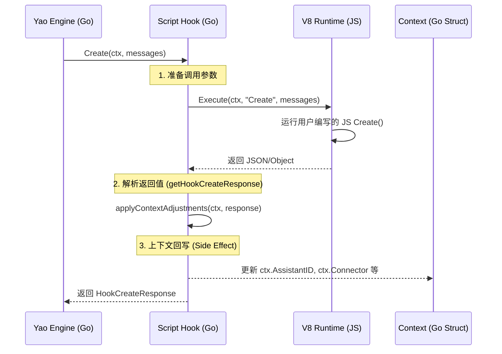

# 钩子（Hook）的设计与实现，是一个非常核心且强大的功能。它构成了 Yao 智能体系统的“动态大脑”。

基于你提供的 `yao` 源码（Golang）和 `yao-dev-app` 脚本（TypeScript），我将从**功能定义、参数与返回值、底层架构、以及实际应用**四个维度为你深入剖析。

### 1. `Create` Hook 的核心作用

在 Yao 的 Agent 体系中，`Create` 钩子并不是用来“创建”一个静态文件的，而是在**每一次对话会话初始化或即将开始处理消息时**触发的生命周期函数。

它的核心目的是：**运行时动态调整（Runtime Dynamic Adjustment）**。

通过 `Create` 钩子，开发者可以在 LLM 介入之前：

- **动态路由**：根据用户输入，决定使用哪个具体的 Assistant（例如从“通用助手”切换到“数据分析助手”）。
- **上下文注入**：在 `messages` 中插入 System Prompt 或 RAG 检索到的知识。
- **参数覆盖**：临时修改 LLM 的 `temperature`、使用的 `connector`（模型）或 `locale`（语言环境）。

### 2. 函数签名与参数信息 (JS/TS 层面)

根据 `yao-dev-app` 中的测试用例 和 Mohe 助手 的实现，`Create` 函数的定义如下：

```typescript
// 典型的函数签名
function Create(
  ctx: agent.Context,
  messages: agent.Message[]
): agent.CreateResponse;
```

#### **输入参数 (Arguments):**

1. **`ctx` (Context)**:

- **定义**: 当前运行时的上下文对象。
- **包含内容**: `assistant_id` (当前助手ID), `chat_id` (会话ID), `locale` (语言), `theme` (主题), `authorized` (用户信息，如 `user_id`, `team_id`) 等。
- **作用**: 让脚本感知“谁”在“哪个环境”下发起了请求。

2. **`messages` (Input/History)**:

- **定义**: 当前对话的消息列表，通常包含用户的最新输入以及历史对话。
- **结构**: `[{role: "user", content: "..." }, {role: "system", content: "..."}]`。
- **作用**: 允许脚本分析用户意图，从而做出路由决策或修改消息内容（例如插入 System Prompt）。

#### **返回值 (Return - `HookCreateResponse`):**

JS 脚本需要返回一个对象，该对象会被 Golang 层的 `getHookCreateResponse` 解析。支持的字段包括：

- **`assistant_id`**: (String) **最关键字段**。如果返回此字段，引擎将立即切换到指定的 Assistant ID 处理后续逻辑。
- **`connector`**: (String) 强制指定使用的 LLM 连接器（如 `gpt-4o`）。
- **`messages`**: (Array) 修改后的消息列表。你可以在这里做 Prompt Engineering，比如插入检索到的文档。
- **`options`**: (Object) 覆盖 LLM 参数，如 `temperature`。
- **`metadata`**: (Map) 自定义元数据，会合并回 Context 中。

### 3. 底层架构与调用流程 (Golang 层面)

分析 `agent/assistant/hook/create.go`，我们可以看到 Golang 是如何驱动这个过程的：



**关键技术点解析：**

1. **V8 Bridge (`s.Execute`)**:
   Yao 使用 `gou/runtime/v8` 作为 JS 引擎。`s.Execute(ctx, "Create", messages)` 会将 Go 的 `Context` 结构体和 `messages` 切片映射为 JS 对象传递给脚本。
2. **结果解析 (`getHookCreateResponse`)**:
   Go 接收到 JS 的返回值（可能是 `interface{}`），通过 `json.Marshal` 和 `json.Unmarshal` 将其转换为强类型的 `context.HookCreateResponse` 结构体。这种做法虽然有序列化开销，但保证了 Go 类型系统的安全性。
3. **副作用应用 (`applyContextAdjustments`)**:
   这是一个非常重要的逻辑。

```go
// applyContextAdjustments applies context field overrides...
func (s *Script) applyContextAdjustments(ctx *context.Context, response *context.HookCreateResponse) {
    if response.AssistantID != "" {
        ctx.AssistantID = response.AssistantID // <--- 路由切换的核心
    }
    // ... 其他字段覆盖 ...
}

```

**这意味着 JS 脚本具有修改 Go 运行时状态的权限**。如果 JS 返回了新的 `AssistantID`，Go 引擎在后续处理中就会加载新的助手配置，从而实现智能体路由。

### 4. 实际案例分析：Mohe 助手的实现

查看 `assistants/mohe/src/index.ts`，我们可以看到 `Create` 的一个高级用法：**RAG（检索增强生成）与动态提示词注入**。

```typescript
function Create(input: agent.Input, options: agent.Options): agent.Create {
  const self = this as agent.This;
  const ctx = self.context as agent.Context;

  // 1. 调用 Go 处理器搜索其他助手
  // 这里使用了 Process("neo.assistant.search", ...)
  let res = Process('neo.assistant.search', params, locale);
  let asts = res.data;

  // 2. 动态构建 System Prompt
  // 将搜索到的助手列表作为上下文注入到 input (messages) 中
  if (asts.length > 0) {
    input.splice(input.length - 1, 0, {
      role: 'system',
      text: `${JSON.stringify(asts)}`, // 注入知识
      name: 'Assistants_List'
    });
  }

  // 3. 返回配置
  return { assistant_id: ctx.assistant_id, chat_id: ctx.chat_id, input };
}
```

**分析结论：**
Mohe 的 `Create` 函数实际上充当了一个**上下文预处理器**。它不仅是简单的初始化，而是主动去检索系统中的其他 Agent 信息，并将这些信息“喂”给 LLM。这样，LLM 就知道系统里有哪些能力可用，从而能够准确地进行路由（通过后续的 `Done` 钩子调用 `select_assistant` 工具）。

### 总结

`Create` Hook 是 Yao Engine 实现 **Data-Driven Agent（数据驱动智能体）** 的基石。它打通了 Go 的高性能运行时和 JS 的动态业务逻辑，允许开发者在对话开始前精确控制：

1. **Context**: 谁在对话？（用户身份验证、元数据）
2. **Configuration**: 用什么参数？（模型、温度、语言）
3. **Routing**: 由谁来回答？（动态切换 Assistant）
4. **Content**: 基于什么知识？（RAG/Prompt Injection）

## 至关重要的 `context` 参数对象。

在 Yao 的 Agent 运行时中，`context` 不仅仅是一个存放数据的容器，它是一个**全功能的控制接口（Control Interface）**，打通了 JavaScript 业务逻辑与 Golang 底层引擎的交互通道。

根据 `agent/context` 下的源码（特别是 `types.go`, `context.go`, 和 `jsapi.go`），我们可以将 `context` 对象分为**基础数据字段**和**内置控制方法**两个部分进行分析。

### 1. 基础数据结构 (Data Fields)

`context` 对象在传递给 JS 之前，会将 Golang 的 `Context` 结构体序列化。根据 `agent/context/types.go`，它包含以下核心只读属性，用于感知运行环境：

- **身份与路由信息**:
- `assistant_id` (string): 当前调用的助手 ID。
- `chat_id` (string): 当前对话的会话 ID。
- `sid` (string): 全局会话 ID (Session ID)。
- `parent_id` (string): 如果是嵌套调用，指父级助手的 ID。

- **用户与权限信息 (`Auth`)**:
- `authorized` (Object): 包含当前登录用户的详细信息，如 `user_id`, `name`, `roles` 等。这对于在脚本中做基于角色的权限控制至关重要。

- **环境配置**:
- `locale` (string): 当前的语言环境（如 `zh-cn`, `en-us`），用于多语言回复。
- `theme` (string): 前端主题设置。
- `namespace` (string): 助手的命名空间。

- **元数据 (`Meta`)**:
- `metadata` (Map): 在会话初始化时传递的自定义键值对，用于在多轮对话中传递上下文状态。

### 2. 内置控制方法 (Control Methods / JS API)

最强大的部分在于 `agent/context/jsapi.go` 中定义的方法。这些 Go 方法被绑定到 JS 的 `this` 上下文或作为 helper 函数暴露，允许脚本主动控制引擎行为。

#### **A. 消息与流式控制 (Output & Streaming)**

- **`Stream(text)`**: 向客户端发送流式文本片段。这允许你在 LLM 生成内容之前或之间，手动插入文本（例如：“正在查询数据库...”）。
- **`Send(message)`**: 发送完整的 JSON 格式消息对象。这可以用来发送富文本、卡片或图表。
- **`Status(key, value)`**: 更新前端的状态指示器（例如 loading 状态或当前步骤）。

#### **B. 存储与状态管理 (Storage & State)**

- **SaveState(data) / LoadState()**: 允许助手在 Redis 或数据库中持久化存储“记忆”。这对于实现跨会话的长期记忆（Long-term Memory）非常关键。
- **`Upload(file)`**: 处理文件上传逻辑，将二进制流转换为系统可用的 `File` 对象。

#### **C. 引擎能力调用 (Engine Capabilities)**

- **`Call(tool_name, args)`**: 直接在脚本中调用定义的 MCP 工具或 Yao 处理器（Process），无需等待 LLM 决策。这在 `Create` 钩子中非常常用，用于预加载数据（例如：先调用 `Call("models.user.find", id)` 获取用户信息，再注入提示词）。
- **`Include(assistant_id)`**: 动态加载其他助手的配置或能力，实现类似“插件插拔”的架构。

### 3. 架构设计总结

`agent/context` 的设计体现了 Yao 引擎的**"Go Host, JS Guest"** 哲学：

1. **类型安全**: 核心状态（如 `ChatID`）由 Go 严格管理，JS 只能读取，防止逻辑污染。
2. **副作用封装**: 所有的 I/O 操作（发消息、存状态、调工具）都封装在 Go 的 `jsapi` 方法中。JS 脚本本身保持纯粹的业务逻辑，这极大地提高了系统的稳定性和性能。
3. **动态上下文**: 通过 `metadata` 和 `Create` 钩子的返回值（在上一轮对话中讨论过），JS 可以反向更新 Go 的上下文（如切换模型配置），实现了双向的动态控制。

### 代码示例：Context 在 JS 中的实际形态

基于上述分析，你在编写脚本时可以这样利用 `context`：

```javascript
function Create(ctx, messages) {
  // 1. 获取基础信息 (types.go)
  const userId = ctx.authorized?.user_id;
  const lang = ctx.locale || 'en-us';

  // 2. 利用 API 主动获取数据 (jsapi.go -> Call)
  // 注意：这里假设 Process 是全局暴露的，但在 context 设计中，
  // 往往推荐通过 context 绑定的方法或全局 helper 来操作
  const userProfile = Process('models.user.find', userId, {});

  // 3. 动态调整 (反向影响 context)
  return {
    // 注入查询到的数据到 System Prompt
    messages: [
      {
        role: 'system',
        content: `Current User: ${JSON.stringify(userProfile)}`
      },
      ...messages
    ],
    // 根据用户语言强制切换模型参数
    temperature: lang === 'zh-cn' ? 0.7 : 0.5
  };
}
```

总结来说，`agent/context` 目录下的代码构建了一个稳固的**运行时沙箱（Runtime Sandbox）**，它既赋予了 JS 脚本强大的控制力，又通过严格的接口定义（Interface Definition）守住了系统底层的边界。
