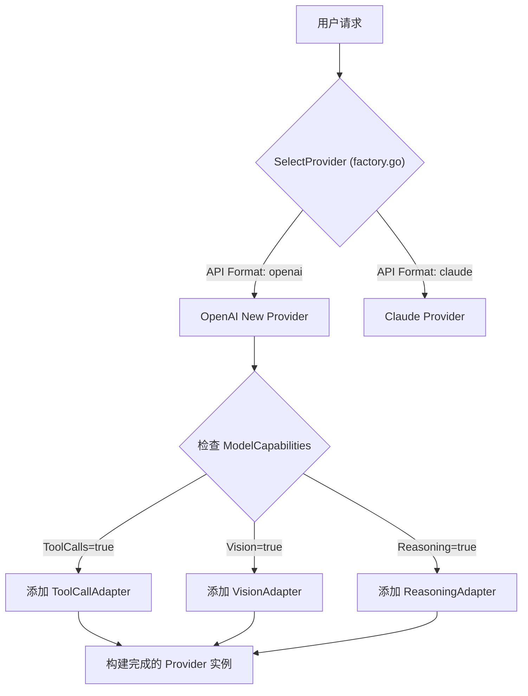
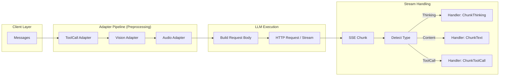
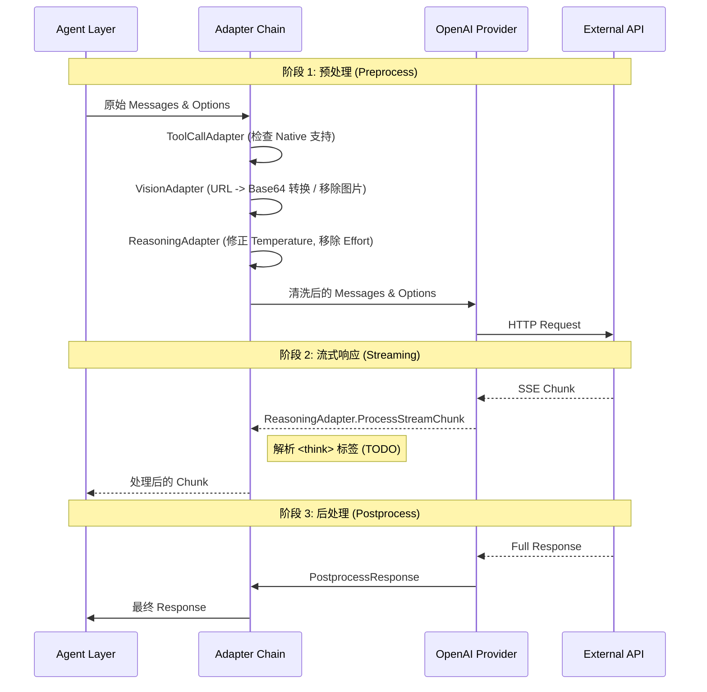

# Yao 引擎中 LLM 提供商架构的一次重大重构

以下是对该架构的深度技术分析。

### 1. 架构核心设计：解耦 API 格式与模型能力

Yao 的新架构将 LLM 的处理逻辑拆分为两个正交的维度：**Provider（提供商）** 和 **Adapter（适配器）**。

- **Provider (API 格式层)**：负责底层的 HTTP 通信协议。例如，无论是 GPT-4o 还是 DeepSeek V3，只要它们兼容 OpenAI 的 `/v1/chat/completions` 接口规范，就统一使用 `openai` Provider 处理。
- **Adapter (能力层)**：负责具体的功能特性。例如，有些模型原生支持 Function Calling，有些则需要通过 Prompt 工程实现；有些支持原生图片输入，有些需要 OCR 预处理。这些差异被封装在 `ToolCallAdapter`、`VisionAdapter` 等模块中。

这种设计使得我们在 `factory.go` 中可以根据连接配置（`connector.Connector`）动态探测 API 格式，并根据配置的 `Capabilities` 自动组装适配器管道，而无需为每个新模型编写独立的 Provider。

### 2. 初始化流程与适配器组装

在 `openai.go` 的实现中，`New` 函数是构建的核心。它调用 `buildAdapters` 方法，根据 `context.ModelCapabilities` 的布尔值标志，动态生成适配器切片。

例如，如果配置了 `Reasoning: true`（如 DeepSeek R1 或 OpenAI o1），系统会自动挂载 `ReasoningAdapter` 来处理思维链内容；如果模型不支持原生 Vision，则挂载非原生的 `VisionAdapter` 来移除或转换图片内容。



### 3. 执行管道：流式处理与消息转换

在实际的 `Stream` 或 `Post` 方法执行时，Yao 采用了一个 **Pipeline（管道）** 模型。

1. **预处理 (Preprocessing)**：请求发送前，消息列表（Messages）和选项（Options）会依次通过所有注册的适配器。例如，`base.go` 中的 `PreprocessMessages` 会过滤掉模型不支持的多模态内容。
2. **流式响应处理 (Stream Processing)**：

- 利用 `messageTracker` 追踪消息边界。
- 通过 `Accumulator` 聚合 SSE（Server-Sent Events）数据。
- 特别是针对 DeepSeek R1 等推理模型，专门处理了 `reasoning_content` 字段，将其识别为 `ChunkThinking` 类型的消息块。

3. **后处理 (Postprocessing)**：在响应完成后，会对结果进行校验。例如，`validateToolCallResults` 会利用 JSON Schema 验证模型生成的工具调用参数是否合法。



### 4. 代码亮点与最佳实践

几个值得注意的实现细节：

- **组合优于继承**：`Provider` 结构体通过嵌入 `*base.Provider` 实现了基础功能的复用，同时保持了结构的灵活性。
- **健壮的重试机制**：`Stream` 方法内置了带有指数退避（Exponential Backoff）的重试循环，并且严格处理了 Go `context` 的取消信号，防止 Goroutine 泄漏。
- **兼容性处理**：在 `buildRequestBody` 中，代码智能地处理了新旧 API 参数的差异（如 `max_tokens` 与 `max_completion_tokens`），确保了对 GPT-5 预览版及旧版模型的双向兼容。

## 对 Yao 引擎中 LLM 的 **能力适配器模式 (Capability Adapters Pattern)** 进行更深入的代码级分析。

这一模式的核心在于**将“模型支持什么”与“如何与 API 交互”完全解耦**。这使得 Yao 能够通过组合不同的 Adapter，让同一个 OpenAI 格式的 Provider 既能驱动 GPT-4o（全功能），也能驱动 DeepSeek R1（推理模型）或 Claude（需要特殊的 Vision 格式）。

以下是针对源代码的详细技术分析：

### 1. 核心接口定义 (`adapter.go`)

`CapabilityAdapter` 接口定义了一个**拦截器 (Interceptor)** 风格的生命周期。所有的适配器都必须实现这个接口，从而介入 LLM 调用的各个阶段。

```go
type CapabilityAdapter interface {
    Name() string
    // 请求前：修改消息内容（例如：移除不支持的图片，或将图片转为 Base64）
    PreprocessMessages(messages []context.Message) ([]context.Message, error)
    // 请求前：修改配置参数（例如：移除不支持的 tool_choice，或强制 temperature=1）
    PreprocessOptions(options *context.CompletionOptions) (*context.CompletionOptions, error)
    // 响应后：处理完整响应（例如：解析非原生工具调用的 JSON）
    PostprocessResponse(response *context.CompletionResponse) (*context.CompletionResponse, error)
    // 流式中：处理实时数据块（例如：解析 <think> 标签）
    ProcessStreamChunk(chunkType context.StreamChunkType, data []byte) (context.StreamChunkType, []byte, error)
}

```

**设计亮点：** `BaseAdapter` 结构体提供了所有方法的默认“透传”实现（No-op）。具体的 Adapter 只需嵌入 `*BaseAdapter` 并重写它关心的那个方法即可，这利用了 Golang 的嵌入特性实现了类似继承的效果，代码非常简洁。

### 2. 各适配器深度解析

#### A. VisionAdapter (`vision.go`)：跨厂商兼容与降级策略

这是最复杂的适配器，它展示了适配器模式的强大之处——**“Polyfill”（填补功能缺失）**。

- **策略 1：降级 (Degradation)**
  当 `nativeSupport=false` 时，它会遍历消息，直接移除所有图片内容，只保留文本。防止向不支持视觉的模型发送图片导致 API 报错。
- **策略 2：格式转换 (Transpilation)**
  当目标模型（如 Claude）需要 Base64 而用户提供的是 URL 时，它会自动下载图片并转换为 Base64 编码。

```go
// 代码片段：自动下载并转换图片
if partType == "image_url" {
    // 如果是 URL，下载并转为 Base64 结构
    convertedPart, err := a.convertImageURLToBase64(part)
    // ...
}

```

这使得上层业务代码无需关心底层模型接受 URL 还是 Base64，统一传 URL 即可。

#### B. ReasoningAdapter (`reasoning.go`)：参数守卫 (Parameter Guard)

这个适配器主要用于处理推理模型（如 o1, DeepSeek R1）的特殊约束。

- **参数清洗**：如果模型不支持 `reasoning_effort`（如非 o1 模型），它会在请求发出前悄悄移除该参数，防止 API 报错。
- **强制约束**：推理模型通常对 `temperature` 敏感。代码逻辑显示，如果模型不支持温度调节（`supportsTemperature=false`），它会强制将 `temperature` 重置为 `1.0`。

```go
// 代码片段：强制重置 Temperature
if !a.supportsTemperature && newOptions.Temperature != nil {
    if *newOptions.Temperature != 1.0 {
        defaultTemp := 1.0
        newOptions.Temperature = &defaultTemp // 强制覆盖
    }
}

```

#### C. ToolCallAdapter (`toolcall.go`)：垫片 (Shim)

目前代码主要处理 `nativeSupport=true` 的情况。对于不支持原生工具调用的模型，代码留有 `TODO`，计划通过 Prompt Engineering（提示词工程）将工具定义注入到 System Prompt 中，并从文本响应中解析 JSON。这展示了适配器如何让普通模型“假装”拥有高级功能。

#### D. AudioAdapter (`audio.go`)：过滤器

目前的实现比较简单，主要起过滤作用。如果模型不支持音频输入，它会移除 `ContentInputAudio` 类型的消息部分，防止请求失败。

### 3. 执行流程可视化

当一个请求发起时，数据流经适配器链的过程如下：



### 4. 总结：该模式对开发的意义

对于 Yao 引擎的开发者来说，这种架构带来了极大的便利：

1. **新模型接入快**：接入一个新的兼容 OpenAI 协议的模型（例如国内的某种新模型），如果它支持 ToolCall 但不支持 Vision，只需要在配置里开关相应的 flag，系统会自动组装对应的 Adapter，无需写一行 Go 代码。
2. **业务逻辑纯粹**：上层业务逻辑（DSL 或 JS 脚本）可以统一编写。比如统一发送图片 URL，由底层 Adapter 决定是透传、转 Base64 还是丢弃，业务层不需要写大量的 `if model == 'gpt4' then ... else ...`。
3. **鲁棒性**：通过 `ReasoningAdapter` 的参数守卫机制，避免了因为传了不支持的参数（如向旧模型传 `reasoning_effort`）导致的 API 400 错误。

这是一个非常典型的**组合优于继承 (Composition over Inheritance)** 的 Golang 实践。
