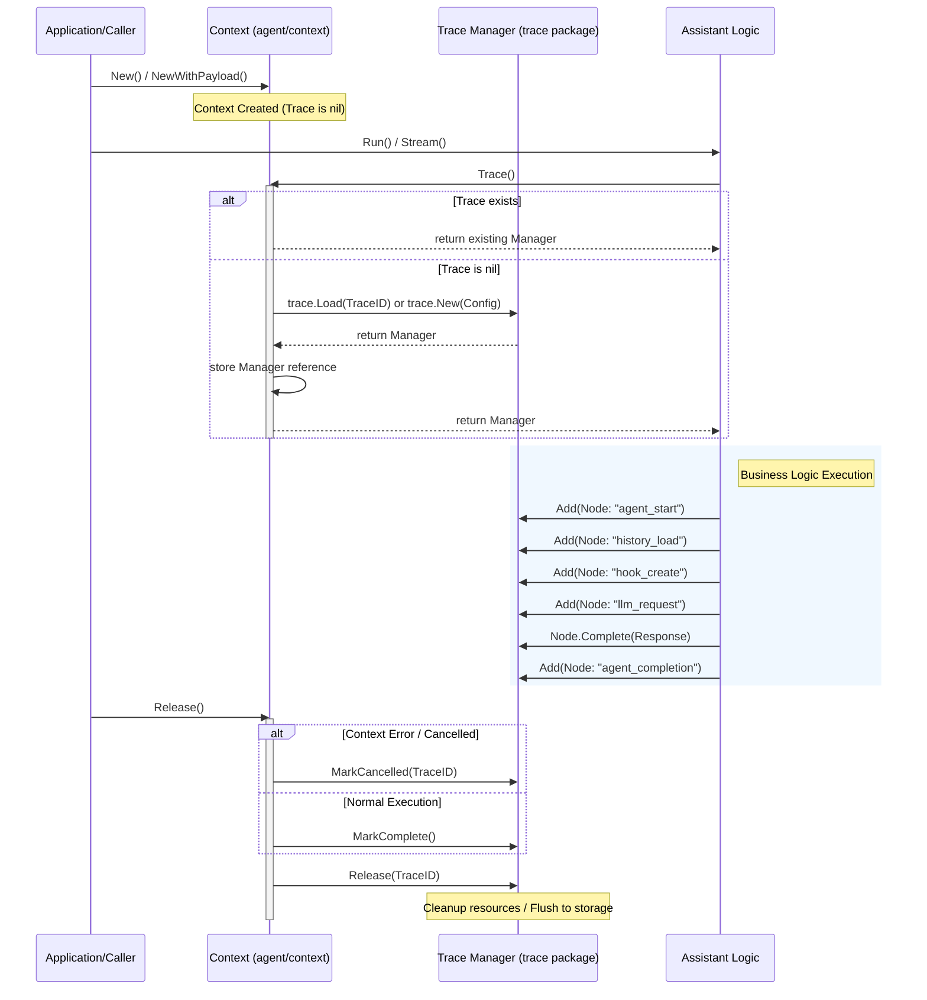
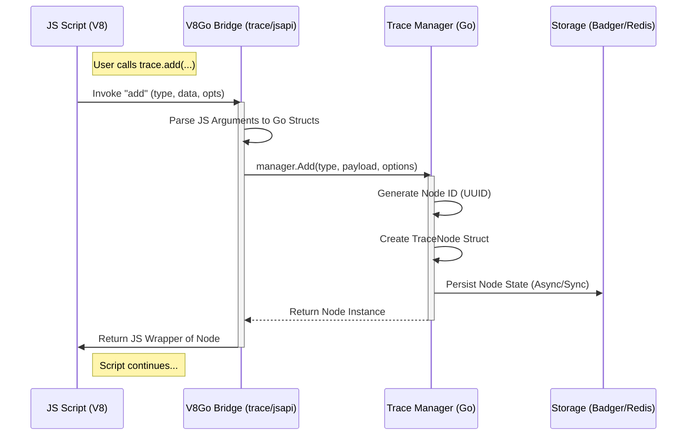
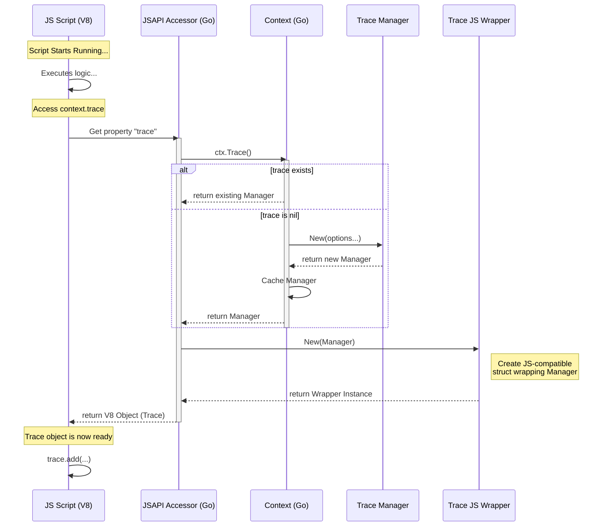

# 深入剖析 Yao 引擎中 AI Agent 的 `Trace` 机制

在构建复杂的 AI 应用时，可观测性（Observability）至关重要。Yao 引擎通过 `Context` 对象集成了强大的 `Trace`（追踪）功能，用于记录 Agent 执行过程中的每一步操作、耗时、输入输出以及 LLM 的交互细节。

基于 `agent/context` 和 `agent/assistant` 目录下的代码，整理了关于 Context 中 Trace 对象的使用文档、原理分析及流程图。

---

### Yao Agent Trace 系统技术文档

#### 1. 核心设计原则

Yao 的 Trace 系统设计遵循以下核心原则：

- **懒加载（Lazy Initialization）**：Trace 对象并非在 Context 创建时立即初始化，而是在首次调用 `ctx.Trace()` 时按需创建。这减少了不必要的资源开销。
- **生命周期绑定**：Trace 的生命周期严格绑定于 `Context`。当 `Context.Release()` 被调用时，Trace 会自动完成状态标记（完成或取消）并释放资源。
- **多驱动支持**：支持本地文件系统（Local）和存储服务（Store，如 Redis）两种驱动，由全局配置决定。
- **结构化节点**：Trace 以树状结构记录执行流，每个关键步骤（如调用 LLM、执行 Hook、获取历史记录）都是一个 "Node"。

#### 2. Context 中的 Trace 管理

代码位置: `agent/context/context.go`

`Context` 结构体充当了 Trace 的容器和管理器。

**获取 Trace 实例：**

```go
// 开发者通过此方法获取 Trace 管理器
manager, err := ctx.Trace()

```

**原理分析：**

1. **检查缓存**：如果 `ctx.trace` 已存在，直接返回。
2. **复用 TraceID**：检查 `ctx.Stack.TraceID`。如果存在，尝试从全局注册表中加载现有的 Trace 实例（这意味着 Trace 可以跨 Context 传递，只要 TraceID 相同）。
3. **新建实例**：如果不存在，则根据 `config.Conf.Trace` 配置（Local 或 Store）初始化新的 Trace Manager。
4. **注入元数据**：将当前用户的 `Authorized` 信息（UserID, TeamID 等）注入 Trace 配置中。

**资源释放与状态完结：**

代码位置: `agent/context/context.go` -> `Release()`

当 Agent 执行结束调用 `ctx.Release()` 时，Trace 会进行以下逻辑：

1. **取消状态检测**：如果 `ctx.Context` 报错（如超时或被取消），调用 `trace.MarkCancelled` 标记追踪记录为“已取消”。
2. **正常完成**：如果执行正常，调用 `ctx.trace.MarkComplete()` 标记追踪记录为“已完成”。
3. **资源清理**：最后调用 `trace.Release(traceID)` 从内存注册表中移除该 Trace 对象。

#### 3. Assistant 中的 Trace 实践

代码位置: `agent/assistant/trace.go`

在具体的业务逻辑（Assistant）中，Trace 被用于记录关键节点的执行情况。

**常见使用模式：**

1. **初始化 Agent 节点**：
   通常在 Agent 启动时创建一个根节点或主节点。

```go
agentNode, _ := trace.Add(inputMessages, types.TraceNodeOption{
    Type: "agent",
    Label: "Assistant Demo",
    // ...
})

```

2. **记录 LLM 请求（流式/非流式）**：
   在调用 OpenAI 或其他模型前，记录请求参数。

```go
trace.Add(
    map[string]any{"messages": msgs, "options": opts},
    types.TraceNodeOption{
        Type: "llm",
        Label: "LLM gpt-4",
        // ...
    },
)

```

3. **记录关键事件**：

- **历史记录加载**：`traceAgentHistory`
- **Hook 执行**：`traceCreateHook`
- **能力获取**：`traceConnectorCapabilities`

4. **完成与结果记录**：
   使用 `traceAgentCompletion` 创建一个包含最终结果的节点，并标记 Trace 完成。

```go
// 创建完成节点
completionNode, _ := trace.Add(input, types.TraceNodeOption{
    Type: "agent_completion",
    // ...
})
// 写入最终结果
completionNode.Complete(finalResponse)

```

#### 4. Trace 执行流程图

以下流程图展示了从 Context 创建到 Trace 记录再到释放的完整生命周期：



### 总结与建议

**Trace 对象在 Yao 引擎中扮演着“黑匣子”的角色。**

- **对于开发者**：你不需要手动管理 Trace 的初始化和销毁，只需要通过 `ctx.Trace()` 获取实例，并使用 `Add` 方法记录你关心的业务节点数据。
- **注意事项**：
- **Context 传递**：确保 `Context` 在函数调用链中正确传递，否则 Trace 链路会断裂。
- **敏感数据**：Trace 会记录输入输出（如 `traceLLMRequest` 中的 messages）。在生产环境中，需要留意记录的数据是否包含不应持久化的敏感信息（尽管 Yao 的架构通常用于企业内部应用，这一点仍需注意）。
- **性能影响**：虽然是懒加载，但大量的 Trace 节点写入（尤其是使用 IO 较慢的存储驱动时）可能会带来轻微的性能损耗。

## 进一步深入分析 Yao 引擎中 **Trace 对象在 JavaScript 环境（JSAPI）中的使用**。

在 Yao 的 Agent 运行时中，`trace` 对象是连接业务逻辑与可观测性系统的桥梁，它允许你在 JavaScript 脚本中手动记录关键步骤，从而构建出完整的执行链路图。

### Trace 对象 (JSAPI) 深度分析

#### 1. Trace 对象的定位与获取

在 Yao 的 V8 运行环境中（尤其是 Agent 的上下文），`trace` 对象通常作为 `context` 的一部分或者全局对象暴露给脚本。

- **Go 层实现**：`agent/context/jsapi.go` 和 `trace/jsapi/trace.go`。
- **JS 层表现**：一个包含特定方法的对象，用于操作底层的 `Trace Manager`。

通常在 Agent 的脚本中，你可以通过以下方式访问：

```javascript
// 假设在 Agent 的脚本上下文中
const trace = context.trace; // 或者直接作为全局对象 trace 使用
```

#### 2. 核心方法 (JSAPI Methods)

根据 Go 源码 (`trace/jsapi/trace.go` 和 `trace/trace.go`) 的映射逻辑，`Trace` 对象通常暴露以下核心方法给 JS 环境：

| 方法签名 (JS)              | 对应 Go 方法               | 描述                                           |
| -------------------------- | -------------------------- | ---------------------------------------------- |
| `add(type, data, options)` | `Trace.Add(...)`           | **核心方法**。向当前追踪链路添加一个新的节点。 |
| `complete(result)`         | `Trace.MarkComplete(...)`  | 标记整个 Trace 任务完成，并记录最终结果。      |
| `cancel(reason)`           | `Trace.MarkCancelled(...)` | 标记 Trace 任务被取消。                        |
| `fail(error)`              | `Trace.Error(...)` (推测)  | 记录错误信息（如果暴露了此接口）。             |

---

#### 3. `trace.add()` 详解与使用

这是最常用的方法，用于记录执行过程中的“快照”或“步骤”。

**语法：**

```javascript
let node = trace.add(type, data, options);
```

**参数分析：**

- **`type` (String)**: 节点类型。用于区分不同的操作，例如：
- `"agent"`: Agent 整体执行。
- `"llm"`: 调用大语言模型。
- `"tool"`: 调用外部工具或函数。
- `"chain"`: 逻辑链的一个环节。

- **`data` (Object/Any)**: 该步骤的输入数据或关键载荷（Payload）。
- _注意_：如果是敏感数据，建议在传入前进行脱敏。

- **`options` (Object, 可选)**: 额外的配置项，通常包含：
- `label`: 节点的显示名称（如 "GPT-4 调用"）。
- `parent`: 指定父节点 ID（用于构建嵌套结构）。

**返回值：**

- 返回一个 **Trace Node** 对象（或其 ID），允许你后续更新该节点的状态（如标记该子步骤完成）。

---

#### 4. 使用场景与代码示例

假设你正在编写一个自定义的 Agent 脚本，需要调用一个外部 API 并记录其过程。

```javascript
/**
 * Agent 自定义处理脚本
 * @param {object} input - 用户输入
 */
function Process(input) {
  // 1. 获取 trace 对象 (通常挂载在 context 下)
  const trace = __context.trace;

  // 2. 记录 Agent 开始
  // 创建一个根节点，记录输入
  const rootNode = trace.add('agent', input, { label: 'MyCustomAgent' });

  try {
    // --- 业务逻辑：步骤 A (数据预处理) ---
    let processedData = someLogic(input);

    // 记录步骤 A
    trace.add(
      'step',
      { raw: input, processed: processedData },
      { label: 'DataPreprocessing' }
    );

    // --- 业务逻辑：步骤 B (调用 LLM) ---
    const llmPayload = { messages: [{ role: 'user', content: processedData }] };

    // 记录 LLM 请求前
    const llmNode = trace.add('llm', llmPayload, { label: 'Call GPT-4' });

    // 模拟 LLM 调用
    const response = 'This is the AI response';

    // 更新 LLM 节点，记录输出结果 (如果 JSAPI 支持 node 对象的操作)
    // llmNode.complete(response);

    // --- 业务逻辑：结束 ---
    // 3. 标记 Trace 完成
    trace.complete(response);

    return response;
  } catch (err) {
    // 4. 异常处理与记录
    trace.cancel(err.message);
    throw err;
  }
}
```

#### 5. 原理与流程图 (JS 与 Go 的交互)

当你在 JS 中调用 `trace.add()` 时，Yao 引擎内部发生了一次跨语言调用（V8Go Bridge）。



#### 6. 最佳实践建议

1. **粒度控制**：不要记录每一个微小的变量赋值。重点记录**IO 操作**（数据库、网络请求）、**AI 推理**（LLM 调用）和**关键决策点**。
2. **结构化数据**：在 `data` 字段中尽量使用 JSON 对象而不是纯字符串，这样在后续的可视化分析中更易于解析。
3. **异常捕获**：务必在 `try-catch` 块的 `catch` 分支中调用 `trace.cancel()` 或 `trace.fail()`，否则 Trace 状态可能会一直卡在 "Running"，导致调试困难。
4. **上下文传递**：如果在 JS 中进行了异步操作或深层函数调用，确保 `trace` 对象能被正确传递下去。

## jsapi context.trace对象初始化

继续深入分析，在 JavaScript 环境中通过 `context.trace` 引用 `trace` 对象时，其初始化时机和机制是非常精妙的，体现了 Yao 引擎对性能的极致追求。

### 核心结论：延迟初始化 (Lazy Initialization)

**JS 中的 `trace` 对象并不是在脚本启动时立即创建的，而是在代码中首次访问 `context.trace` 属性的那一刻才被初始化。**

这与 Go层面的 `ctx.Trace()` 方法的懒加载设计保持了高度一致。

---

### 详细原理解析

#### 1. 桥接层设计 (`agent/context/jsapi.go`)

在 Yao 的 V8 引擎集成中，`context` 对象通过 `v8go` 暴露给 JS 环境。为了实现懒加载，`trace` 属性通常被配置为一个 **Accessor (访问器)**，而不是一个普通的静态值。

- **定义**：在 `NewJSAPI` 或相关初始化代码中，`context` 的 Object Template 会定义 `trace` 属性的 Getter 回调。
- **触发**：当 JS 脚本执行到 `let t = context.trace` 时，V8 引擎拦截该属性访问，并调用 Go 定义的回调函数。

#### 2. 初始化流程 (Access Sequence)

当你在 JS 中写下 `context.trace` 时，引擎内部发生了一连串的同步操作：

1. **触发 Getter**：JS 引擎请求读取 `trace` 属性。
2. **调用 Go 方法**：Go 层的 Getter 函数被执行。
3. **底层初始化 (Context 层)**：

- Getter 调用 Go 结构体中的 `ctx.Trace()` 方法。
- **检查缓存**：如果 `ctx.trace` (Go对象) 已经存在，直接返回。
- **创建实例**：如果不存在，根据配置（Local/Store）创建 `trace.Manager` 实例并缓存。

4. **构建 JS 包装器 (Wrapper)**：

- 获取到 `trace.Manager` 后，代码会调用 `trace/jsapi.New(manager)` (在 `trace/jsapi/trace.go` 中)。
- 这个方法会创建一个新的 Go 结构体（JSAPI Wrapper），它封装了底层的 manager，并导出了 `add`、`complete` 等方法供 JS 调用。

5. **返回 V8 对象**：这个 Wrapper 被转换成 V8 对象返回给 JS 运行环境。

#### 3. 为什么这么设计？ (Why)

- **性能优化**：绝大多数简单的脚本可能根本不需要追踪功能。如果在每个请求开始时都初始化 Trace 系统（可能涉及文件 IO 或 Redis 连接），会造成巨大的资源浪费。
- **按需付费**：只有当业务逻辑明确需要追踪时（代码里写了 `context.trace`），系统才付出初始化的成本。

---

### 初始化时序图 (Diagram)

为了更清晰地理解这个瞬间发生的初始化过程，请看下面的时序图：



### 开发者注意事项

1. **避免重复解构**：虽然有缓存机制，但在高频循环中，建议在循环外获取一次 `trace` 对象，而不是在循环内反复访问 `context.trace`（尽管 Go 层有缓存，但跨语言调用的开销依然存在）。

```javascript
// 推荐
const trace = context.trace;
for (const item of items) {
    trace.add(...)
}

```

2. **空值检查**：在极其罕见的情况下（如系统配置错误导致 Trace 初始化失败），访问 `context.trace` 可能会抛出异常或返回空，编写健壮的代码时可以考虑 `try-catch` 或可选链（如果环境支持）。

通过这种机制，Yao 确保了 AI Agent 在保持高性能运行的同时，提供了强大的可观测性能力。
