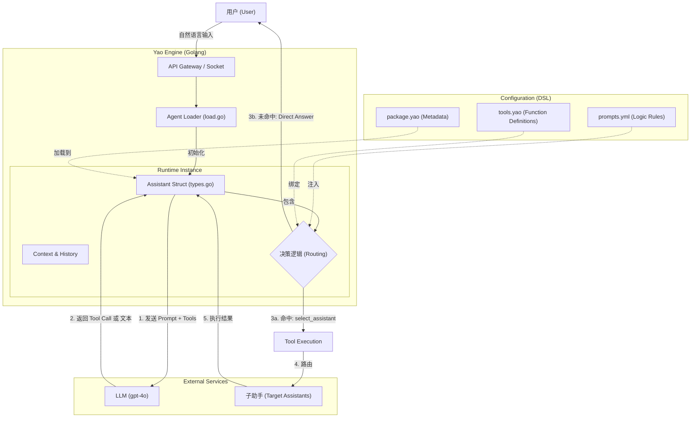

# Yao 的 Agent 架构

Yao 的 Agent 架构采用了一种**数据驱动与运行时解耦**的设计模式。在 Golang 运行时层面，系统通过 `load.go` 中的 `Load` 函数初始化整个 Agent 子系统，加载 `agent.yml` 配置并初始化存储层（如 Redis、Mongo 或 Xun 数据库）以及默认助手（如 "mohe"）。这种设计确保了底层基础设施（存储、连接器）与上层业务逻辑（助手定义、提示词）的分离。

核心实体 `Assistant`（定义在 `types.go` 中）是整个架构的枢纽，它聚合了 LLM 连接器（如 `gpt-4o`）、知识库（KB）、MCP 工具集以及运行时脚本。在 `yao-dev-app` 的配置中，`package.yao` 充当了这些实体的蓝图，定义了助手的基本属性（名称、头像、标签）和参数配置。Golang 层的 `assistant.go` 提供了 `Clone` 方法，这至关重要，因为它允许在运行时为每个会话创建助手的深拷贝副本，确保并发安全的同时，支持针对特定会话的动态配置覆盖。

业务逻辑的编排主要通过 DSL（领域特定语言）实现。`prompts.yml` 定义了智能体的思维链和决策树，例如在 "mohe" 助手不仅充当聊天机器人，还作为路由层执行严格的 "Assistant Selection Process"。与之配合的 `tools.yao` 定义了具体的函数调用接口（如 `select_assistant`），这些定义在运行时被解析为 `MCPTool` 结构体，并通过 `ToolCallResult` 结构处理执行结果，实现了 LLM 意图到具体 Go/JS 代码执行的映射。

此外，架构展现了高度的扩展性和标准化能力。`models.yml` 和 `types.go` 中的 `ModelCapabilities` 结构体表明引擎不仅支持文本交互，还原生抽象了视觉（Vision）、音频和推理（Reasoning）能力。`load.go` 中的初始化逻辑还涵盖了全球化（I18n）支持，允许助手根据 `locales` 动态加载不同语言的提示词和描述，这展示了 Yao 作为一个企业级 AI 引擎在多模态和多语言环境下的成熟设计。

这是一个经典的 **"Router-Executor"**（路由-执行）架构。系统核心是一个名为 "Mohe" 的主助手，它充当流量入口和路由器的角色，利用 DSL 定义的规则将用户意图分发给具体的子助手或直接处理。

以下是使用 Mermaid 绘制的系统架构图，以及各层的详细技术分析。

### 1. 系统架构图 (System Architecture)

---

### 2. 架构组件深度解析

这个架构的设计展现了 Yao 引擎如何通过配置驱动（DSL）将 Golang 的强类型能力与 LLM 的灵活性结合起来。

#### A. 配置层 (Configuration Layer)

这是开发者定义业务逻辑的地方，完全解耦于代码。

- **蓝图定义 (`package.yao`)**:
- 定义了助手的基本元数据（名称 `DeepExcel`、连接器 `gpt-4o`）。
- 通过 `options` 设置模型参数（如 `temperature: 0`），确保路由决策的确定性。

- **思维链与路由规则 (`prompts.yml`)**:
- 这是系统的“大脑”。它定义了严格的 **"Assistant Selection Process"**。
- 规则明确：如果匹配到助手，**必须** 且 **仅能** 调用工具；如果没有匹配，**必须** 直接回答。这种 `System Prompt` 工程确保了 LLM 不会产生幻觉或混淆职责。

- **能力接口 (`tools.yao`)**:
- 定义了 LLM 可调用的函数接口，例如 `select_assistant`。
- 这是一个标准的 MCP (Model Context Protocol) 工具定义，明确了参数 `assistant_id` 的类型和约束。

#### B. 引擎层 (Golang Engine Layer)

这是 Yao 引擎的核心，负责加载配置并管理运行时状态。

- **加载器 (`load.go`)**:
- `Load` 函数初始化整个 Agent 子系统。
- 它解析 YAML/JSON 配置文件，并将其映射到 Golang 的内存结构中。
- 初始化默认助手（如 `mohe`），使其准备好接收请求。

- **助手实体 (`types.go` & `assistant.go`)**:
- `Assistant` 结构体是核心对象，它聚合了 `Prompts` (提示词)、`Tools` (工具集) 和 `Connector` (LLM 连接)。
- `MCPTool` 结构体用于在内部表示像 `select_assistant` 这样的工具，以便构建发往 LLM 的请求。
- 引擎通过 `ToolCallResult` 处理 LLM 的回调，执行具体的 Golang 或 JavaScript 逻辑。

#### C. 执行流 (Execution Flow)

1. **输入分析**: 用户消息进入系统，引擎将 `prompts.yml` 中的系统提示词与用户消息组合。
2. **决策**: `gpt-4o` 根据提示词分析意图。

- 如果用户问 "帮我分析这个 Excel"，模型根据规则匹配到数据分析助手。

3. **工具调用**: 模型返回一个 `tool_calls` 指令，要求执行 `select_assistant("data_analyst")`。
4. **路由/响应**:

- Yao 引擎拦截这个工具调用。
- 在内部，它可能会加载目标助手的上下文，或者返回一个特定的前端指令让 UI 切换助手。
- 如果未匹配，模型直接返回文本，Yao 引擎将其流式传输给用户。

### 3. 关键技术点总结

1. **数据驱动架构**: 所有的业务逻辑（路由规则、工具定义）都在 DSL 中，Golang 代码只负责执行机制。这意味着修改路由规则不需要重新编译 Go 代码。
2. **确定性路由**: 通过将 `temperature` 设为 0 并在 `prompts.yml` 中制定严格的 "Critical Rules"，系统最大程度减少了 AI 的随机性，适合企业级应用。
3. **MCP 协议集成**: 系统原生支持工具调用 (`ToolCalls` 和 `MCPTool`)，这使得它可以轻松扩展对接外部 API 或内部数据处理逻辑。
