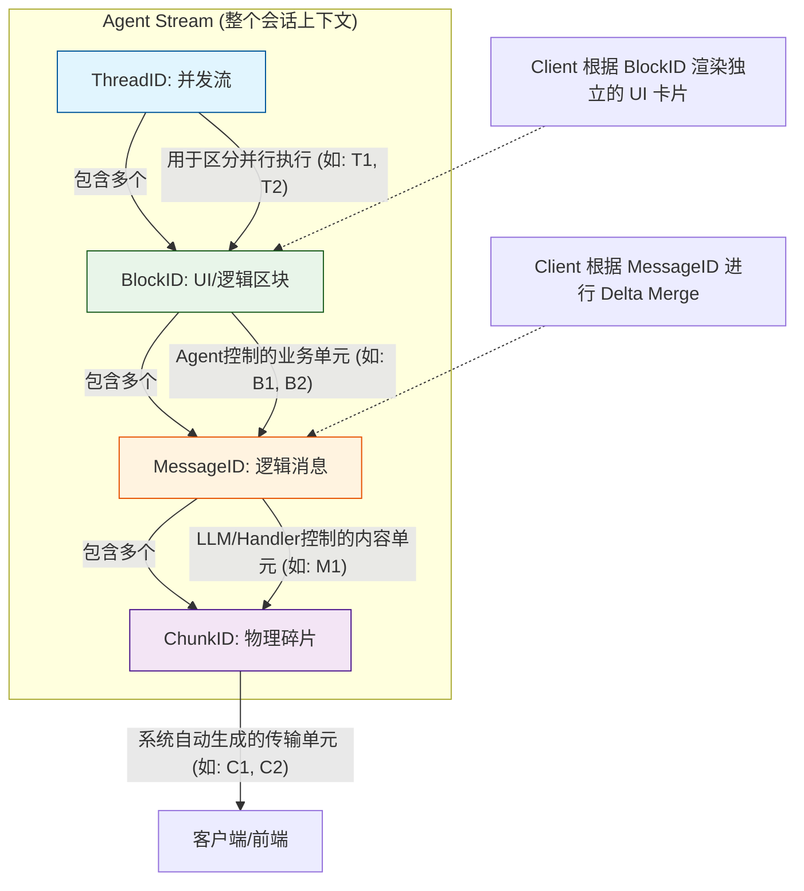
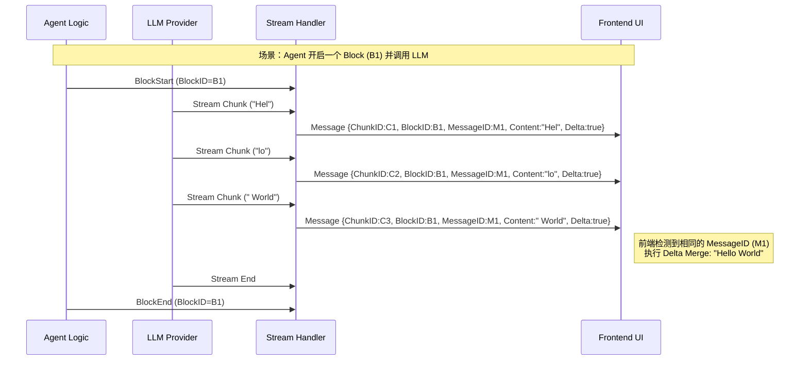

# Yao 引擎中关于流式消息（Streaming Message）的架构设计。

通过分析 `agent/output/message/STREAMING.md` 文档以及 `agent/output/message/types.go` 源代码，整理了这份关于 Yao 引擎**分层流式架构（Hierarchical Streaming Architecture）**的深入技术分析。

### 1. 架构核心理念

Yao 的流式系统不仅仅是简单的文本流传输，它是为了解决 AI Agent 复杂场景而设计的一种**分层结构**。它需要同时处理单一 LLM 的多类型输出（思考、工具调用、文本）、Agent 的顺序操作（LLM -> MCP -> LLM）以及并发操作。

为了实现这一点，Yao 采用了 **Stream -> Thread -> Block -> Message -> Chunk** 的五层层级模型。

### 2. 详细层级与 Golang 实现分析

在 `agent/output/message/types.go` 中，`Message` 结构体通过一组特定的字段实现了这一架构：

```go
type Message struct {
    // ... 核心字段 ...
    Type  string                 `json:"type"`
    Props map[string]interface{} `json:"props,omitempty"`

    // 流式控制字段
    ChunkID   string `json:"chunk_id,omitempty"`   // 物理层：用于传输、去重和排序
    MessageID string `json:"message_id,omitempty"` // 逻辑层：Delta合并的目标，多个Chunk组合成一个逻辑消息
    BlockID   string `json:"block_id,omitempty"`   // 业务层：UI渲染区块，代表Agent的一次操作单元
    ThreadID  string `json:"thread_id,omitempty"`  // 并发层：区分并行的流（如同时调用天气和新闻工具）

    // Delta 更新控制
    Delta       bool   `json:"delta,omitempty"`
    DeltaPath   string `json:"delta_path,omitempty"`
    DeltaAction string `json:"delta_action,omitempty"`
    // ...
}

```

#### 层级职责详解图表

以下是根据 `STREAMING.md` 绘制的架构层级图，展示了各 ID 的作用范围和生成源头：



### 3. 数据流转与 Delta 合并机制

在流式传输中，最关键的是如何将碎片化的 `Chunk` 还原为完整的 `Message`。Yao 使用 `MessageID` 配合 `Delta` 字段来实现这一点。

- **ChunkID**: 全局唯一且递增，保证客户端收到的数据不丢失、不乱序。
- **MessageID**: 聚合标识。前端收到 `message_id="M1"` 且 `delta=true` 的多个包时，会将它们的内容合并。

#### 序列图：从 LLM 到客户端的流转



### 4. 并发流处理 (Concurrency)

当 Agent 并行执行任务（例如同时调用两个 MCP 工具）时，`ThreadID` 变得至关重要。它允许在一个 `Block` 内或者整个 `Stream` 中区分不同的执行线程，防止输出内容混淆。

根据 `types.go` 中的 `EventThreadStartData` 定义，并发开始时会发送事件通知。

#### 状态图：并发消息的交错传输

```mermaid
gantt
    title 并发流 (ThreadID) 传输示意图
    dateFormat X
    axisFormat %s

    section 主线程
    Block B1 Start       : 0, 1

    section Thread T1 (天气查询)
    Msg M1 (Chunk C1)    : 2, 3
    Msg M1 (Chunk C3)    : 4, 5

    section Thread T2 (新闻查询)
    Msg M2 (Chunk C2)    : 3, 4
    Msg M2 (Chunk C4)    : 5, 6

    section 客户端视角
    收到 C1 (T1) : 2, 3
    收到 C2 (T2) : 3, 4
    收到 C3 (T1) : 4, 5
    收到 C4 (T2) : 5, 6
    合并显示 T1 : 2, 6
    合并显示 T2 : 3, 6

```



### 5. 总结与建议

Yao 的这套架构设计体现了 Golang 在处理高并发和结构化数据时的优势。它将**传输层**（Chunk）与**业务逻辑层**（Block/Message）解耦。

**针对开发的建议：**

1. **BlockID 的使用**：如果你在编写自定义的 Agent 逻辑（Go 或 DSL），请务必在逻辑切换（例如从思考转为行动，或从一个工具切到另一个工具）时划分 clear 的 `Block`。这决定了用户界面上卡片的分割。
2. **Delta 处理**：在实现自定义 `Adapter` 时，确保正确处理 `DeltaAction`（如 `append` vs `replace`）。对于文本通常是 `append`，但对于状态更新可能是 `replace` 或 `merge`。
3. **调试**：如果发现消息乱序或丢失，首先检查 `ChunkID` 的生成逻辑是否保证了唯一性和顺序性；如果发现消息内容错乱（如 A 的回复拼到了 B 上），检查 `MessageID` 和 `ThreadID` 是否在上下文中被正确透传。
