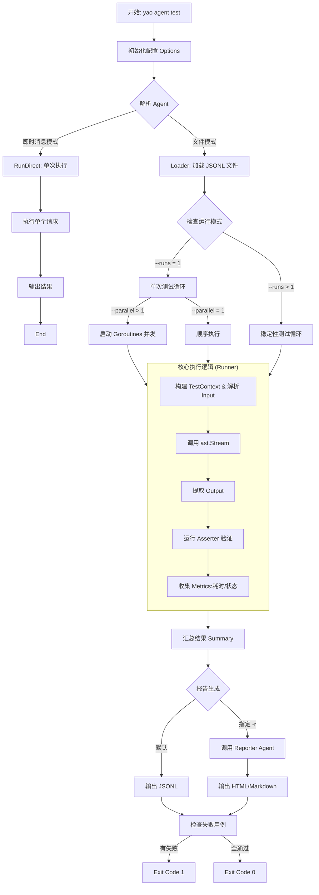

# Agent 测试框架

### 1. Agent 测试框架的使用方法

Yao 的 Agent 测试框架旨在解决 AI 应用输出不确定性的问题，通过结构化的测试用例（Test Cases）和断言（Assertions）来验证 Agent 的行为。

#### 1.1 核心命令与模式

测试工具主要通过 `yao agent test` 命令触发，支持两种输入模式：

- **即时消息模式 (Direct Message Mode)**：用于快速调试。

```bash
yao agent test -i "你好，世界" -n keyword.agent

```

它会自动从当前目录向上查找 `package.yao` 来解析 Agent，或通过 `-n` 显式指定。

- **JSONL 文件模式 (JSONL File Mode)**：用于批量回归测试和 CI 集成。

```bash
yao agent test -i tests/inputs.jsonl --runs 5 --parallel 4

```

该模式支持并发执行（`--parallel`）和稳定性分析（`--runs`）。

#### 1.2 测试用例定义 (DSL)

测试用例通常定义在 `.jsonl` 文件中，每行一个 JSON 对象。Yao 定义了灵活的断言机制来验证非确定性的 AI 输出：

```json
{
  "id": "T001",
  "input": "计算 1+1",
  "assert": [
    { "type": "contains", "value": "2" },
    { "type": "json_path", "path": "$.confidence", "value": 0.9 },
    { "type": "not_contains", "value": "error" }
  ]
}
```

支持的断言类型包括 `equals` (精确匹配), `contains` (包含), `regex` (正则), `json_path` (结构化数据提取), 以及 `script` (自定义脚本验证)。

---

### 2. 核心架构与原理分析

根据 `agent/test/runner.go` 和 `agent/test/types.go` 的源码，该框架的运行原理可以概括为以下几个关键组件的协作。

#### 2.1 Agent 解析与上下文构建 (Resolver & Context)

在执行测试前，框架首先通过 `Resolver` 确定目标 Agent。

- **解析策略**：优先使用 `-n` 参数，其次根据输入文件路径向上遍历查找 `package.yao`，最后检查当前工作目录。
- **上下文模拟**：`runner.go` 中的 `NewTestContextFromOptions` 会构建一个模拟的 `context.Context`。这允许测试者通过 `-u` (User) 和 `-t` (Team) 参数注入特定的用户身份和租户信息，从而测试权限控制和个性化逻辑。

#### 2.2 执行器 (Executor/Runner)

`Executor` 结构体是核心调度器，它根据配置决定执行策略：

- **单次运行**：解析输入 -> 调用 `ast.Stream` -> 获取结果 -> 运行断言。
- **并发执行**：如果配置了 `--parallel N`，它会使用 Go 协程 (`go func`) 和信号量模式 (`chan struct{}`) 来控制并发度，加速批量测试。
- **稳定性测试**：如果 `--runs N` (N > 1)，它会对同一个 Case 循环执行 N 次。框架会自动计算通过率 (`pass_rate`)、响应时间标准差 (`std_deviation_ms`) 和一致性得分，从而判断 Agent 是否“稳定”。

#### 2.3 报告生成 (Reporter)

测试结果被汇聚成 `Report` 结构体。Yao 的一个设计亮点是支持**使用 Agent 生成报告**。

- 默认输出为 JSONL 流，适合 CI/CD 管道处理。
- 如果指定 `-r report.agent`，系统会将原始测试数据作为输入，调用一个专门的 AI Agent 来生成 HTML 或 Markdown 格式的分析报告。

---

### 3. 测试执行流程图

基于 `agent/test/runner.go` 的逻辑，我为你绘制了以下流程图，展示了从命令输入到报告生成的完整生命周期。



### 总结

Yao 的 `agent/test` 模块是一个成熟的工程化测试方案。它利用 Golang 的并发特性实现了高效的批量测试，通过结构化的 JSONL 定义了 DSL 级别的断言逻辑，并创新性地引入了“稳定性分析”来应对 LLM 的概率性输出问题。
