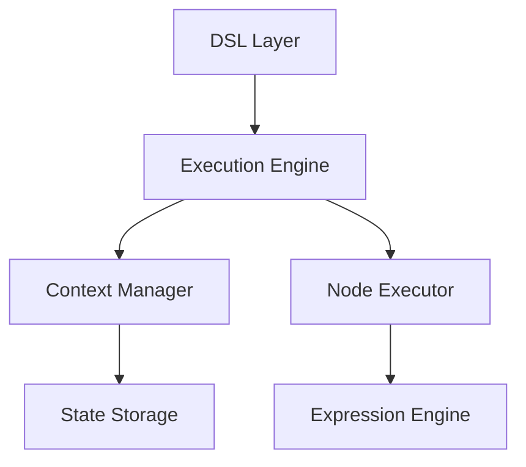

# Pipe 文档完善说明

本文档说明了对 Yao Pipe 模块的完善工作和文档结构。

## 完善内容概览

基于对 Pipe 源代码的深入分析，我们完善了以下文档：

### 📚 核心文档

1. **[概览](./index.md)** - Pipe 的基本介绍、特性和使用场景
2. **[DSL 语法](./dsl.md)** - 详细的 DSL 配置语法说明
3. **[节点类型](./nodes.md)** - 各种节点类型的使用方法和配置
4. **[表达式引擎](./expression.md)** - 表达式语法和数据处理
5. **[执行流程](./execution.md)** - Pipe 的执行机制和原理
6. **[API 参考](./api.md)** - 完整的 API 接口文档
7. **[架构设计](./architecture.md)** - Pipe 的系统架构设计
8. **[最佳实践](./best-practices.md)** - 使用建议和注意事项
9. **[示例代码](./examples.md)** - 实际应用案例和代码示例

### 🎯 源代码分析

通过深入分析以下源代码文件，我们全面了解了 Pipe 的功能和实现：

```
pipe/
├── pipe.go          # Pipe 核心结构和加载逻辑
├── types.go         # 数据类型定义
├── context.go       # 上下文管理
├── node.go          # 节点执行逻辑
├── process.go       # Process API 接口
├── expression.go    # 表达式引擎
├── json.go          # JSON 解析
├── utils.go         # 工具函数
├── pipe_test.go     # 单元测试
└── ui/cli/          # CLI 界面
    └── cli.go       # CLI 实现
```

## 🔍 核心功能特性

### 1. 节点类型支持

- ✅ **Process Node**: 执行 Yao Process
- ✅ **AI Node**: 调用 AI 模型，支持流式响应
- ✅ **Switch Node**: 条件分支逻辑
- ✅ **User Input Node**: 多种用户界面（CLI/Web/App/小程序）
- 🔄 **Request Node**: HTTP 请求（计划中）

### 2. 表达式引擎

- 基于 Expr 库实现的高性能表达式引擎
- 支持 `{{ }}` 语法的动态数据绑定
- 丰富的内置变量和函数
- 类型安全的数据处理

### 3. 上下文管理

- 完整的执行状态管理
- 支持暂停和恢复执行
- 上下文继承机制（Switch 分支）
- 并发安全的存储

### 4. 安全机制

- Process 白名单验证
- 输入验证和清理
- 沙箱执行环境
- 权限控制

## 🏗️ 架构亮点

### 1. 模块化设计



### 2. 插件化节点系统

每种节点类型都是独立的执行器，便于扩展和维护。

### 3. 多层次安全防护

从 DSL 解析到执行过程的多层安全验证。

## 📈 使用场景

### 1. 图形界面生成 DSL

- 通过可视化界面生成流程配置
- 降低开发复杂度
- 提高开发效率

### 2. 简单功能扩展

- 在应用端实现简单的功能逻辑
- 无需修改核心代码
- 灵活的功能扩展

### 3. 交互式流程

- 需要用户输入的业务流程
- 支持暂停和恢复
- 多种用户界面支持

### 4. AI 驱动应用

- 集成 AI 能力的智能应用
- 支持多种 AI 模型
- 流式响应处理

## 🛠️ API 接口

### Process API

```bash
# 运行已加载的 Pipe
yao run pipes.<Widget.ID> [args...]

# 从 DSL 创建并运行
yao run pipe.Create <DSL> [args...]

# 恢复被中断的执行
yao run pipe.Resume <Context.ID> [args...]

# 带全局数据的创建和恢复
yao run pipe.CreateWith <DSL> '<GlobalData>' [args...]
yao run pipe.ResumeWith <Context.ID> '<GlobalData>' [args...]
```

### Go API

```go
// 创建 Pipe
pipe, err := pipe.New([]byte(dsl))

// 创建执行上下文
ctx := pipe.Create().
    WithGlobal(data).
    WithSid(sessionId)

// 执行 Pipe
result := ctx.Run(args...)

// 恢复执行
result := ctx.Resume(contextId, args...)
```

## 🔮 发展前景

### 当前状态

- ✅ 实验性功能，不建议生产使用
- ✅ 核心功能完备
- ✅ 良好的扩展性
- ✅ 完善的文档支持

### 未来规划

1. **功能增强**
   - Request Node 的完整实现
   - 更多 AI 模型支持
   - 更丰富的表达式函数

2. **性能优化**
   - 缓存机制优化
   - 并发执行支持
   - 内存使用优化

3. **生态完善**
   - 可视化编辑器
   - 调试工具
   - 监控和日志

## 📝 文档特色

### 1. 图文并茂

- 使用 Mermaid 图表展示架构和流程
- 代码示例完整且可运行
- 表格清晰对比不同功能

### 2. 实用性强

- 从基础到高级的渐进式学习路径
- 丰富的实际应用示例
- 最佳实践和注意事项

### 3. 全面覆盖

- 涵盖所有核心功能
- 详细的 API 参考
- 完整的架构设计说明

## 🤝 贡献指南

### 文档结构

```
YaoDSL/Pipe/
├── index.md           # 概览
├── dsl.md             # DSL 语法
├── nodes.md           # 节点类型
├── expression.md      # 表达式引擎
├── execution.md       # 执行流程
├── api.md             # API 参考
├── architecture.md    # 架构设计
├── best-practices.md  # 最佳实践
├── examples.md        # 示例代码
├── pipe管道.md        # 原有文档
└── README.md          # 本说明文档
```

### 更新流程

1. **代码分析**: 深入分析源代码实现
2. **文档编写**: 基于代码实现编写准确文档
3. **示例验证**: 确保所有代码示例可运行
4. **图表绘制**: 使用 Mermaid 绘制架构图
5. **同行评审**: 技术内容的准确性验证
6. **持续维护**: 跟随代码更新同步更新文档

## 📞 联系方式

如有任何问题或建议，请通过以下方式联系：

- GitHub Issues: 提交问题和建议
- 文档反馈：直接在文档中添加评论
- 社区讨论：参与 Yao 社区讨论

---

**更新时间**: 2026年1月15日  
**版本**: 1.0  
**维护者**: Yao 开发团队
