# 架构设计

Pipe 采用模块化的架构设计，各个组件职责清晰，便于维护和扩展。本节详细介绍 Pipe 的架构设计。

## 整体架构

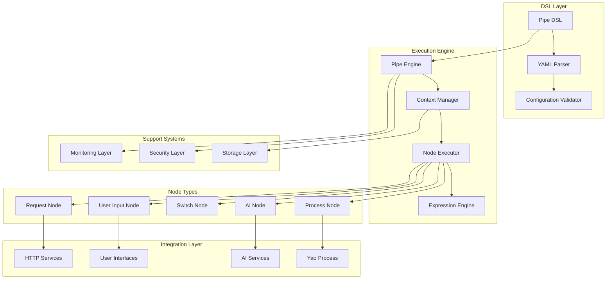

## 核心组件架构

### 1. Pipe Core Engine

Pipe Core Engine 是整个系统的核心，负责协调各个组件的工作。

```go
// Pipe 结构体
type Pipe struct {
    // 配置信息
    ID        string
    Name      string
    Nodes     []Node
    Label     string
    Hooks     *Hooks
    Output    any
    Input     Input
    Whitelist Whitelist
    Goto      string

    // 运行时信息
    parent    *Pipe
    namespace string
    mapping   map[string]*Node
}
```

**职责：**

- DSL 解析和验证
- 节点关系管理
- 执行流程控制
- 安全策略实施

### 2. Context Manager

Context Manager 管理 Pipe 的执行上下文，是状态管理的核心。

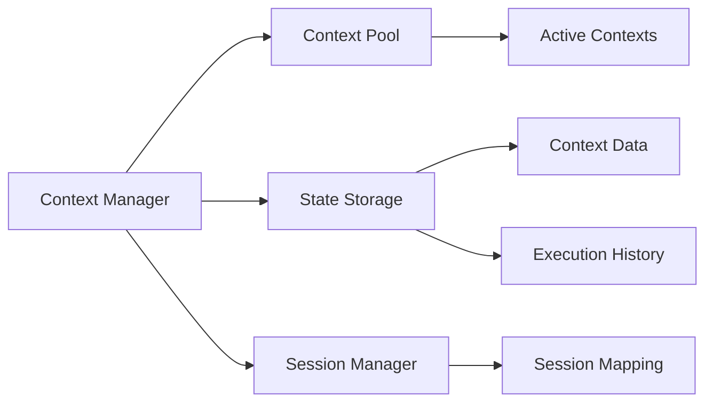

**核心功能：**

```go
type Context struct {
    *Pipe                    // 关联的 Pipe
    id      string           // 唯一标识
    parent  *Context         // 父上下文
    context context.Context // Go context

    // 数据存储
    global  map[string]interface{}
    sid     string
    current *Node

    // 执行历史
    in      map[*Node][]any
    out     map[*Node]any
    history map[*Node][]Prompt

    // 输入输出
    input  []any
    output any
}
```

### 3. Node Executor

Node Executor 负责执行各种类型的节点。

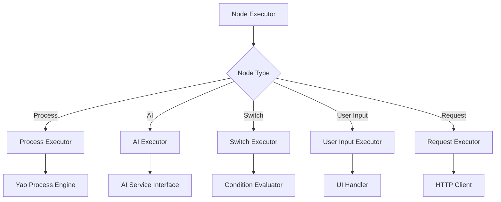

## 数据流架构

### 1. 数据流向

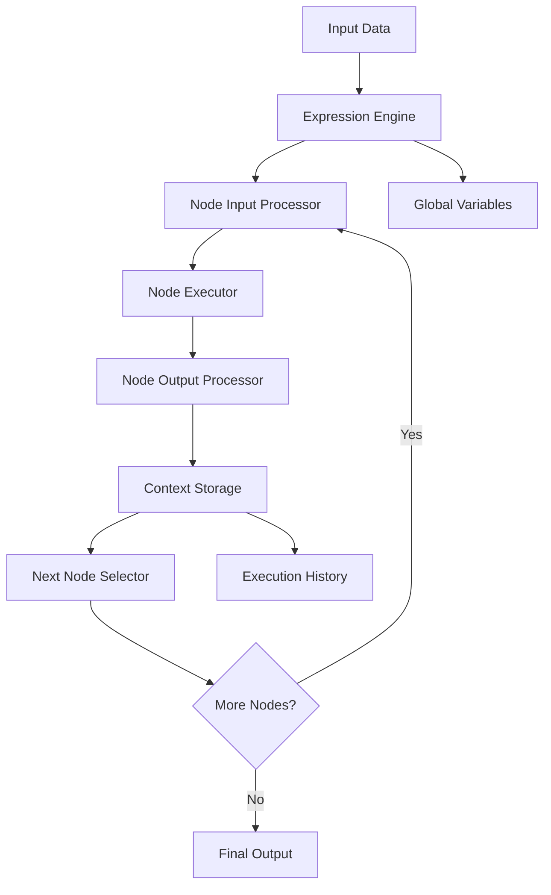

### 2. 表达式处理流程

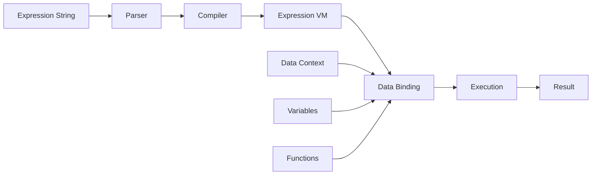

## 节点架构详情

### 1. Process Node

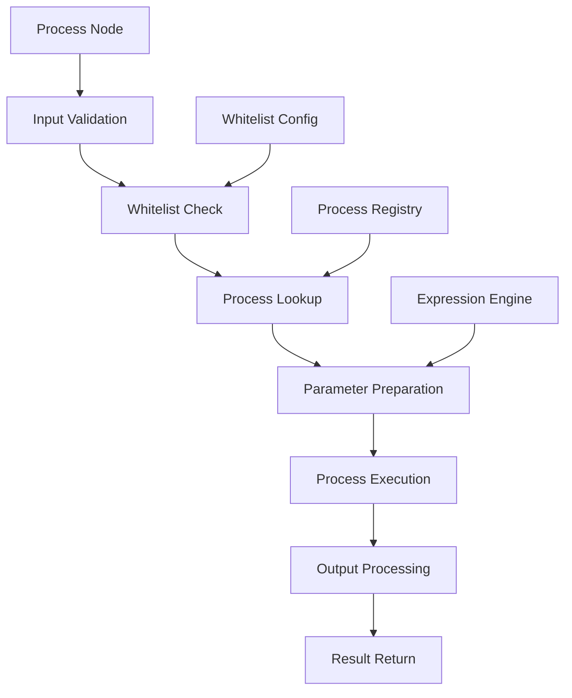

### 2. AI Node

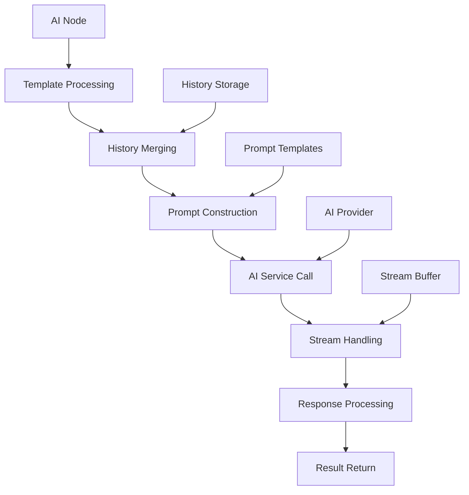

### 3. Switch Node

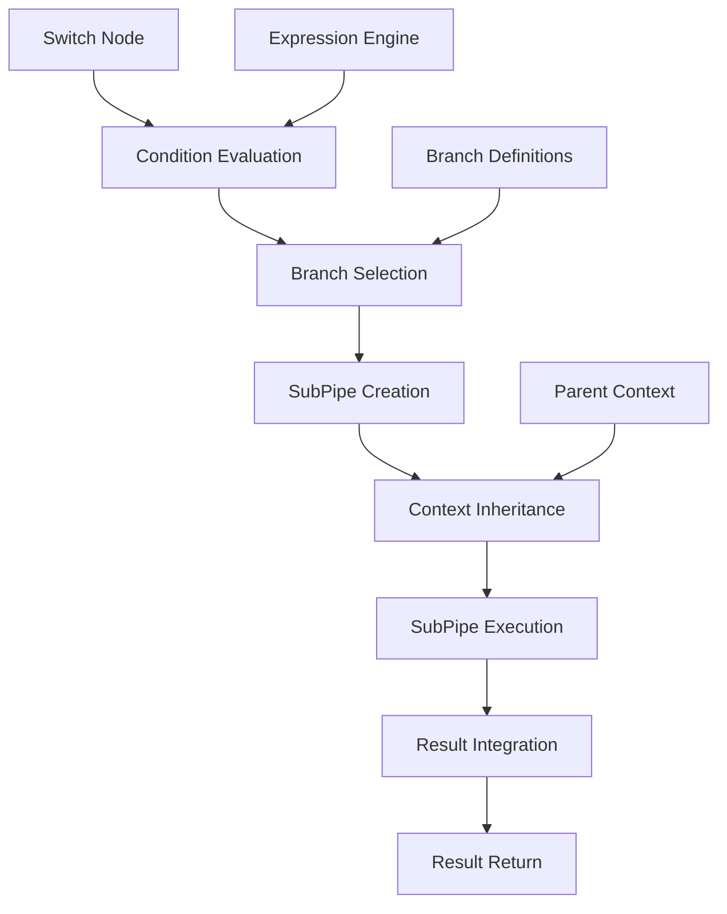

## 安全架构

### 1. 多层安全防护

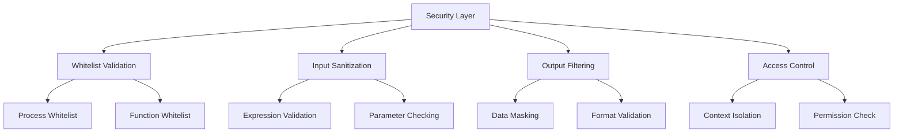

### 2. 沙箱机制

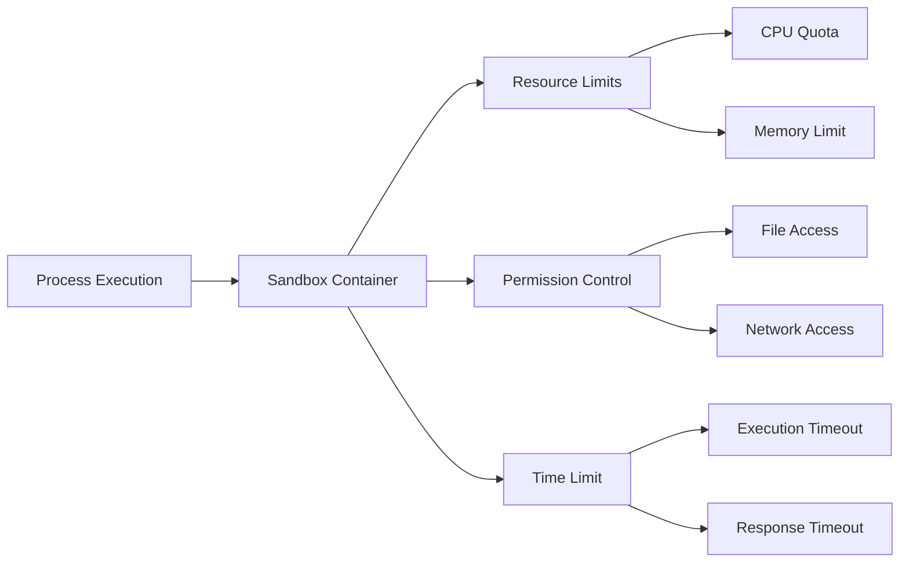

## 存储架构

### 1. Context 存储

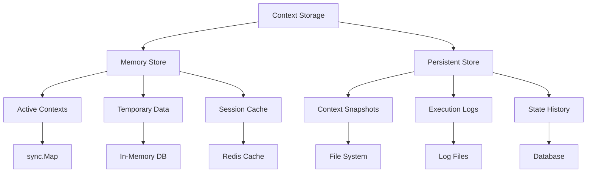

### 2. 数据生命周期

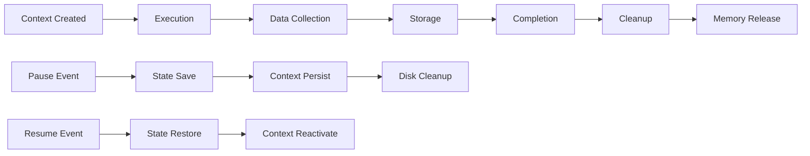

## 扩展架构

### 1. 插件系统

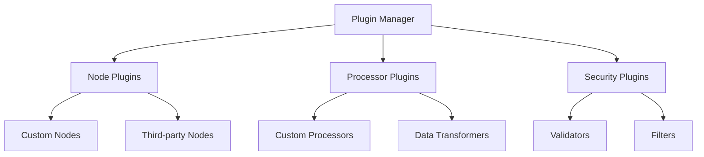

### 2. 接口设计

```go
// 节点执行器接口
type NodeExecutor interface {
    Execute(ctx *Context, input Input) (any, error)
    Validate() error
    GetType() string
}

// 表达式处理器接口
type ExpressionProcessor interface {
    Compile(expr string) (Program, error)
    Execute(program Program, data Data) (any, error)
}

// 存储接口
type ContextStorage interface {
    Store(id string, ctx *Context) error
    Load(id string) (*Context, error)
    Delete(id string) error
    List() []string
}
```

## 监控架构

### 1. 性能监控

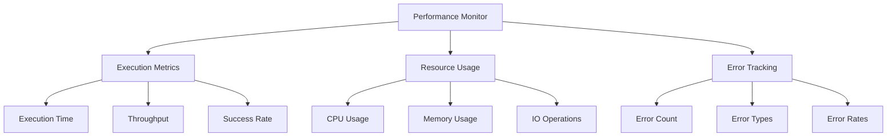

### 2. 日志系统

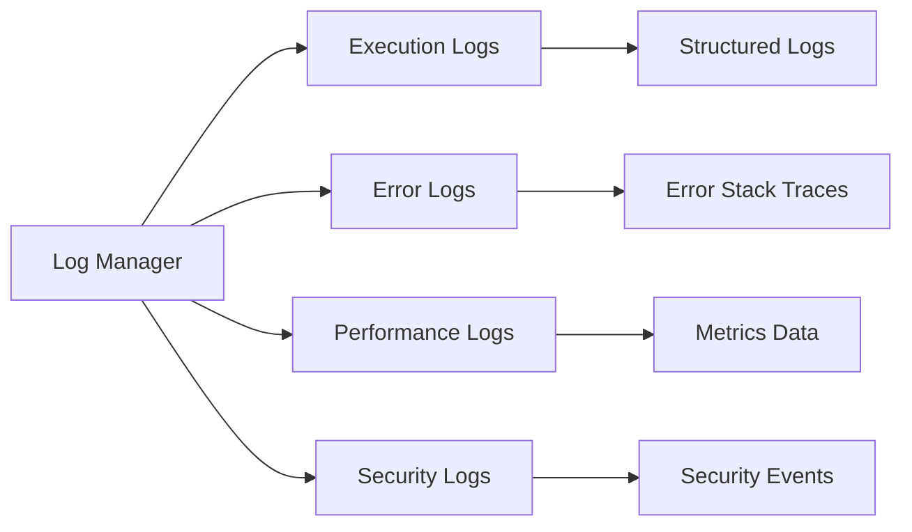

## 部署架构

### 1. 单机部署

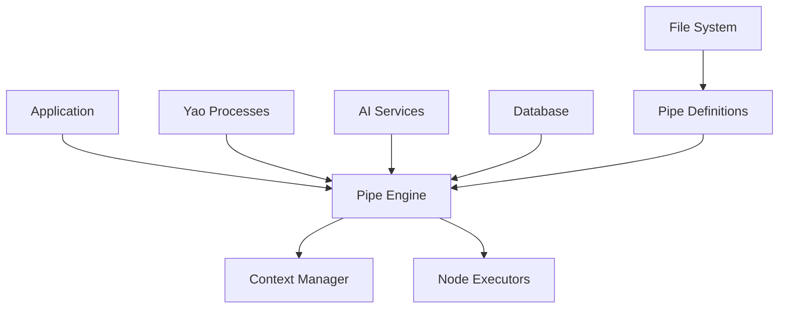

### 2. 分布式部署

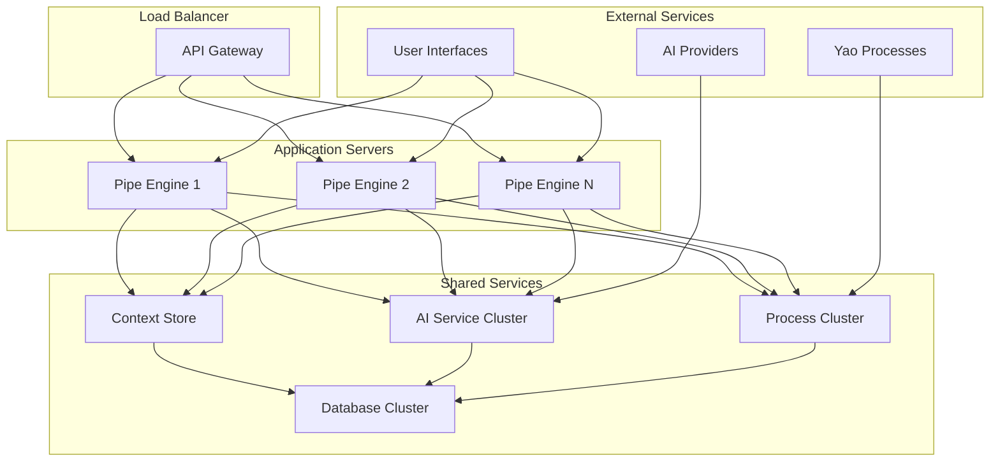

## 性能优化架构

### 1. 缓存层

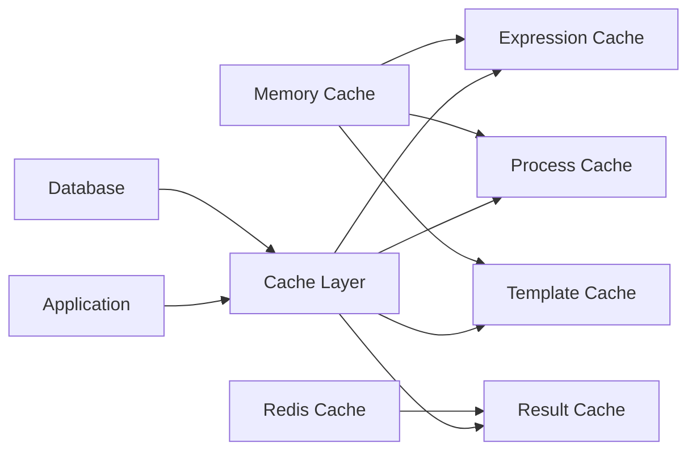

### 2. 连接池

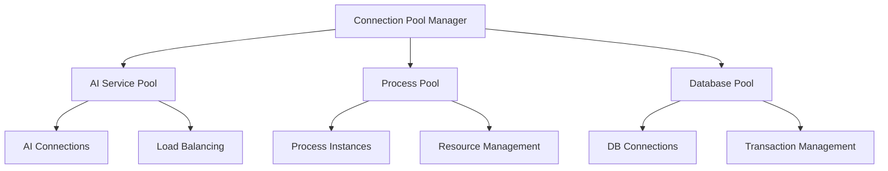

## 错误处理架构

### 1. 错误分类

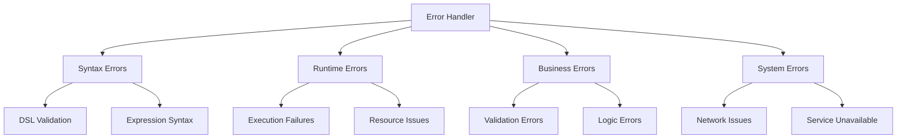

### 2. 恢复机制

```mermaid
graph LR
    A[Error Detection] --> B[Error Classification]
    B --> C[Recovery Strategy]
    C --> D[Retry Mechanism]
    C --> E[Fallback Handler]
    C --> F[Graceful Degradation]

    D --> G[Exponential Backoff]
    E --> H[Alternative Path]
    F --> I[Limited Functionality]
```

这个架构设计为 Pipe 提供了强大的扩展性、高性能和良好的可维护性。各个组件之间职责清晰，接口标准，便于未来的功能扩展和性能优化。
