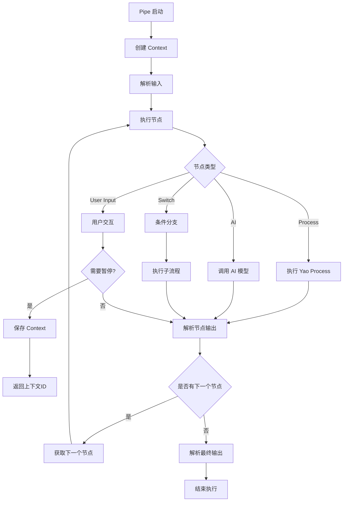

# 执行流程

Pipe 的执行流程由多个关键组件协同完成，包括上下文管理、节点执行、状态保存和恢复等。本节详细介绍 Pipe 的执行机制。

## 执行架构概览



## 核心组件

### 1. Context (上下文)

Context 是 Pipe 执行的核心数据结构，管理执行状态和数据流。

```go
type Context struct {
    *Pipe                    // 关联的 Pipe
    id      string           // 唯一标识
    parent  *Context         // 父上下文（用于 Switch 分支）

    context context.Context // Go context
    global  map[string]interface{} // $global
    sid     string          // $sid
    current *Node           // 当前执行节点

    in      map[*Node][]any  // 节点输入历史
    out     map[*Node]any    // 节点输出历史
    history map[*Node][]Prompt // AI 提示词历史

    input  []any            // $input
    output any              // $output
}
```

### 2. 节点执行器

每个节点类型都有对应的执行器：

- **Process 执行器**: 调用 Yao Process
- **AI 执行器**: 调用 AI 模型
- **Switch 执行器**: 条件分支逻辑
- **User Input 执行器**: 用户交互处理

### 3. 表达式引擎

处理数据绑定和动态计算，支持复杂的表达式语法。

## 执行流程详解

### 1. 初始化阶段

```yaml
# 1. 创建 Pipe 实例
pipe, err := New([]byte(dsl))

# 2. 创建执行上下文
ctx := pipe.Create()

# 3. 配置上下文
ctx.WithGlobal(data).WithSid(sid)
```

```go
// Context 创建过程
func (pipe *Pipe) Create() *Context {
    id := uuid.NewString()  // 生成唯一ID
    ctx := &Context{
        id:      id,
        Pipe:    pipe,
        in:      make(map[*Node][]any),
        out:     make(map[*Node]any),
        history: make(map[*Node][]Prompt),
        current: nil,
        input:   []any{},
        output:  nil,
    }

    // 设置起始节点
    if pipe.HasNodes() {
        ctx.current = &pipe.Nodes[0]
    }

    contexts.Store(id, ctx)  // 保存到全局存储
    return ctx
}
```

### 2. 执行阶段

#### 2.1 输入解析

```go
// 解析 Pipe 级输入
func (ctx *Context) parseInput(input Input) (Input, error) {
    ctx.input = input

    // 如果有输入表达式，进行替换
    if ctx.Input != nil && len(ctx.Input) > 0 {
        data := ctx.data(nil)
        input, err := data.replaceArray(ctx.Input)
        if err != nil {
            return nil, err
        }
        ctx.input = input
        return input, nil
    }
    return input, nil
}
```

#### 2.2 节点执行

```go
// 执行节点
func (ctx *Context) exec(node *Node, input Input) (output any, err error) {
    var out any

    switch node.Type {
    case "process":
        out, err = node.YaoProcess(ctx, input)
    case "ai":
        out, err = node.AI(ctx, input)
    case "switch":
        out, err = node.Case(ctx, input)
    case "user-input":
        var pause bool = false
        out, pause, err = node.Render(ctx, input)
        if pause {
            return out, nil  // 暂停执行
        }
    default:
        return nil, node.Errorf(ctx, "type '%s' not support", node.Type)
    }

    // 继续执行下一个节点
    if err == nil {
        next, eof, err := ctx.next()
        if !eof && err == nil {
            return ctx.exec(next, anyToInput(out))
        }
    }

    return output, err
}
```

#### 2.3 节点输出解析

```go
// 解析节点输出
func (ctx *Context) parseNodeOutput(node *Node, output any) (any, error) {
    ctx.out[node] = output

    if node.Output != nil {
        data := ctx.data(node)
        output, err := data.replace(node.Output)
        if err != nil {
            return nil, err
        }
        ctx.out[node] = output
        return output, nil
    }

    return output, nil
}
```

### 3. 节点跳转逻辑

```go
// 获取下一个节点
func (ctx *Context) next() (*Node, bool, error) {
    if ctx.current == nil {
        return nil, true, nil
    }

    // 处理 Goto 跳转
    if ctx.current.Goto != "" {
        data := ctx.data(ctx.current)
        next, err := data.replaceString(ctx.current.Goto)
        if err != nil {
            return nil, false, err
        }

        if next == "EOF" {
            return nil, true, nil  // 结束
        }

        if node, has := ctx.mapping[next]; has {
            ctx.current = node
            return ctx.current, false, nil
        }
        return nil, false, ctx.Errorf("node %s not found", next)
    }

    // 顺序执行下一个节点
    next := ctx.current.index + 1
    if next >= len(ctx.Nodes) {
        return nil, true, nil  // 结束
    }

    ctx.current = &ctx.Nodes[next]
    return ctx.current, false, nil
}
```

## 特殊执行场景

### 1. User Input 节点的暂停和恢复

#### 暂停执行

```go
// User Input 节点可以暂停执行等待用户输入
func (node *Node) Render(ctx *Context, input Input) (any, bool, error) {
    switch node.UI {
    case "cli":
        // CLI 界面直接执行
        output, err := node.renderCli(ctx, input)
        return output, false, nil

    default:
        // 其他界面类型暂停执行
        input, err := ctx.parseNodeInput(node, input)
        return ResumeContext{
            ID:    ctx.id,
            Input: input,
            Node:  node,
            Data:  ctx.data(node),
            Type:  node.Type,
            UI:    node.UI,
        }, true, nil  // 暂停执行
    }
}
```

#### 恢复执行

```go
// 恢复被暂停的执行
func (ctx *Context) Resume(id string, args ...any) any {
    v, err := ctx.resume(args...)
    if err != nil {
        exception.New("pipe: %s %s", 500, ctx.Name, err).Throw()
    }
    return v
}

func (ctx *Context) resume(args ...any) (any, error) {
    if ctx.current == nil {
        return nil, ctx.Errorf("pipe %s has no nodes", ctx.Name)
    }

    node := ctx.current
    output, err := ctx.parseNodeOutput(node, args)
    if err != nil {
        return nil, node.Errorf(ctx, "%v", err)
    }

    // 继续执行下一个节点
    next, eof, err := ctx.next()
    if eof {
        defer Close(ctx.id)
        output, err := ctx.parseOutput()
        if err != nil {
            return nil, err
        }
        return output, nil
    }

    return ctx.exec(next, anyToInput(output))
}
```

### 2. Switch 节点的子流程执行

```go
// Switch 节点执行子流程
func (node *Node) Case(ctx *Context, input Input) (any, error) {
    // 查找匹配的分支
    var child *Pipe = node.Switch["default"]
    data := ctx.data(node)

    for expr, pip := range node.Switch {
        expr, err := data.replaceString(expr)
        if err != nil {
            return nil, err
        }

        v, err := data.Exec(expr)
        if err != nil {
            return nil, err
        }

        if v == true {
            child = pip
        }
    }

    // 执行子流程
    var res any = nil
    subctx := child.Create().inheritance(ctx)
    if subctx.current != nil {
        res, err = subctx.Exec(input...)
        if err != nil {
            return nil, err
        }
    }

    output, err := ctx.parseNodeOutput(node, res)
    if err != nil {
        return nil, err
    }

    return output, nil
}
```

### 3. AI 节点的流式处理

```go
// AI 节点支持流式响应
func (node *Node) chatCompletions(ctx *Context, prompts []Prompt, options map[string]interface{}) (any, error) {
    ai, err := openai.NewMoapi(node.Model)
    if err != nil {
        return nil, err
    }

    response := []string{}
    content := []string{}

    // 流式处理回调
    _, ex := ai.ChatCompletions(promptsToMap(prompts), node.Options, func(data []byte) int {
        if len(data) > 5 && string(data[:5]) == "data:" {
            var res ChatCompletionChunk
            err := jsoniter.Unmarshal(data[5:], &res)
            if err != nil {
                return 0
            }
            if len(res.Choices) > 0 {
                response = append(response, res.Choices[0].Delta.Content)
            }
        } else {
            content = append(content, string(data))
        }
        return 1
    })

    if ex != nil {
        return nil, node.Errorf(ctx, "AI error: %s", ex.Message)
    }

    raw := strings.Join(response, "")

    // 尝试解析为 JSON
    var res any
    err = jsoniter.UnmarshalFromString(raw, &res)
    if err != nil {
        return raw, nil  // 返回原始字符串
    }

    return res, nil
}
```

## 数据流管理

### 1. 数据绑定上下文

```go
// 构建数据绑定上下文
func (ctx *Context) data(node *Node) Data {
    data := map[string]any{
        "$sid":    ctx.sid,
        "$global": ctx.global,
        "$input":  ctx.input,
        "$output": ctx.output,
    }

    // 添加节点输入历史
    if ctx.in != nil {
        for k, v := range ctx.in {
            key := fmt.Sprintf("$node.%s.in", k.Name)
            data[key] = v
        }
    }

    // 添加节点输出历史
    if ctx.out != nil {
        for k, v := range ctx.out {
            data[k.Name] = v
        }
    }

    // 添加当前节点的输入输出
    if node != nil {
        data["$in"] = ctx.in[node]
        data["$out"] = ctx.out[node]
    }

    return data
}
```

### 2. 表达式替换

```go
// 替换表达式中的变量
func (data Data) replace(value any) (any, error) {
    switch v := value.(type) {
    case string:
        return data.replaceAny(v)
    case []any:
        return data.replaceArray(v)
    case map[string]any:
        return data.replaceMap(v)
    case Input:
        return data.replaceArray(v)
    }
    return value, nil
}

// 替换字符串中的表达式
func (data Data) replaceString(value string) (string, error) {
    if !IsExpression(value) {
        return value, nil
    }

    v, err := data.ExecString(value)
    if err != nil {
        return "", err
    }
    return v, nil
}
```

## 状态管理

### 1. Context 生命周期

```go
var contexts = sync.Map{}  // 全局 Context 存储

// 创建 Context
func (pipe *Pipe) Create() *Context {
    ctx := &Context{...}
    contexts.Store(id, ctx)  // 保存到存储
    return ctx
}

// 恢复 Context
func Open(id string) (*Context, error) {
    ctx, ok := contexts.Load(id)
    if !ok {
        return nil, fmt.Errorf("context %s not found", id)
    }
    return ctx.(*Context), nil
}

// 关闭 Context
func Close(id string) {
    contexts.Delete(id)
}
```

### 2. 继承机制

Switch 分支使用继承机制共享父上下文的数据：

```go
// 子上下文继承父上下文
func (ctx *Context) inheritance(parent *Context) *Context {
    ctx.in = parent.in          // 继承输入历史
    ctx.out = parent.out        // 继承输出历史
    ctx.history = parent.history // 继承 AI 历史
    ctx.global = parent.global  // 继承全局数据
    ctx.sid = parent.sid        // 继承会话ID
    ctx.parent = parent         // 设置父上下文
    return ctx
}
```

## 错误处理

### 1. 节点级错误

```go
// 节点错误格式化
func (node *Node) Errorf(ctx *Context, format string, a ...any) error {
    message := fmt.Sprintf(format, a...)
    pid := ctx.Pipe.ID
    return fmt.Errorf("pipe: %s nodes[%d](%s) %s (%s)", pid, node.index, node.Name, message, ctx.id)
}
```

### 2. Context 级错误

```go
// Context 错误格式化
func (ctx *Context) Errorf(format string, a ...any) error {
    message := fmt.Sprintf(format, a...)
    return fmt.Errorf("pipe: %s(%s) %s %s", ctx.Name, ctx.Pipe.ID, ctx.id, message)
}
```

### 3. 执行异常

```go
// 执行过程中的异常处理
func (ctx *Context) Run(args ...any) any {
    v, err := ctx.Exec(args...)
    if err != nil {
        exception.New("pipe: %s %s", 500, ctx.Name, err).Throw()
    }
    return v
}
```

## 性能优化

### 1. 表达式编译

```go
// 表达式预编译
func (data Data) New(stmt string) (*vm.Program, error) {
    // 清理表达式语法
    stmt = stmtRe.ReplaceAllStringFunc(stmt, func(stmt string) string {
        matches := stmtRe.FindStringSubmatch(stmt)
        if len(matches) > 0 {
            stmt = strings.ReplaceAll(stmt, matches[0], matches[1])
        }
        return stmt
    })

    // 编译表达式
    return expr.Compile(stmt, append([]expr.Option{expr.Env(data)}, options...)...)
}
```

### 2. 内存管理

- 使用 `sync.Map` 进行并发安全的 Context 存储
- 及时清理已完成的 Context
- 避免循环引用导致内存泄漏

### 3. 并发控制

- 每个 Context 独立执行，互不干扰
- Switch 分支创建新的子 Context
- 支持并发执行多个 Pipe 实例

## 调试支持

### 1. 执行日志

```go
// 可以添加执行日志记录
func (ctx *Context) exec(node *Node, input Input) (output any, err error) {
    log.Debug("Executing node: %s (%s)", node.Name, node.Type)

    // 执行节点逻辑...

    log.Debug("Node %s completed, output: %v", node.Name, output)
    return output, err
}
```

### 2. 状态检查

```go
// 检查 Context 状态
func (ctx *Context) Status() map[string]interface{} {
    return map[string]interface{}{
        "id": ctx.id,
        "pipe": ctx.Name,
        "current": ctx.current.Name,
        "completed_nodes": len(ctx.out),
        "total_nodes": len(ctx.Nodes),
    }
}
```
