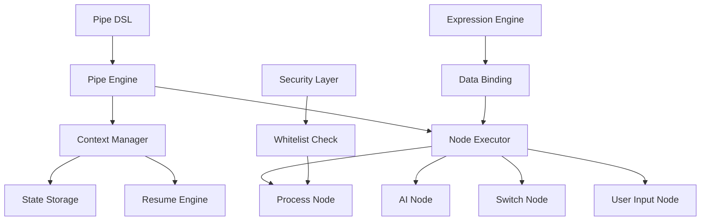

# Pipe 概览

Pipe 是 Yao 框架中用于复杂逻辑编排的 Widget，作为 Flow 的替代方案。它提供了一种基于节点的流程编排方式，支持条件分支、AI 集成、用户交互等高级功能。

## 🚨 重要提示

**Pipe Widget 是实验性功能，不建议在生产环境中使用。**

## 核心特性

- 🔄 **逻辑编排**: 通过节点组合实现复杂业务逻辑
- 🔀 **条件分支**: 支持 Switch 节点进行条件判断
- 🤖 **AI 集成**: 内置 AI 节点，支持大语言模型调用
- 👥 **用户交互**: 支持多种用户输入界面（CLI、Web、App、小程序）
- ⚙️ **Process 调用**: 可以调用 Yao Process 执行业务逻辑
- 🌊 **流式处理**: 支持流式 AI 响应
- 💾 **状态管理**: 支持上下文保存和恢复

## 使用场景

1. **图形界面生成 DSL**: 通过可视化界面生成流程配置
2. **简单功能扩展**: 在应用端实现简单的功能逻辑扩展
3. **交互式流程**: 需要用户输入的交互式业务流程
4. **AI 驱动应用**: 集成 AI 能力的智能应用

## 架构概览



## 文档结构

本部分包含以下内容：

- [DSL 语法](./dsl.md) - Pipe 配置语法详解
- [节点类型](./nodes.md) - 各种节点类型的使用方法
- [表达式引擎](./expression.md) - 表达式语法和数据处理
- [执行流程](./execution.md) - Pipe 的执行机制
- [API 参考](./api.md) - 完整的 API 文档
- [最佳实践](./best-practices.md) - 使用建议和注意事项
- [示例代码](./examples.md) - 实际应用案例

## 快速开始

> ⚠️ **重要**: Pipe DSL 使用 **JSON 格式**！
>
> 📖 查看 [JSON 格式说明](./JSON-格式说明.md) 了解详细的转换指南

### 1. 创建 Pipe 配置

```json
{
  "name": "translator",
  "label": "翻译助手",
  "nodes": [
    {
      "name": "input",
      "type": "user-input",
      "ui": "cli",
      "label": "请输入要翻译的内容"
    },
    {
      "name": "translate",
      "type": "ai",
      "prompts": [
        {
          "role": "system",
          "content": "你是一个专业的翻译助手"
        },
        {
          "role": "user",
          "content": "请将以下内容翻译成英文：{{ $in[0] }}"
        }
      ],
      "model": "gpt-3.5-turbo"
    },
    {
      "name": "output",
      "type": "user-input",
      "ui": "cli",
      "label": "翻译结果",
      "autofill": {
        "value": "{{ $out[1] }}"
      }
    }
  ]
}
```

### 2. 运行 Pipe

```bash
# 运行已加载的 Pipe
yao run pipes.translator

# 直接从 DSL 创建并运行
yao run pipe.Create '<DSL 内容>'

# 恢复中断的 Pipe
yao run pipe.Resume <context-id>
```

## 核心概念

### 节点 (Node)

节点是 Pipe 的基本执行单元，每个节点都有特定的类型和功能。

### 上下文 (Context)

Context 管理 Pipe 的执行状态，包括输入输出、全局数据、执行历史等。

### 表达式 (Expression)

使用 `{{ }}` 语法的表达式，用于数据绑定和动态计算。

### 白名单 (Whitelist)

安全机制，限制可执行的 Yao Process。

## 下一步

- 查看 [DSL 语法](./dsl.md) 了解配置方法
- 阅读 [节点类型](./nodes.md) 了解各种节点功能
- 参考 [示例代码](./examples.md) 查看实际应用
