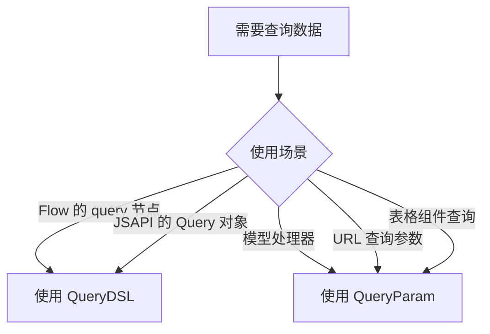

# Query

Yao 查询系统提供了两种查询语法：**QueryDSL** 和 **QueryParam**。本章节将详细介绍它们的用法和区别。

## 文档导航

### 📚 核心文档

| 文档                                            | 说明                            | 适合人群                          |
| ----------------------------------------------- | ------------------------------- | --------------------------------- |
| [查询数据](查询数据.md)                         | QueryDSL 完整语法参考（主文档） | 所有开发者，需要深入理解 QueryDSL |
| [QueryParam语法](QueryParam语法.md)             | QueryParam 完整语法参考         | 使用模型处理器和 URL 查询的开发者 |
| [QueryParam与QueryDSL](QueryParam与QueryDSL.md) | 两种语法的详细对比              | 所有开发者，必须了解区别          |

### 💡 实战指南

| 文档                                              | 说明                                     | 场景                         |
| ------------------------------------------------- | ---------------------------------------- | ---------------------------- |
| [复杂数据查询](复杂数据查询.md)                   | 实战示例，包含 Flow 和 Script 的完整案例 | 需要实现复杂查询功能的开发者 |
| [在url中使用QueryParam](在url中使用QueryParam.md) | URL 参数转换详细说明                     | 开发 RESTful API 的开发者    |

### 🔧 技术细节

| 文档                                              | 说明                         | 阅读时机                       |
| ------------------------------------------------- | ---------------------------- | ------------------------------ |
| [JSAPI](JSAPI.md)                                 | JSAPI 使用 QueryDSL 的示例   | 使用 JavaScript 编写查询逻辑时 |
| [Flow处理器与JSAPI区别](Flow处理器与JSAPI区别.md) | Flow 与 JSAPI 的查询机制区别 | 需要理解底层执行逻辑时         |
| [Flow Query绑定变量](Flow%20Query绑定变量.md)     | Flow 中查询变量的绑定方法    | 在 Flow 中使用查询时           |

## 快速开始

### QueryDSL vs QueryParam 的核心区别

| 特性             | QueryDSL                                                        | QueryParam                                                             |
| ---------------- | --------------------------------------------------------------- | ---------------------------------------------------------------------- |
| **Where 字段名** | `field`                                                         | `column`                                                               |
| **操作符字段**   | `op`                                                            | `op`（但取值不同）                                                     |
| **OR 条件**      | `"or": true`                                                    | `"method": "orwhere"`                                                  |
| **操作符值**     | `=`, `>=`, `<=`, `<>`, `like`, `match`, `in`, `null`, `notnull` | `eq`, `gt`, `lt`, `ge`, `le`, `like`, `match`, `in`, `null`, `notnull` |
| **主要场景**     | Flow 的 `query` 节点、JSAPI 的 Query 对象                       | 模型处理器、URL 查询参数                                               |

### 使用场景速查

<!-- links begin -->

- [查询数据](查询数据.md)
- [复杂数据查询](复杂数据查询.md)
- [在url中使用QueryParam](在url中使用QueryParam.md)
- [Flow Query绑定变量](Flow%20Query绑定变量.md)
- [Flow处理器与JSAPI区别](Flow处理器与JSAPI区别.md)
- [JSAPI](JSAPI.md)
- [QueryParam与QueryDSL](QueryParam与QueryDSL.md)
- [QueryParam语法](QueryParam语法.md)
<!-- links end -->
