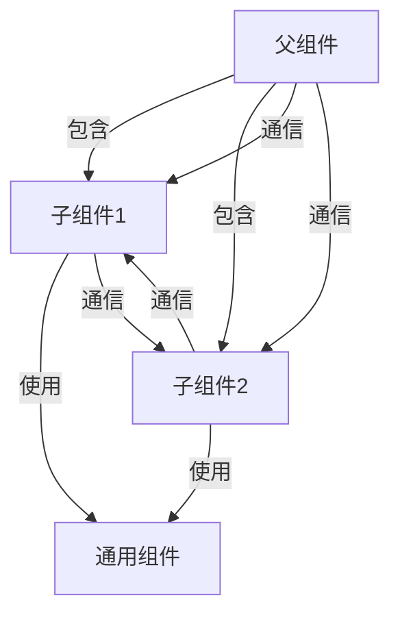

# 组件化开发

SUI 支持组件化开发，可以通过以下方式实现代码复用：

## 组件结构



### 1. 组件定义

```html
<!-- components/header.html -->
<header class="site-header">
  <nav>
    <a href="/">首页</a>
    <a href="/about">关于</a>
  </nav>
</header>
```

### 2. 组件使用

```html
<!-- pages/index.html -->
<div is="/components/header"></div>
<main>页面内容</main>
```

## 组件通信

### 1. 数据传递

```html
<!-- 父组件 -->
<div is="components/header" title="网站标题"></div>

<!-- 子组件 -->
<header class="site-header">
  <h1></h1>
</header>
```

### 2. 事件处理

```html
<!-- 父组件 -->
<div is="components/button" s:on-click="handleClick"></div>

<!-- 子组件 -->
<button s:on-click="emit('click')">点击</button>
```

## 插槽使用

### 1. 定义插槽

```html
<!-- components/layout.html -->
<div class="layout">
  <header></header>
  <main></main>
  <footer></footer>
</div>
```

### 2. 使用插槽

```html
<!-- pages/index.html -->
<div is="components/layout">
  <slog name="header">自定义头部</slot>
  <slog name="content">自定义内容</slot>
  <slog name="footer">自定义底部</slot>
</div>
```

## 最佳实践

1. 将通用组件放在 `components` 目录
2. 使用 `is` 引入组件
3. 通过数据传递实现组件通信
4. 使用 CSS 模块化避免样式冲突
5. 合理使用插槽增加组件灵活性
6. 保持组件的单一职责
7. 使用 TypeScript 增强类型安全

## 示例

### 1. 导航组件

```html
<!-- components/nav.html -->
<nav class="site-nav">
  <ul>
    <li s:for="items" s:for-item="item">
      <a href="{{ item.url }}" class="">
        {{ item.text }}
      </a>
    </li>
  </ul>
</nav>
```

### 2. 卡片组件

```html
<!-- components/card.html -->
<div class="card">
  <header>
    <slog name="header"></slot>
  </header>
  <content>
    <slog name="content"></slot>
  </content>
  <div class="card-footer">
    <footer>
      <button s:on-click="emit('action')"></button>
    </footer>
  </div>
</div>
```

### 3. 使用组件

```html
<!-- pages/index.html -->
<div
  is="/components/nav"
  items="{{ navigation }}"
  active="{{ currentPath }}"
></div>

<div
  is="/components/card"
  title="标题"
  content="内容"
  s:data-button-text="点击"
>
  <slog name="header">自定义头部</slot>
  <slog name="content">自定义内容</slot>
  <slog name="footer">
    <button s:on-click="handleAction">自定义按钮</button>
  </slot>
</div>
```
