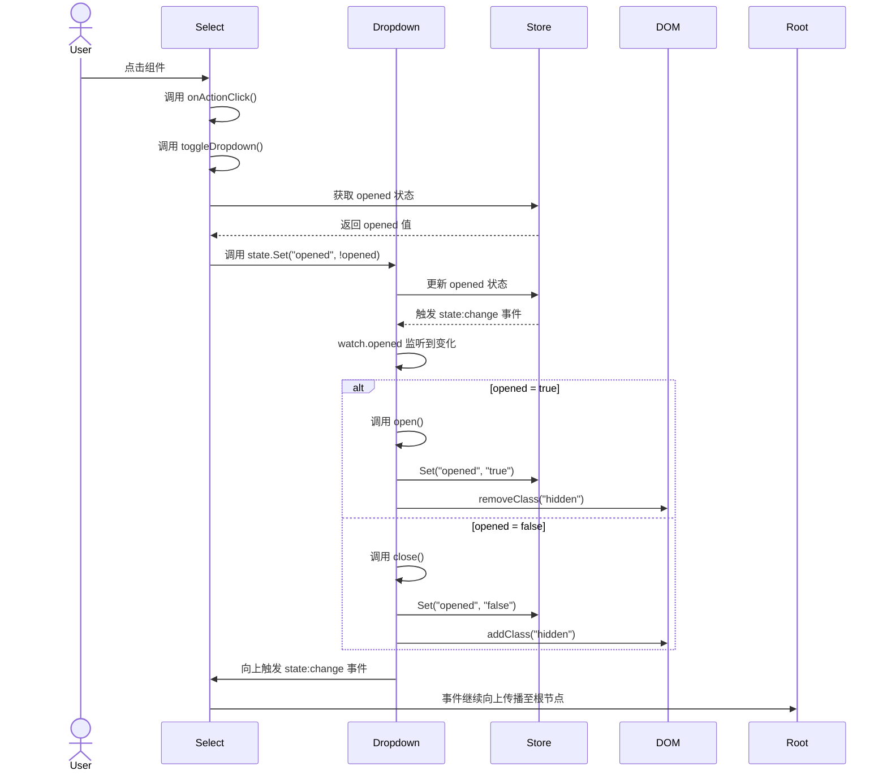

# SUI组件的状态管理

SUI组件的状态有两种：一种是组件本身的状态，一种是组件之间的状态。

组件本身的状态管理使用`store`对象，用于存储当前组件状态，每一个组件都有自己的`store`,并且使用了html自定义属性进行状态的保存。

组件之间的状态管理使用`state`对象，用于传递组件间状态变化的状态。

## `state`状态管理

`state`状态管理主要是为了在不同组件之间进行通信。每一个组件初始化后都会监听`state:change`事件。当用户调用目标组件的state->Set方法时，会触发此组件的`state:change`事件，并且事件默认情况下会不断的向上传传递，当前组件`state:change`响应->上级组件`state:change`响应。

比如现在有两个组件：Select与Dropdown，两个是父子关系。

Select组件是一个下拉框组件，Dropdown组件是一个下拉框的下拉列表组件。

Select组件的html代码如下：

```html
<select s:on-click="onActionClick">
  <Dropdown> </Dropdown>
</select>
```

先给Dropdown加上状态监听处理，比如这里监听opened状态的变化，当opened状态为true时，打开Dropdown组件，否则关闭Dropdown组件。

dropdown.ts:

```ts
const self = this as Component;
self.watch = {
  opened: (value: boolean) => {
    if (value) return open();
    return close();
  }
};
function open() {
  self.store.Set('opened', 'true');
  self.$root.removeClass('hidden');
}

function close() {
  self.store.Set('opened', 'false');
  self.$root.addClass('hidden');
}
```

Select组件的ts代码如下，当用户点击Select组件时，会调用onActionClick方法，这个方法会调用toggleDropdown方法， 此方法会查找dropdown组件，并把它的opened状态设置成true或是false。

select.ts:

```ts
self.onActionClick = (event: Event, data: EventData, detail: EventDetail) => {
  toggleDropdown();
};

function toggleDropdown() {
  const opened = self.store.Get('opened') == 'true' ? true : false;
  const dropdown = self.root.querySelector(`[name="options"]`) as HTMLElement;
  $$(dropdown).state.Set('opened', !opened);
}
```

整个过程是这样的：

1. 用户点击Select组件，会调用onActionClick方法，这个方法会调用toggleDropdown方法。
2. toggleDropdown方法会查找dropdown组件，并把它的opened状态设置成true或是false。
3. dropdown组件的opened状态发生变化，会触发dropdown组件的`state:change`事件，事件会向上传递，直到根节点。
4. 如果目标组件中在watch函数中监听了相关状态的变化，会执行相关的处理逻辑。

详细的流程如下：


