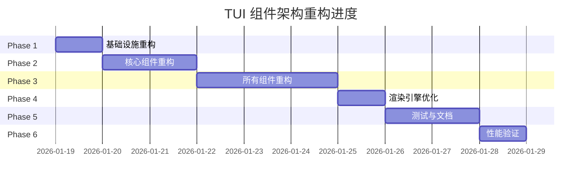

建立在对现有代码（`registry.go`, `table.go`, `model.go`, `render.go`）以及上传的重构计划（`COMPONENT_ARCHITECTURE_REFACTOR_PLAN.md`）的深入分析基础上，当前的组件架构存在一个严重的 **P0 级设计缺陷**：组件工厂在创建实例时忽略了 `RenderConfig`（即初始 Props），导致组件以空状态初始化，且后续的 `UpdateRenderConfig` 可能无法正确重建底层模型（如 Table 的 columns/rows）。

以下是基于最佳实践的重构建议与详细的 TODO 列表：

### 核心建议：建立“响应式”组件声明周期

目前的实现更接近“命令式”，即先创建、再更新。最佳设计应采用 **响应式声明周期**，确保组件实例在任何时候都与其 Props 保持同步。

1. **构造函数必须消费配置**：工厂函数不应仅仅是 `New(id)`，必须是 `New(id, initialProps)`。
2. **强制的状态与模型解耦**：组件的底层模型（如 `table.Model`）应当是可重置或按需更新的，而不是仅在构造时初始化一次。
3. **统一的更新契约**：`UpdateRenderConfig` 必须负责处理所有副作用（如重新计算列宽、更新数据源），而不仅仅是简单的赋值。

---

### 详细建议方案

#### 1. 完善组件工厂注册 (`registry.go`)

当前的注册逻辑中，大部分组件在匿名函数中直接丢弃了 `config` 参数。

- **建议**：修改工厂函数，将 `config.Data`（即解析后的 Props）传递给组件构造函数。

#### 2. 增强组件状态同步机制 (`table.go`)

`TableModel` 的 `UpdateRenderConfig` 逻辑目前仅更新了 `m.props`，并没有反映到 `m.Model`（即 `bubbles/table` 的核心模型）中。

- **建议**：在 `UpdateRenderConfig` 中加入逻辑，对比新旧数据，若列定义或行数据发生变化，需重新调用 `table.New` 或 `m.Model.SetColumns/SetRows`。

#### 3. 优化属性解析效率 (`render.go`)

`RenderComponent` 每次渲染都会调用 `resolveProps`。

- **建议**：引入简单的 **Change Detection (变更检测)**。只有当 `m.State` 中相关的 key 发生变化时，才重新解析 Props 并调用组件的 `UpdateRenderConfig`。

---

### 详细 TODO 列表

📝 **详细的任务清单已整理至**: `TODO_LIST.md`

该文档包含：

- ✅ 6个阶段的完整任务列表
- ✅ 每个 Task 的详细子任务
- ✅ 24个组件的改造明细
- ✅ 代码示例和实现指导
- ✅ 测试策略和验收标准

#### 快速链接

- [Phase 1: 基础设施重构 (1天)](#phase-1-基础设施重构)
- [Phase 2: 核心组件重构 (2天)](#phase-2-核心组件重构)
- [Phase 3: 所有组件重构 (3天)](#phase-3-所有组件重构)
- [Phase 4: 渲染引擎优化 (1天)](#phase-4-渲染引擎优化)
- [Phase 5: 测试与文档 (2天)](#phase-5-测试与文档)
- [Phase 6: 性能验证 (1天)](#phase-6-性能验证)

---

#### 阶段概览

---

### Phase 1: 基础设施重构

**目标**: 建立响应式组件生命周期的基础架构

**关键任务**:

1. 修改 `ComponentFactory` 类型定义，明确 `config` 参数作用
2. 增强 `ComponentInstanceRegistry`，添加配置验证和变更检测
3. 优化 `RenderComponent` 调用流程

**预计时间**: 1天

---

### Phase 2: 核心组件重构

**目标**: 以 Table 组件为模板，建立响应式组件的完整实现

**关键任务**:

1. **Table 组件完全重构** (1天)
   - 修改工厂函数签名，接受 `RenderConfig`
   - 实现智能的 `UpdateRenderConfig`
   - 判断何时重建模型 vs 轻量更新
   - 保持用户交互状态（滚动、选中）

2. **Menu 组件重构** (0.5天)
   - 修改工厂函数
   - 实现列表项更新逻辑
   - 保持选中状态

3. **List 组件重构** (0.5天)
   - 修改工厂函数
   - 实现列表项更新逻辑
   - 保持选中状态

**预计时间**: 2天

---

### Phase 3: 所有组件重构

**目标**: 将响应式模式应用到所有24个组件

**组件清单** (21个):

- Form, Input, Textarea, Chat, CRUD (P1 - 重要组件)
- FilePicker, Paginator, Progress, Spinner, Timer, Stopwatch (P2)
- Help, Key, Cursor, Footer, Viewport, Header, Text, StaticComponent (P2)

**每个组件包含的任务**:

1. 修改工厂函数签名
2. 实现配置解析
3. 增强UpdateRenderConfig
4. 更新测试

**预计时间**: 3天

---

### Phase 4: 渲染引擎优化

**目标**: 优化性能，减少不必要的渲染和更新

**关键任务**:

1. 优化 `resolveProps` - 添加缓存和变更检测
2. 优化 `UpdateRenderConfig` 触发 - 只在 props 变化时调用
3. 增强焦点管理 - 实现 focus/blur 事件系统

**预计时间**: 1天

---

### Phase 5: 测试与文档

**目标**: 确保质量和可维护性

**关键任务**:

1. 编写架构回归测试
2. 编写性能基准测试
3. 更新组件文档
4. 更新架构文档
5. 编写迁移指南

**预计时间**: 2天

---

### Phase 6: 性能验证与优化

**目标**: 验证性能，识别和修复瓶颈

**关键任务**:

1. 运行所有测试
2. 性能分析与优化 (pprof)
3. 内存泄漏检测

**预计时间**: 1天

---

## 涉及的组件清单 (24个)

| 组件            | Phase   | 优先级 | 当前状态  |
| --------------- | ------- | ------ | --------- |
| Table           | Phase 2 | 🔴 P0  | ⏳ 待重构 |
| Menu            | Phase 2 | 🔴 P0  | ⏳ 待重构 |
| List            | Phase 2 | 🔴 P0  | ⏳ 待重构 |
| Form            | Phase 3 | 🟡 P1  | ⏳ 待重构 |
| Input           | Phase 3 | 🟡 P1  | ⏳ 待重构 |
| Textarea        | Phase 3 | 🟡 P1  | ⏳ 待重构 |
| Chat            | Phase 3 | 🟡 P1  | ⏳ 待重构 |
| CRUD            | Phase 3 | 🟡 P1  | ⏳ 待重构 |
| FilePicker      | Phase 3 | 🟢 P2  | ⏳ 待重构 |
| Paginator       | Phase 3 | 🟢 P2  | ⏳ 待重构 |
| Progress        | Phase 3 | 🟢 P2  | ⏳ 待重构 |
| Spinner         | Phase 3 | 🟢 P2  | ⏳ 待重构 |
| Timer           | Phase 3 | 🟢 P2  | ⏳ 待重构 |
| Stopwatch       | Phase 3 | 🟢 P2  | ⏳ 待重构 |
| Help            | Phase 3 | 🟢 P2  | ⏳ 待重构 |
| Key             | Phase 3 | 🟢 P2  | ⏳ 待重构 |
| Cursor          | Phase 3 | 🟢 P2  | ⏳ 待重构 |
| Footer          | Phase 3 | 🟢 P2  | ⏳ 待重构 |
| Viewport        | Phase 3 | 🟢 P2  | ⏳ 待重构 |
| Header          | Phase 3 | 🟢 P2  | ⏳ 待重构 |
| Text            | Phase 3 | 🟢 P2  | ⏳ 待重构 |
| StaticComponent | Phase 3 | 🟢 P2  | ⏳ 待重构 |

---

## 涉及的文件清单

### 核心文件 (4个)

- ✅ `tui/registry.go` - 组件注册表
- ✅ `tui/component_registry.go` - 实例管理
- ✅ `tui/render.go` - 渲染引擎
- ✅ `tui/model.go` - 模型管理

### 组件文件 (25个)

- ✅ `tui/components/component_factories.go` - 工厂函数
- ✅ `tui/components/table.go` - Table 组件
- ✅ `tui/components/menu.go` - Menu 组件
- ✅ `tui/components/list.go` - List 组件
- [ ] `tui/components/form.go`
- [ ] `tui/components/input.go`
- [ ] `tui/components/textarea.go`
- [ ] `tui/components/chat.go`
- [ ] `tui/components/crud.go`
- [ ] ... 其他15个组件文件

### 测试文件 (新增)

- [ ] `tui/architecture_test.go` - 架构测试
- [ ] `tui/benchmark_test.go` - 性能测试

### 文档文件

- ✅ `tui/TODO_LIST.md` - 详细任务清单 (新增)
- ✅ `tui/COMPONENT_ARCHITECTURE_REFACTOR_PLAN.md` - 重构计划
- ✅ `tui/plan.md` - 本文档
- [ ] `tui/ARCHITECTURE.md` - 架构文档 (新增)
- [ ] `tui/MIGRATION_GUIDE.md` - 迁移指南 (新增)

### 预期效果

通过上述重构，你将解决 **P0 级设计缺陷**，实现：

1. **状态驱动 UI**：修改 `yao` 的 State，TUI 自动反映变化。
2. **组件复用**： interactive 组件（如输入框、表格）不会因为刷新而丢失输入焦点或滚动位置。
3. **一致性签名**：所有组件遵循相同的生命周期契约，降低后续开发 24+ 组件的复杂度。
