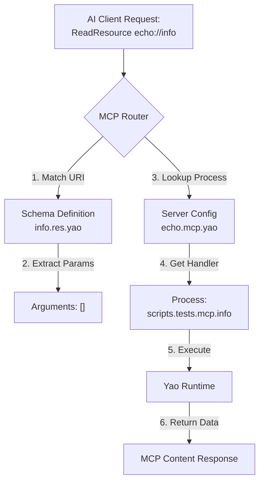

# Yao 的 MCP Resource（资源）配置采用了一种 **“声明式定义 + 动态绑定”** 的设计模式。

这种设计分为两部分：**MCP 服务器定义**（定义资源与处理器的关系）和 **Mapping 映射定义**（定义资源的对外 Schema 和参数转换逻辑）。

以下是详细的配置逻辑分析：

### 1\. 核心架构：两层配置逻辑

配置一个 Resource 需要在两个不同的文件中进行定义，它们协同工作：

1.  **入口定义 (`.mcp.yao`)**: 在 MCP 服务器配置文件中，声明资源 ID 对应的 **Yao Process (处理器)**。
2.  **Schema 定义 (`.res.yao`)**: 在 `mapping` 目录下，定义该资源的 URI 格式、MIME 类型以及如何将 URI 参数转换为处理器的参数。

---

### 2\. 配置文件详解

#### 第一层：MCP 服务器定义 (`mcps/*.mcp.yao`)

在 `yao-dev-app` 的 `mcps/echo.mcp.yao` 文件中，定义了哪些资源是可用的，以及它们由哪个内部逻辑处理。

```json
{
  "transport": "process",
  "resources": {
    "info": "scripts.tests.mcp.info", // 资源ID "info" -> 对应处理器 "scripts.tests.mcp.info"
    "health": "scripts.tests.mcp.health" // 资源ID "health" -> 对应处理器 "scripts.tests.mcp.health"
  }
}
```

- **逻辑**: 当外部请求访问资源时，Yao 会根据这里配置的映射表，找到对应的 Go 函数或 JS 脚本（Process）。

#### 第二层：Mapping Schema 定义 (`mcps/mapping/.../resources/*.res.yao`)

这是配置的核心，位于 `mapping/<client_id>/resources/` 目录下。它告诉 AI 客户端这个资源长什么样，以及如何提取参数。

以 `mcps/mapping/echo/resources/info.res.yao` 为例:

```json
{
  "uri": "echo://info", // [关键] 资源的 URI 模板
  "name": "Echo Info", // 资源名称（显示给 AI）
  "description": "Get echo server info", // 资源描述
  "mimeType": "application/json", // 返回内容的 MIME 类型
  "x-process-args": [] // [核心] 参数映射规则
}
```

**参数映射详解 (`x-process-args`)**:
根据 `mcp/README.md` 的文档，`x-process-args` 是将 MCP 协议中的参数转换为 Yao Process 参数的桥梁。

如果 URI 包含动态参数，例如定义为 `customers://{id}`，配置如下：

```json
{
  "uri": "customers://{id}",
  "x-process-args": ["$uri.id"]
}
```

- **`$uri.id`**: 表示从 URI 模板 `{id}` 中提取值。
- **`$query.page`**: 表示从 URL 查询参数 `?page=1` 中提取值。
- 这最后会变成调用：`process.Run("models.customer.Find", "1")`。

---

### 3\. 完整工作流程图

当 AI 客户端 (如 Claude) 发起一个资源读取请求时，内部流转逻辑如下：



### 4\. 总结：如何配置一个新资源

如果您想在 `gou` 项目中添加一个名为 `user_profile` 的资源，并通过 URI `users://{id}/profile` 访问：

1.  **编写处理逻辑**: 确保有一个 Process (如 `models.user.Find`) 能接收 ID 并返回数据。
2.  **修改 `.mcp.yao`**: 在 `resources` 字段添加映射 `"profile": "models.user.Find"`。
3.  **创建 Schema (`profile.res.yao`)**:
    ```json
    {
      "uri": "users://{id}/profile",
      "name": "User Profile",
      "mimeType": "application/json",
      "x-process-args": ["$uri.id", { "select": ["id", "name", "email"] }]
    }
    ```
    _(注：这里 `x-process-args` 的第二个参数演示了传递固定查询配置给 Process 的能力)_

这种设计将**接口定义**（Schema）与**业务实现**（Process）解耦，非常利于维护和扩展。
