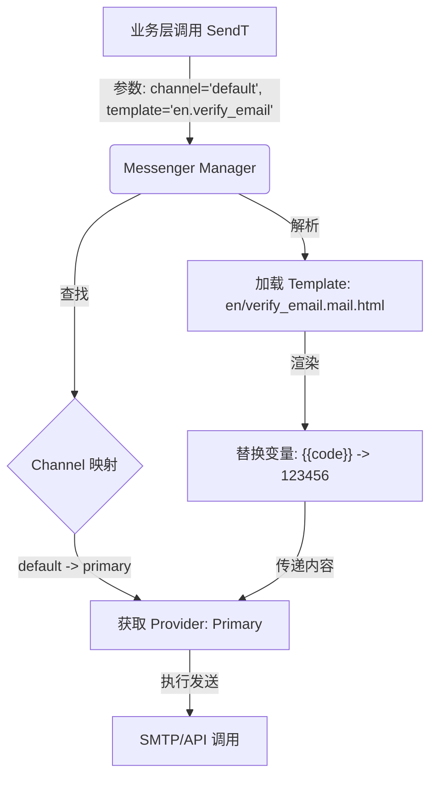

# `messengers`（消息通知）模块的架构。

Yao 的消息系统采用了 **“通道 (Channel) - 提供商 (Provider) - 模板 (Template)”** 的三层解耦设计。这种设计允许开发者灵活切换底层服务商（如从 SMTP 切换到 SendGrid），而无需修改业务逻辑代码。

以下是详细的技术分析：

:::v-pre

### 1\. 目录结构与配置层分析 (`yao-dev-app`)

在 `yao-dev-app` 中，`messengers` 目录是消息服务的定义中心。

#### 目录树结构

```text
yao-dev-app/messengers/
├── channels.yao                // [核心] 通道定义，将逻辑名称映射到具体 Provider
├── providers/                  // [底层] 具体服务商的连接配置
│   ├── primary.mailer.yao      // 例如：SMTP 邮件服务
│   ├── unified.twilio.yao      // 例如：Twilio 短信服务
│   └── ...
└── templates/                  // [内容] 消息内容模板
    ├── en/                     // 英文模板目录
    │   ├── verify_email.mail.html  // 邮件模板
    │   └── verify_mobile.sms.txt   // 短信模板
    └── zh-cn/                  // 中文模板目录
        └── ...
```

#### A. 提供商 (Provider)

位于 `messengers/providers/`。这是与外部服务（SMTP, Twilio, Mailgun 等）通讯的物理配置。

- **配置示例** (`providers/primary.mailer.yao`):
  ```json
  {
    "name": "Primary Mailer",
    "type": "mailer", // 对应引擎中的加载器类型
    "options": {
      "host": "$ENV.MAIL_HOST", // 支持环境变量
      "port": "$ENV.MAIL_PORT",
      "username": "$ENV.MAIL_USERNAME",
      "password": "$ENV.MAIL_PASSWORD"
    }
  }
  ```
- **作用**：定义 **“怎么发”**。它封装了协议细节和凭证。

#### B. 通道 (Channel)

位于 `messengers/channels.yao`。这是业务层使用的逻辑名称。

- **配置示例**:
  ```json
  {
    "default": "primary", // 逻辑名 "default" -> 映射到 provider ID "primary"
    "sms": "unified", // 逻辑名 "sms" -> 映射到 provider ID "unified"
    "marketing": "marketing"
  }
  ```
- **作用**：定义 **“用谁发”**。业务代码（如注册接口）只引用 "default" 或 "sms" 通道，而不关心底层是 SMTP 还是 API。

#### C. 模板 (Template)

位于 `messengers/templates/`。Yao 使用文件系统路径来解析模板 ID。

- **命名规则**: `<语言>/<名称>.<类型>.<扩展名>`
  - 例如 `en/verify_email.mail.html`
  - **Template ID**: `en.verify_email` (在调用时使用)
  - **类型**: `mail` (对应邮件类型)
- **内容**: 支持 Go `text/template` 语法，例如 `{{ .code }}` 用于插入验证码。

---

### 2\. 引擎层处理逻辑分析 (`yao`)

Yao 引擎的 `messenger` 包负责加载配置并执行发送逻辑。

#### A. 加载逻辑 (Loading Logic)

在 `yao/messenger/messenger.go` 中：

1.  **加载 Provider**: 引擎扫描 `messengers/providers/*.yao`，根据文件后缀和内容初始化具体的客户端（如 `mailer`, `twilio` 等）。
2.  **加载 Channel**: 解析 `messengers/channels.yao`，建立 `Channel Name -> Provider` 的映射关系。
3.  **加载 Template**: 引擎会扫描 `messengers/templates` 目录，将文件内容加载到内存中，并预编译为 Go Template 对象。

#### B. 发送逻辑 (Sending Flow)

当业务层（如用户注册）调用发送接口时，流程如下：



**关键代码分析 (`yao/messenger/messenger.go`):**

- **`SendT` 函数**: 这是发送模板消息的核心入口。

  ```go
  func (m *Messenger) SendT(ctx context.Context, channel, template string, data map[string]interface{}, messageType ...interface{}) error {
      // 1. 获取 Provider
      provider := m.getProvider(channel)

      // 2. 渲染模板内容
      // 这里会根据 template ID 找到对应的文件内容，并用 data 进行渲染
      content, err := m.render(template, data)

      // 3. 调用 Provider 的 Send 方法
      // 不同的 Provider (Mailer, Twilio) 实现了统一的 Send 接口
      return provider.Send(ctx, content, messageType...)
  }
  ```

#### C. 验证码发送的具体实现

结合之前的 `openapi/user/entry.go` 分析：

1.  **触发**：用户请求 `/entry/verify`。
2.  **配置读取**：读取 `openapi/user/entry/en.yao` 中的 `messenger` 配置：
    ```json
    "messenger": {
      "mail": {
        "channel": "default",       // 指向 channels.yao 中的 "default"
        "template": "en.verify_email" // 指向 templates/en/verify_email.mail.html
      }
    }
    ```
3.  **执行**：
    - Yao 后端调用 `messenger.Instance.SendT(...)`。
    - `data` 参数包含了生成的 OTP `code`。
    - 模板中的 `{{ code }}` 被替换。
    - 最终通过 `primary.mailer.yao` 配置的 SMTP 服务器发出邮件。

### 3\. 总结

Yao 的消息系统配置逻辑具有高度的**工程化特征**：

1.  **多语言原生支持**：通过目录结构 (`en/`, `zh-cn/`) 直接管理多语言模板，无需在代码中通过 `if-else` 判断语言。
2.  **运行时动态替换**：你可以通过修改 `channels.yao` 将 `sms` 通道从 `twilio` 切换到 `aliyun`，而无需重启服务或修改任何业务代码（基于热加载机制）。
3.  **标准化接口**：无论是邮件、短信还是 WebHook，在 Go 代码层面都抽象为统一的 `Send` 接口，这使得扩展新的消息类型（如钉钉、飞书）变得非常容易。

如果你需要新增一种消息通知（例如接入 Slack），你只需要在 `providers/` 下新增配置文件，在 `channels.yao` 中注册，并添加对应的模板即可。
:::
