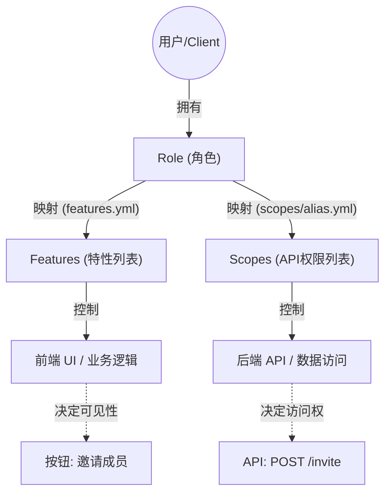

# 解析 Yao 引擎中的权限特性（Features）配置机制。

根据 `yao-dev-app` 配置文件和 `yao` 源码，Yao 的特性管理系统设计非常精妙，它实现了一套基于 **RBAC（基于角色的访问控制）** 的层级化权限系统。这套系统通过 YAML 文件定义特性、别名和角色映射，并在 Golang 运行时通过 `FeatureManager` 进行解析和缓存，以实现高效的 O(1) 权限查找。

以下是结合代码对 `features` 配置文件使用方法及底层原理的详细分析：

### 1. 配置文件的结构与使用方法

Yao 的特性配置采用分层结构，旨在降低配置的复杂度和冗余。

- **原子特性定义（Domain Definitions）：**
  具体的特性定义分散在 `openapi/features` 的子目录中。例如 `openapi/features/kb/collections.yml` 定义了 `collections:create`。源码逻辑中，Yao 会遍历子目录，将文件路径（如 `kb/collections`）作为特性的“域（Domain）”进行管理。这意味着你可以通过目录结构来组织你的业务功能模块。

- **特性别名（Aliases）：**
  `openapi/features/alias.yml` 用于将多个原子特性组合成一个“别名”。例如，`kb:manage` 包含了 `collections:create`。更高级的别名如 `user:full` 可以包含其他别名（如 `kb:manage`），形成嵌套结构。这允许你定义粗粒度的权限包，方便分配。

- **角色映射（Role Mapping）：**
  `openapi/features/features.yml` 是最终的绑定层。它将上述定义的特性或别名分配给具体的角色 ID（如 `system:root` 或 `owner:free`）。这里支持通配符 `*:*:*`，赋予超级管理员所有权限。

### 2. 核心加载逻辑 (`feature.go`)

在 `yao` 引擎的 `openapi/oauth/acl/feature.go` 中，`LoadFeatures` 函数是初始化的核心。它遵循严格的加载顺序：

1.  **加载别名：** 首先读取 `alias.yml`，并使用 `expandAlias` 方法递归解析嵌套别名，检测循环引用，将其展平并存入 `aliasIndex`。
2.  **加载定义：** 使用 `application.App.Walk` 遍历 `features` 目录下的所有 `.yml` 文件（排除根目录文件）。它根据文件路径自动推断“域”（Domain），例如 `features/user/profile.yml` 会被解析为 `user/profile` 域。这种设计使得新增模块无需修改代码，只需添加配置文件即可。
3.  **加载角色映射：** 最后读取 `features.yml`，建立角色到特性列表的原始映射。

### 3. 运行时权限解析与扩展

为了保证运行时的高性能，Yao 不会在每次请求时实时解析 YAML。

- **O(1) 查找表：** `FeatureManager` 结构体中维护了 `roleFeatures` 和 `aliasIndex`。当你调用 `Features(roleID)` 时，系统会调用 `expandFeaturesAsMap`。该方法会将角色关联的所有别名展开为具体的原子特性，并处理通配符（`*`），最终返回一个 `map[string]bool`。这使得在业务逻辑中检查权限（如 `features["profile:edit"]`）极其快速。
- **上下文集成：** `GetFeatures(c *gin.Context)` 函数展示了如何与 HTTP 请求上下文集成。它会自动判断当前请求是来自“用户”还是“团队成员”（通过检查 `__team_id`），从而加载对应的角色权限。

### 4. 实际应用流程

在 `openapi/user/features.go` 中可以看到这套系统的实际出口。

当客户端调用 `/user/features` 接口时，Yao 引擎会：

1.  从 Gin 上下文中提取当前认证用户的信息。
2.  调用 `acl.GetFeatures(c)` 获取该用户角色展开后的所有特性 Map。
3.  或者通过 `acl.GetFeaturesByDomain(c, domain)` 获取特定域（如 `kb`）下的权限。

**总结：** 如果你要在 Yao 应用中添加新功能权限，你需要在 `openapi/features/` 下新建或修改模块 YAML 定义原子特性，然后在 `alias.yml` 中将其加入对应的功能组，最后在 `features.yml` 中确保相应的角色拥有该组权限。代码层面完全无需改动，引擎会自动热加载这些配置。

## **Feature（特性）**、**Scope（权限/范围）** 和 **Role（角色）** 是 Yao 引擎中权限控制体系的三个核心概念。

它们共同构成了一个**前后端分离**、**功能与数据安全分离**的访问控制系统。

### 1\. 核心概念与关系图解

我们可以把 **Role（角色）** 看作是一个中心枢纽，它连接了 **Feature（前端/功能）** 和 **Scope（后端/数据）**。

- **Role (角色)**: 用户的身份标识（如 `owner:free`, `team:admin`）。它是分配权限的单位。
- **Feature (特性)**: 定义**功能**是否可用。主要用于**前端 UI 控制**（如显示/隐藏按钮、菜单）。
- **Scope (范围)**: 定义**资源**是否可访问。主要用于**后端 API 安全**（如是否允许调用 `GET /api/users`）。

**关系示意：**



---

### 2\. 详细关系解析

#### A. Feature 与 Role 的关系

- **配置位置**: `openapi/features/features.yml`
- **关系类型**: 这是一个显式的映射关系。你为一个角色 ID（如 `owner:free`）分配一组特性 ID（如 `team:manage`）。
- **别名机制**: 为了方便管理，`alias.yml` 允许你将多个原子特性（如 `profile:read`, `profile:edit`）打包成一个别名（如 `profile:manage`），然后分配给角色。
- **代码示例**:
  ```yaml
  # features.yml
  owner:free:
    - profile:manage # 角色拥有 profile:manage 特性组
    - collections:create
  ```

#### B. Scope 与 Role 的关系

- **配置位置**: 通常在 `openapi/scopes/` 目录下的配置文件或数据库中定义。
- **关系类型**: 同样是映射关系。角色被授予一组 Scopes，这些 Scopes 决定了用户可以访问哪些具体的 API 端点以及受什么数据约束（如 `owner:true` 仅限访问自己的数据）。
- **代码示例** (参考 `SCOPES_CONFIGURATION.md`):
  ```yaml
  # scopes/alias.yml (概念示例)
  role:editor:
    - posts:read:all
    - posts:write:own
  ```

#### C. Feature 与 Scope 的关系

- **关系类型**: **逻辑关联，但技术解耦**。
- **协同工作**: 它们通常成对出现，服务于同一个业务场景，但各司其职。
  - **Feature** 告诉前端：“用户**能看到**‘删除’按钮吗？”
  - **Scope** 告诉后端：“用户**能执行** `DELETE /api/resource` 请求吗？”
- **实际案例**:
  - 你可能有特性 `team:member:invite`（允许看到邀请界面）。
  - 同时你需要对应的 Scope `teams:invitations:write`（允许调用发邮件的 API）。

---

### 3\. Feature 的使用方法与原理

**Feature 的核心目的：前端功能开关 (Feature Flag)**

Yao 的 Feature 系统通过 O(1) 复杂度的查找表，让前端能极其高效地判断用户是否有权使用某项功能。

#### 1\. 定义特性 (Definition)

在 `openapi/features/<domain>/<file>.yml` 中定义。路径决定了特性的“域”（Domain）。

- 例如文件 `openapi/features/kb/collections.yml`:
  ```yaml
  collections:create:
    description: 'Create collections'
  ```

#### 2\. 分配给角色 (Assignment)

在 `openapi/features/features.yml` 中将特性（或别名）赋予角色。

#### 3\. 后端暴露 (API)

后端使用 `acl.GetFeatures(c)` 获取当前登录用户的特性列表，并返回给前端。

- 参考代码 `openapi/user/features.go`:
  ```go
  func GinFeatures(c *gin.Context) {
      // ... 获取用户 ...
      features, _ := acl.GetFeatures(c)
      // 返回: {"profile:edit": true, "kb:create": true}
      response.RespondWithSuccess(c, http.StatusOK, features)
  }
  ```

#### 4\. 前端使用 (Usage)

前端调用接口拿到 Map，进行判断：

```javascript
// 前端代码示例
if (features['collections:create']) {
  return <CreateCollectionButton />;
}
```

### 总结

- **Role** 是身份的容器。
- **Scope** 是**后端**的盾牌，保护数据和接口。
- **Feature** 是**前端**的指挥棒，控制界面展示和功能入口。

这种设计使得你可以在不修改后端安全策略（Scope）的情况下，灵活调整不同订阅等级用户的界面功能（Feature），例如为 `owner:free` 角色隐藏“高级报表”功能，但后端 API 其实可能因共享逻辑而存在，只是前端入口被 Feature 关掉了。
