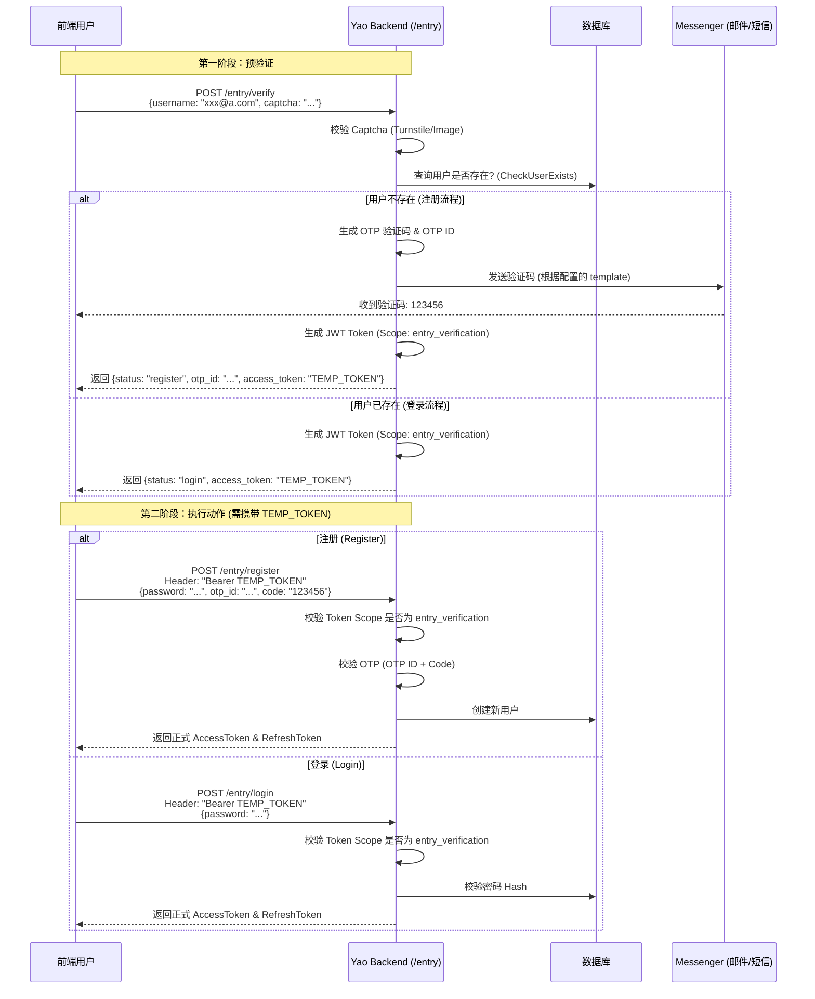

# Openapi **用户认证（Authentication）** 与 **配置驱动（Configuration-Driven）**

基于 `yao-dev-app` `openapi/user` 目录下的配置文件进行技术分析。

### 1. 配置层分析 (`yao-dev-app/openapi/user`)

该目录下的配置文件定义了应用如何处理用户身份验证、前端交互逻辑以及第三方集成。

#### A. 客户端凭证 (`client.yao`)

这是 Yao OpenAPI 自身的 OAuth2 客户端配置。

- **作用**：定义当前应用（Frontend/App）作为 OAuth Client 的身份。
- **关键字段**：`client_id` 和 `client_secret`（支持环境变量注入）。
- **逻辑关联**：在后端启动时，如果该 Client ID 在数据库中不存在，`config.go` 会调用 `DynamicClientRegistration` 自动将其注册为合法的 OAuth Client。

#### B. 统一认证入口配置 (`entry/en.yao`)

这是控制登录/注册页面的核心 DSL。

- **UI 与路由**：定义了标题、登录成功/失败后的跳转路径 (`success_url`, `failure_url`)。
- **表单逻辑 (`form`)**：
  - 定义了用户名字段（如 `email`）、密码占位符等。
  - **验证码 (`captcha`)**：集成了 Cloudflare Turnstile 或图片验证码逻辑。
- **消息通道 (`messenger`)**：指定了注册或验证时使用的消息通道和模板（如 `en.verify_email`），这直接关联到后端发送 OTP（一次性密码）的逻辑。
- **注册策略**：
  - `invite_required`: 是否必须邀请码。
  - `auto_login`: 注册后是否自动发放 Token。
- **第三方登录**：定义了 Google, GitHub 等登录按钮的显示元数据。

#### C. 第三方提供商 (`providers/github.yao`)

- **作用**：定义具体的 OAuth2 提供商参数（Client ID, Secrets, Endpoints, Scopes）以及字段映射关系。

---

### 2. 后端处理逻辑分析 (`yao/openapi/user`)

Yao 引擎使用 `Gin` 框架处理 HTTP 请求，核心逻辑位于 `openapi/user` 包中。

#### A. 配置加载机制 (`config.go`)

后端通过 `Load` 函数加载上述配置：

1.  **加载与解析**：使用 `application.App.Walk` 遍历目录，解析 `.yao` 文件到 Go 结构体 (`EntryConfig`, `TeamConfig` 等)。
2.  **环境变量注入**：代码中包含 `replaceENVVar` 函数，在加载时动态替换配置中的 `$ENV.VAR`。
3.  **敏感数据剥离**：提供了 `getEntryConfig` 处理函数，它会调用 `createPublicEntryConfig` 创建一个**剔除了敏感信息**（如 Secret）的配置副本返回给前端。

#### B. 认证流程逻辑 (`entry.go` & `user.go`)

Yao 采用了 **两阶段认证** 设计，以支持多种登录方式（密码、OTP、第三方）并确保安全性。

**步骤 1：预验证 (`POST /entry/verify`)**

- **请求**：前端提交用户名（邮箱/手机）和验证码（Captcha）。
- **逻辑**：
  1.  **验证码校验**：后端根据配置 (`turnstile` 或 `image`) 校验验证码合法性。
  2.  **用户存在性检查**：调用 `checkUserExists` 判断是“登录”还是“注册”流程。
  3.  **发放临时 Token**：这是关键设计。无论用户是否存在，都会签发一个 **Scope 为 `entry_verification`** 的临时 JWT Token（有效期短，如 10 分钟）。
      - _如果用户不存在_：生成 OTP 验证码，并根据配置调用 `messenger` 发送邮件或短信。
- **响应**：返回 `status` ("login" 或 "register") 和临时 `access_token`。

**步骤 2：执行登录/注册 (`POST /entry/login` 或 `/register`)**

- **前置守卫**：这些接口被 `oauth.Guard` 保护，但只接受 Scope 为 `entry_verification` 的 Token。这确保了必须先通过第一步的验证码检查。
- **注册逻辑 (`GinEntryRegister`)**：
  1.  解析 Token 获取暂存的用户名。
  2.  校验密码复杂度（Go 正则验证）。
  3.  **OTP 校验**：如果配置了 Messenger，必须校验用户提交的 OTP Code。
  4.  **创建用户**：调用底层 Provider 创建用户数据。
  5.  **自动登录**：如果配置允许，直接生成正式的 Auth Token 并设置 Cookie。
- **登录逻辑 (`GinEntryLogin`)**：
  1.  验证密码 Hash。
  2.  生成正式的 Session 和 Token（RefreshToken, AccessToken）。

#### C. 权限与作用域控制 (`user.go`)

代码在 `init()` 中注册了特殊的 ACL Scope：

- `ScopeEntryVerification`: 仅用于登录/注册过程中的临时权限。
- `ScopeTeamSelection`: 登录后用于选择团队的临时权限。
  这种设计遵循了最小权限原则，防止未完全认证的用户访问敏感接口。

### 3. 架构总结

Yao 的这套设计体现了以下工程思想：

1.  **DSL 驱动 UI 与逻辑**：前端不需要硬编码表单字段或验证逻辑，完全由 `entry/en.yao` 里的配置决定，后端透传配置给前端渲染。
2.  **状态分离**：通过 "预验证" 接口和 "临时 Token" 机制，将 Captcha 校验、用户状态查询与最终的凭证校验分离，提高了系统的抗攻击能力（防止直接暴力破解密码接口，因为必须先持有有效的临时 Token）。
3.  **动态客户端**：OAuth Client 不是静态写死的，而是具备动态注册能力，适应容器化和云原生部署。

## Yao OpenAPI 中关于用户注册、登录以及验证码处理的完整逻辑。

Yao 采用了 **“两阶段验证” + “临时授权令牌（Temporary Token）”** 的安全模式，既防止了暴力破解，也统一了注册和登录的入口流程。

以下是详细的技术分析和流程图解。

### 1\. 核心流程架构

Yao 的认证流程分为两个主要步骤：

1.  **预验证 (`POST /entry/verify`)**：检查用户是否存在，根据情况发送验证码，并发放“临时通行证”。
2.  **执行动作 (`POST /entry/register` 或 `/entry/login`)**：携带“临时通行证”完成最终的注册或登录。

#### 流程时序图 (Mermaid)



---

### 2\. 配置逻辑：如何配置发送验证码

在 `yao` 中，通过 DSL 配置来驱动验证码的发送逻辑。

**配置文件:** `openapi/user/entry/en.yao` (或对应语言文件)

#### 关键配置段落分析

```json
  // Messenger config (for registration email/SMS verification)
  "messenger": {
    "mail": {
      "channel": "default",       // 1. 指定发送通道 (对应 messengers/ 目录下的配置)
      "template": "en.verify_email" // 2. 指定消息模板
    },
    "sms": {
      "channel": "default",
      "template": "en.verify_mobile"
    }
  },
```

- **触发条件**：当后端检测到用户不存在（即进入注册流程）时，代码会读取此配置。
- **channel**: 对应项目根目录 `messengers/*.yao` 中定义的连接器（如 SMTP, Twilio 等）。
- **template**: 对应项目根目录 `messengers/templates/` 下的模板文件。例如 `en.verify_email` 对应 `messengers/templates/en/verify_email.mail.html`。

**后台处理逻辑 (`yao/openapi/user/entry.go`):**
当 `/entry/verify` 被调用且用户不存在时，`GinEntryVerify` 函数会：

1.  调用 `generateEntryOTP()` 生成 6 位数字验证码。
2.  解析上述 DSL 配置。
3.  调用 `messenger.Instance.SendT` 发送消息，将 `code` 注入模板。

---

### 3\. 验证逻辑：如何验证验证码

验证码的校验逻辑发生在**注册接口**，并且有严格的安全前置条件。

**接口:** `POST /entry/register`

#### 核心步骤分析

1.  **临时令牌守卫 (Security Guard)**:

    - 该接口被 `oauth.Guard` 保护。
    - **关键点**：代码中检查 `authInfo.Scope` 必须为 `entry_verification`。
    - 这意味着，用户不能直接调用注册接口，必须先通过 `/entry/verify` 获取到这个临时 Token。这有效防止了绕过前置检查（如 Captcha）的攻击。

2.  **获取上下文**:

    - 后端从这个临时 Token 中解析出 `__username` 和 `__username_type`。这意味着用户无法在第一步验证了 A 邮箱，却在第二步注册 B 邮箱。

3.  **OTP 校验**:

    - 前端提交 `otp_id` (第一步返回的) 和 `code` (用户输入的)。
    - 后端调用 `utilsotp.Validate(req.OtpID, req.VerificationCode, true)`。
    - `true` 参数表示验证成功后立即销毁该 OTP，防止重放攻击。

4.  **创建用户**:

    - 只有上述校验全部通过，才会调用 `userProvider.CreateUser` 写入数据库，并将 `email_verified` 或 `phone_number_verified` 标记为 `true`。

### 4\. 总结：给开发者的建议

如果需要自定义或调试这部分：

1.  **自定义邮件内容**：

    - 修改 `yao-dev-app/messengers/templates/` 下的模板文件。
    - 确保模板中包含 `{{ code }}` 占位符，Yao 引擎会自动替换它。

2.  **调试发送失败**：

    - 检查 `openapi/user/entry/xx.yao` 中的 `messenger` 配置是否正确指向了存在的 Channel。
    - 检查 `messengers/` 下的连接器配置（如 SMTP 密码）是否正确。

3.  **理解安全性**：

    - 不要试图绕过 `/entry/verify` 直接调用 `/entry/register`，因为你无法伪造带有 `entry_verification` Scope 且由服务器签名的 JWT Token。

这套逻辑充分利用了 Golang 的强类型特性和 JWT 的无状态特性，构建了一个安全且配置驱动的认证系统。
