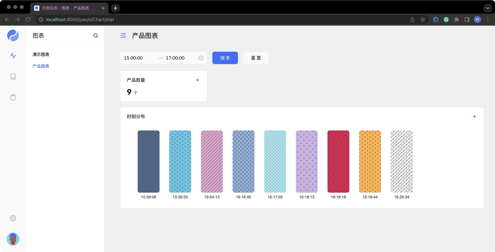

# 编写图表

使用 Chart DSL 编写图表界面, 可用于实现数据看板等功能模块。

**约定**

1. 示例中约定应用根目录为 `/data/app`, 实际编写时需替换为应用根目录。
2. 使用 `<>` 标识自行替换的内容。 例如: `icon-<图标名称>`, 实际编写时应替换为: `icon-foo`, `icon-bar` ...

## 编写图表

### 编排数据查询逻辑

在 `flows/stat` 目录下创建一个数据流, 用来编排统计数据。

聚合查询推荐使用 Query DSL 编写, 常规查询可以使用模型处理器实现。

`/data/app/flows/stat/product.flow.json`

```json
{
  "label": "产品",
  "version": "1.0.0",
  "description": "产品统计",
  "nodes": [
    {
      "name": "总数",
      "engine": "default",
      "query": {
        "select": [":COUNT(id) as 数量"],
        "from": "$product",
        "first": true
      }
    },
    {
      "name": "分布",
      "engine": "default",
      "query": {
        "select": [":COUNT(id) as 数量", ":TIME(created_at) as 时刻"],
        "from": "$product",
        "orders": "时刻",
        "groups": "时刻"
      }
    }
  ],
  "output": {
    "数量": "{{$res.总数.数量}}",
    "分布": "{{$res.分布}}"
  }
}
```

**运行调试**

```bash
yao run flows.stat.product
```

### 添加图表 DSL 文件

在 `charts` 目录下, 创建一个 Chart DSL 文件, 将数据处理器指定为 `flows.stat.product`, 并设置图表布局。

在浏览器输入图表路由地址访问:

`http://<IP>:<YAO_PORT>/<管理后台路由前缀>/x/Chart/stat`

`/data/app/charts/stat.chart.json`

```json
{
  "name": "统计",
  "action": {
    "data": { "process": "flows.stat.product" }
  },
  "layout": {
    "operation": { "actions": [] },
    "chart": {
      "columns": [
        { "name": "产品数量", "width": 6 },
        { "name": "时刻分布", "width": 24 }
      ]
    }
  },
  "fields": {
    "chart": {
      "产品数量": {
        "bind": "数量",
        "link": "/x/Table/product",
        "view": { "type": "Number", "props": { "unit": "个" } }
      },
      "时刻分布": {
        "bind": "分布",
        "link": "/x/Table/product",
        "view": {
          "type": "Bar",
          "props": {
            "height": 240,
            "nameKey": "时刻",
            "axisLabel": { "interval": 0, "fontSize": 12 },
            "series": [
              {
                "valueKey": "数量",
                "type": "bar",
                "colorBy": "data",
                "itemStyle": { "borderRadius": 6 },
                "splitLine": { "show": false },
                "axisLabel": { "show": false }
              }
            ]
          }
        }
      }
    }
  },
  "config": { "full": false }
}
```

## 增加筛选器

### 修改数据查询逻辑

增加按时间范围查询

`/data/app/flows/stat/product.flow.json`

```json
{
  "label": "产品",
  "version": "1.0.0",
  "description": "产品统计",
  "nodes": [
    {
      "name": "总数",
      "engine": "default",
      "query": {
        "select": [":COUNT(id) as 数量"],
        "from": "$product",
        "wheres": [
          { "field": ":TIME(created_at)", ">=": "?:$range[0]" },
          { "field": ":TIME(created_at)", "<=": "?:$range[1]" }
        ],
        "first": true
      }
    },
    {
      "name": "分布",
      "engine": "default",
      "query": {
        "debug": true,
        "select": [":COUNT(id) as 数量", ":TIME(created_at) as 时刻"],
        "from": "$product",
        "wheres": [
          { "field": ":TIME(created_at)", ">=": "?:$range[0]" },
          { "field": ":TIME(created_at)", "<=": "?:$range[1]" }
        ],
        "orders": "时刻",
        "groups": "时刻"
      }
    }
  ],
  "output": {
    "IN": "{{$in}}",
    "数量": "{{$res.总数.数量}}",
    "分布": "{{$res.分布}}"
  }
}
```

:::v-pre

在 Query DSL 中使用上下文变量或参数表，使用 **?:** 作为标识符。
例如: **{{$range[0]}}**, 在 Query DSL中使用时, 写做 **\?:$range[0]** 查阅 Query DSL 手册
:::

**运行调试**

```bash
yao run flows.stat.product '::{"range":["08:00", "16:00"]}'
```

### 添加筛选器

增加按时间范围筛选，并设置为 TimePicker 组件。

`/data/app/charts/stat.chart.json`

```json
{
  "name": "统计",
  "action": {
    "data": { "process": "flows.stat.product" }
  },
  "layout": {
    "operation": { "actions": [] },
    "filter": {
      "columns": [{ "name": "时间区间", "width": 6 }]
    },
    "chart": {
      "columns": [
        { "name": "产品数量", "width": 6 },
        { "name": "时刻分布", "width": 24 }
      ]
    }
  },
  "fields": {
    "filter": {
      "时间区间": {
        "bind": "range",
        "edit": { "type": "TimePicker", "props": { "range": true } }
      }
    },
    "chart": {
      "产品数量": {
        "bind": "数量",
        "link": "/x/Table/product",
        "view": { "type": "Number", "props": { "unit": "个" } }
      },
      "时刻分布": {
        "bind": "分布",
        "link": "/x/Table/product",
        "view": {
          "type": "Bar",
          "props": {
            "height": 240,
            "nameKey": "时刻",
            "axisLabel": { "interval": 0, "fontSize": 12 },
            "series": [
              {
                "valueKey": "数量",
                "type": "bar",
                "colorBy": "data",
                "itemStyle": { "borderRadius": 6 },
                "splitLine": { "show": false },
                "axisLabel": { "show": false }
              }
            ]
          }
        }
      }
    }
  },
  "config": { "full": false }
}
```

### 添加 Hook 转换筛选器参数

添加一个 Befor Hook, 将参数转换为处理器需要格式。

在浏览器刷新图表路由地址访问:

`http://<IP>:<YAO_PORT>/<管理后台路由前缀>/x/Chart/stat`

**添加一个 Hook 脚本用于转换参数。**

`/data/app/scripts/hook.js`

```javascript
/**
 * Stat Hook
 * @param {*} args
 * @returns
 */
function FormatTime(args) {
  log.Trace('[FormatTime] %v', args);
  let range = args['range[]'] || [];
  let start = range[0] ? range[0].split('T')[1].split('+')[0] : '08:00';
  let end = range[1] ? range[1].split('T')[1].split('+')[0] : '18:00';
  return [{ range: [start, end] }];
}
```

运行调试

```bash
yao run scripts.hook.FormatTime '::{"range[]":["2022-11-14T08:00:00+08:00", "2022-11-14T23:00:00+08:00"]}'
```

**修改 Chart DSL 挂载 Hook**

`/data/app/charts/stat.chart.json`

```json
{
  "name": "统计",
  "action": {
    "before:data": "scripts.hook.FormatTime",
    "data": { "process": "flows.stat.product" }
  },
  "layout": {
    "operation": { "actions": [] },
    "filter": {
      "columns": [{ "name": "时间区间", "width": 6 }]
    },
    "chart": {
      "columns": [
        { "name": "产品数量", "width": 6 },
        { "name": "时刻分布", "width": 24 }
      ]
    }
  },
  "fields": {
    "filter": {
      "时间区间": {
        "bind": "range",
        "edit": { "type": "TimePicker", "props": { "range": true } }
      }
    },
    "chart": {
      "产品数量": {
        "bind": "数量",
        "link": "/x/Table/product",
        "view": { "type": "Number", "props": { "unit": "个" } }
      },
      "时刻分布": {
        "bind": "分布",
        "link": "/x/Table/product",
        "view": {
          "type": "Bar",
          "props": {
            "height": 240,
            "nameKey": "时刻",
            "axisLabel": { "interval": 0, "fontSize": 12 },
            "series": [
              {
                "valueKey": "数量",
                "type": "bar",
                "colorBy": "data",
                "itemStyle": { "borderRadius": 6 },
                "splitLine": { "show": false },
                "axisLabel": { "show": false }
              }
            ]
          }
        }
      }
    }
  },
  "config": { "full": false }
}
```

## 添加菜单

编辑 `/data/app/flows/app/menu.flow.json` 添加菜单项

```json
{
  "name": "APP Menu",
  "nodes": [],
  "output": [
    {
      "blocks": 0,
      "icon": "icon-activity",
      "id": 1,
      "name": "图表",
      "parent": null,
      "path": "/x/Chart/dashboard",
      "visible_menu": 1,
      "children": [
        {
          "blocks": 0,
          "icon": "icon-book",
          "name": "演示图表",
          "id": 2010,
          "parent": 1,
          "path": "/x/Chart/dashboard",
          "visible_menu": 1
        },
        {
          "blocks": 0,
          "icon": "icon-book",
          "name": "产品图表",
          "id": 2020,
          "parent": 1,
          "path": "/x/Chart/stat",
          "visible_menu": 1
        }
      ]
    },
    {
      "blocks": 0,
      "icon": "icon-book",
      "id": 2,
      "name": "表格",
      "parent": null,
      "path": "/x/Table/pet",
      "visible_menu": 1,
      "children": [
        {
          "blocks": 0,
          "icon": "icon-book",
          "name": "宠物列表",
          "id": 2010,
          "parent": 2,
          "path": "/x/Table/pet",
          "visible_menu": 1
        },
        {
          "blocks": 0,
          "icon": "icon-book",
          "name": "产品管理",
          "id": 2010,
          "parent": 2,
          "path": "/x/Table/product",
          "visible_menu": 1
        }
      ]
    },
    {
      "blocks": 0,
      "icon": "icon-clipboard",
      "id": 2,
      "name": "表单",
      "parent": null,
      "path": "/x/Form/pet/1/edit",
      "visible_menu": 1,
      "children": [
        {
          "blocks": 0,
          "icon": "icon-clipboard",
          "name": "编辑模式",
          "id": 2010,
          "parent": 2,
          "path": "/x/Form/pet/1/edit",
          "visible_menu": 1
        },
        {
          "blocks": 0,
          "icon": "icon-clipboard",
          "name": "查看模式",
          "id": 2010,
          "parent": 2,
          "path": "/x/Form/pet/1/view",
          "visible_menu": 1
        }
      ]
    }
  ]
}
```

点击菜单栏下方设置图标，点击更新菜单，或退出后台重新登录。


