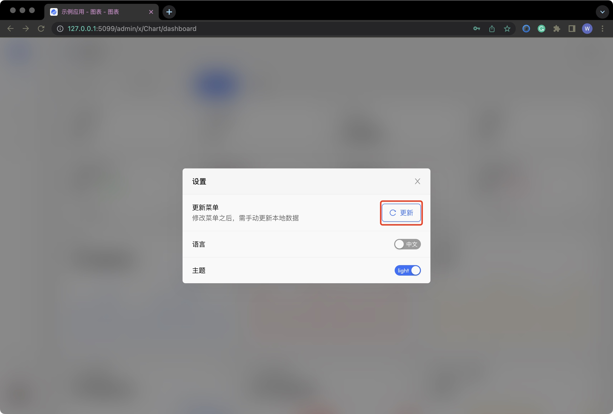

# 编写界面

YAO 内建 XGen 界面引擎，封装了 Table, Form, Chart 等一系列常用功能，通过编写
DSL 实现多种功能模块。

## 编写表格

### 添加表格 DSL 文件

在 `tables` 目录下, 创建一个 Table DSL 文件, 与一个 `product` 数据模型绑定。

在浏览器输入表格路由地址访问:

`http://<IP>:<YAO_PORT>/<管理后台路由前缀>/x/Table/product`

`/data/app/tables/product.tab.json`

```json
{
  "name": "产品",
  "action": {
    "bind": { "model": "product" }
  }
}
```

### 修改表格布局

修改 Table DSL, 刷新页面预览效果。 (如未开启 `watch` 需手动重启服务)

`/data/app/tables/product.tab.json`

```json
{
  "name": "产品",
  "action": { "bind": { "model": "product" } },
  "layout": {
    "header": { "preset": {} },
    "table": {
      "columns": [
        { "name": "名称", "width": 200 },
        { "name": "上架状态", "width": 200 }
      ]
    }
  }
}
```

### 修改呈现组件

修改 Table DSL, 刷新页面预览效果。 (如未开启 `watch` 需手动重启服务)

`/data/app/tables/product.tab.json`

```json
{
  "name": "产品",
  "action": { "bind": { "model": "product" } },
  "layout": {
    "header": { "preset": {} },
    "table": {
      "columns": [
        { "name": "联动", "width": 200 },
        { "name": "名称", "width": 200 },
        { "name": "备注", "width": 200 },
        { "name": "上架状态", "width": 200 }
      ]
    }
  },
  "fields": {
    "table": {
      "联动": {
        "bind": "online",
        "view": {
          "bind": "new_field",
          "type": "Text",
          "compute": {
            "process": "Concat",
            "args": ["$C(row.name)", "(", "$C(row.remark)", ")"]
          }
        },
        "edit": {
          "type": "Select",
          "props": {
            "options": [
              { "label": "已上架", "value": true },
              { "label": "已下架", "value": false }
            ]
          }
        }
      }
    }
  }
}
```

## 编写表单

### 添加表单 DSL 文件

在 `forms` 目录下, 创建一个 Form DSL 文件, 与 `product` 数据模型绑定。

在浏览器输入表格路由地址访问:

`http://<IP>:<YAO_PORT>/<管理后台路由前缀>/x/Form/product/0/edit`

`/data/app/forms/product.form.json`

```json
{
  "name": "产品",
  "action": { "bind": { "model": "product" } }
}
```

## 表格关联表单

修改 Table DSL 文件，新增添加按钮、行编辑按钮。刷新页面预览效果。(如未开启 `watch` 需手动重启服务)

`/data/app/tables/product.tab.json`

```json
{
  "name": "产品",
  "action": { "bind": { "model": "product" } },
  "layout": {
    "header": { "preset": {} },
    "filter": {
      "columns": [{ "name": "名称", "width": 4 }],
      "actions": [
        {
          "title": "添加产品",
          "icon": "icon-plus",
          "width": 3,
          "action": {
            "Common.openModal": {
              "Form": { "type": "edit", "model": "product" }
            }
          }
        }
      ]
    },
    "table": {
      "columns": [
        { "name": "联动", "width": 200 },
        { "name": "名称", "width": 200 },
        { "name": "备注", "width": 200 },
        { "name": "上架状态", "width": 200 }
      ],
      "operation": {
        "fold": false,
        "width": 255,
        "actions": [
          {
            "title": "查看",
            "icon": "icon-eye",
            "action": {
              "Common.openModal": {
                "Form": { "type": "view", "model": "product" }
              }
            }
          },
          {
            "title": "编辑",
            "icon": "icon-edit-2",
            "action": {
              "Common.openModal": {
                "Form": { "type": "edit", "model": "product" }
              }
            }
          }
        ]
      }
    }
  },
  "fields": {
    "table": {
      "联动": {
        "bind": "online",
        "view": {
          "bind": "new_field",
          "type": "Text",
          "compute": {
            "process": "Concat",
            "args": ["$C(row.name)", "(", "$C(row.remark)", ")"]
          }
        },
        "edit": {
          "type": "Select",
          "props": {
            "options": [
              { "label": "已上架", "value": true },
              { "label": "已下架", "value": false }
            ]
          }
        }
      }
    }
  }
}
```

## 添加菜单

编辑 `/data/app/flows/app/menu.flow.json` 添加菜单项

```json
{
  "name": "APP Menu",
  "nodes": [],
  "output": [
    {
      "blocks": 0,
      "icon": "icon-activity",
      "id": 1,
      "name": "图表",
      "parent": null,
      "path": "/x/Chart/dashboard",
      "visible_menu": 0
    },
    {
      "blocks": 0,
      "icon": "icon-book",
      "id": 2,
      "name": "表格",
      "parent": null,
      "path": "/x/Table/pet",
      "visible_menu": 1,
      "children": [
        {
          "blocks": 0,
          "icon": "icon-book",
          "name": "宠物列表",
          "id": 2010,
          "parent": 2,
          "path": "/x/Table/pet",
          "visible_menu": 1
        },
        {
          "blocks": 0,
          "icon": "icon-book",
          "name": "产品管理",
          "id": 2010,
          "parent": 2,
          "path": "/x/Table/product",
          "visible_menu": 1
        }
      ]
    },
    {
      "blocks": 0,
      "icon": "icon-clipboard",
      "id": 2,
      "name": "表单",
      "parent": null,
      "path": "/x/Form/pet/1/edit",
      "visible_menu": 1,
      "children": [
        {
          "blocks": 0,
          "icon": "icon-clipboard",
          "name": "编辑模式",
          "id": 2010,
          "parent": 2,
          "path": "/x/Form/pet/1/edit",
          "visible_menu": 1
        },
        {
          "blocks": 0,
          "icon": "icon-clipboard",
          "name": "查看模式",
          "id": 2010,
          "parent": 2,
          "path": "/x/Form/pet/1/view",
          "visible_menu": 1
        }
      ]
    }
  ]
}
```

点击菜单栏下方设置图标，点击更新菜单，或退出后台重新登录。



通过菜单访问


