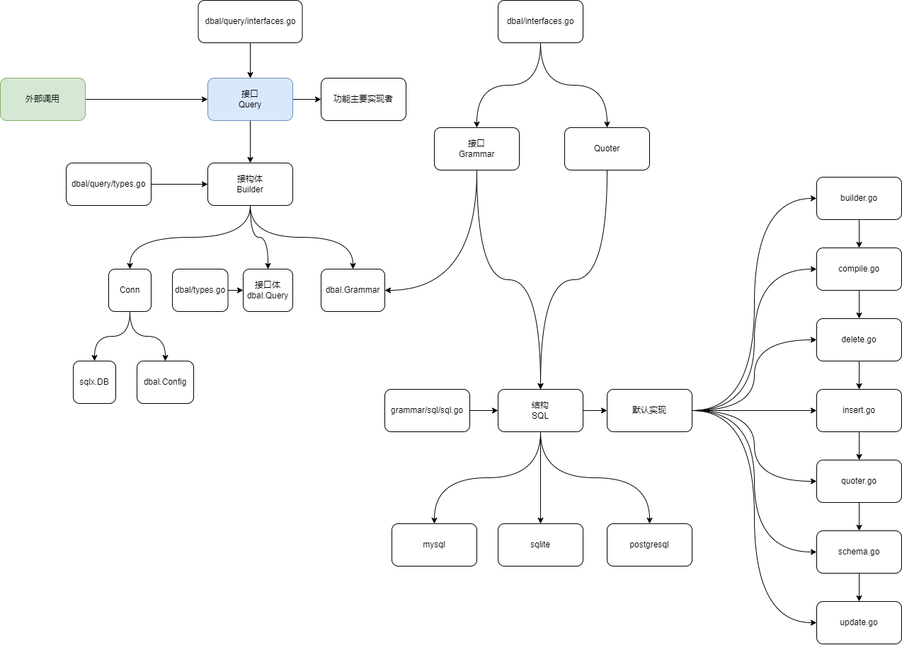

# Yao xun

xun 是一个轻量级别的 ORM。可以根据自己的需求增强 xun 数据库驱动。

[流程图在线查看](https://viewer.diagrams.net/?tags=%7B%7D&highlight=0000ff&edit=_blank&layers=1&nav=1&page-id=2XGTXKiTmeM8RcKDhDW0&title=yao_database.drawio#Uhttps%3A%2F%2Fraw.githubusercontent.com%2Fwwsheng009%2Fyao-docs%2Fmain%2Fdocs%2F%25E6%25B5%2581%25E7%25A8%258B%25E5%259B%25BE%2Fdrawio%2Fyao_database.drawio)

[SAP HANA 数据库适配](https://github.com/wwsheng009/xun/tree/main/grammar/saphdb)
