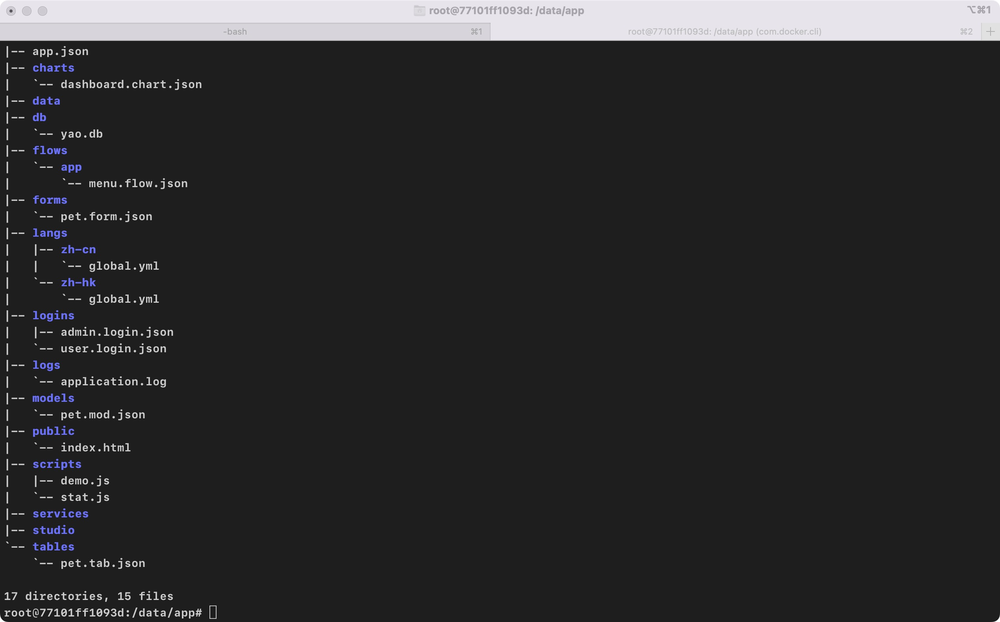

# 入门指南

<!-- YAO-DOC-MERGE-PROCESSED -->

## `Yao`低代码引擎开发与技巧

### 此项目收集使用`Yao`低代码引擎开发应用的文档，希望对您有帮助。

- [Yao 低代码引擎官网](https://yaoapps.com/)
- [Yao Github 主页](https://github.com/YaoApp)
- 文档已经布署到 Githhub Pages 上，欢迎访问：[Yao-docs](https://github.com/wwsheng009/yao-docs)

### 主要分类

- 
- 
- 
- 
- 一些与`Yao`工作机制的流程图

### 其它工具与项目

- [Yao-Amis-Admin](https://github.com/wwsheng009/yao-amis-admin)
- [VSCode 编辑器语法校验证配置](https://github.com/wwsheng009/yao-app-ts-types)
- [Yao-Init](https://github.com/wwsheng009/yao-init)
- [Yao-WMS](https://github.com/wwsheng009/yao-wms)
- [Yao-ChatGPT](https://github.com/wwsheng009/yao-chatgpt)

### 站点主题

项目的`VitePress`主题使用的是:[ChoDocs](https://github.com/chodocs/chodocs)

### ⭐ 请点亮你的小星星


### 🧱 Contribute

期待您的参与

参考 [**Contributing Guide**](https://wwsheng009.github.io/yao-docs/contributing.html).

### 🧑‍💻 Contributors|贡献者

感谢所有的贡献者！

<a href="https://github.com/wwsheng009/yao-docs/graphs/contributors">
  
</a>

### 📄 License

<a href="https://github.com/wwsheng009/yao-docs/blob/main/LICENSE" target="_blank" rel="noreferrer">LICENSE</a>
© 2023-PRESENT [Vincent Wang](https://github.com/wwsheng009)

## Yao 学习路线图

### 入门与上手

- 到官网上看看 Yao 的介绍，先了解 Yao 的定位与用途=>[官网入口](https://yaoapps.com/)。

- 下载安装 Yao。

- 使用 Yao-Init 初始化工具构建您的第一个 Yao 项目，让自己对 Yao 有一个感性的认识。[初始化项目入口](https://github.com/wwsheng009/yao-init)。

- 创建您的第一个模型文件。在目录/models 下参考 pet.mod.json 创建你的模型，初始阶段模型定义尽可能的简单。如果你的电脑环境可以使用 ChatGPT,可以让参考这里：

- 完成上一步后，你得到系统自动创建的界面配置。你可以尝试手工编写，进行更复杂的界面功能配置。

- 让数据从外部访问。创建您的第一个 api 配置文件。

### 进阶

- 学习使用 Yao 命令。命令提供了很多有用的工具

  - Yao migrate 更新模型数据表结构
  - Yao start 启动服务
  - Yao run 运行处理器

- 更新您的模型定义文件，增加更多的字段，或是调整字段类型，增加模型与模型之间的关系。创建了新的模型，同样可以使用工具生成界面配置。

  > 更新模型后，记得运行命令`yao migrate`更新数据库，sqlite 数据库请执行`yao migrate --reset`

- 学习并编写 Yao 脚本文件，Yao 使用 js 进行功能扩展，使用 js 脚本可以实现更复杂的功能与逻辑处理。

### 学习资源

- [官网文档](https://yaoapps.com/doc)
- [官网仓库](https://github.com/YaoApp)
- [本项目](https://wwsheng009.github.io/yao-docs/)

### Yao 项目

目前官方正式的版本是 0.10.3。可以在官网的 github 上下载并学习。

- [yao-admin，零代码生成 yao 应用] (https://github.com/YaoApp/yao-admin)
- [yao-wms，仓库管理系统] (https://github.com/YaoApp/yao-wms)

开发版本 0.10.3,以下非官方维护。

- [yao-init](https://github.com/wwsheng009/yao-init)，项目初始化模板
- [yao-wms](https://github.com/wwsheng009/yao-wms)，比较复杂的示例
- [yao-chatgpt](https://github.com/wwsheng009/yao-chatgpt)，简单的示例
- [yao-admin](https://github.com/wwsheng009/yao-admin)，增强版 yao-admin

### 工具

- [YAO 应用 JSON-SCHEMA](https://github.com/wwsheng009/yao-app-ts-types)

## Yao 简单介绍

### 概述

YAO 是一款开源应用引擎，使用 Golang 编写的命令行工具，适用于开发业务系统、API接口、管理后台和低代码平台。本文将介绍 YAO 的核心概念、开发理念和主要功能模块。

[[toc]]

### 什么是 YAO？

YAO 是一款开源应用引擎，使用 Golang 编写，仅一个命令行工具，下载即用。适合用于开发业务系统、网站/APP API 接口、管理后台、自建低代码平台等。

### 技术栈

YAO 使用以下核心技术栈：

- 后端：Golang
- 前端：React
- 脚本：JavaScript

### 开发理念

#### 元数据编程

通过模型配置文件来驱动数据库配置与界面配置。

#### AI 驱动开发

2023年人工智能大爆发，YAO 充分利用 AI 技术解析自然语言生成代码，让人人都能编程。

#### 配置驱动UI

- 平台提供前端框架
- 界面配置在后端编写
- 使用 JSON/JSONC 格式配置文件

#### 零代码开发

定义好模型文件后，框架会生成一系列的默认配置，开箱即用。

#### 灵活编程编排

- 引擎平台将功能封装为独立处理器
- 处理器之间无代码级耦合
- 通过配置文件灵活组合功能

#### 无限扩展

前端 Xgen 和后端 Yao 都提供完善的扩展机制，可通过插件实现个性化需求。

### 主要开发工作

1. 编写 DSL 配置文件
2. 开发 JS 脚本增强数据操作
3. 开发 GO 插件实现特殊需求
4. 使用 Studio 命令生成配置
5. 查阅文档和源码

### 技术优势

- **高性能部署**：Golang 开发的程序部署方便，性能优异
- **丰富的前端功能**：React 开发的前端满足大部分需求
- **快速开发**：标准后台 CRUD 功能仅需少量配置

### 核心模块

#### 后端模块

1. **Yao API 服务**

   - 提供 API 网关功能
   - 支持 REST API 和 WebSocket
   - 内置用户认证
   - 预置数据操作接口
   - 文件处理功能
     [GitHub 仓库](https://github.com/yaoapp/yao)

2. **Gou 引擎框架**

   - 流程编排处理器
   - JS V8 引擎集成
     [GitHub 仓库](https://github.com/yaoapp/gou)

3. **Xun ORM**

   - 数据库驱动
     [GitHub 仓库](https://github.com/yaoapp/xun)

4. **Kun 工具包**
   - 常用数据处理功能
     [GitHub 仓库](https://github.com/yaoapp/kun)

### 相关链接

- [YAO GitHub](https://github.com/yaoapp/yao)
- 
- 

## yao 下载与安装

如何安装 Yao

这里说的 Yao 是指 Yao 引擎的执行程序。安装 Yao 只需要下载一个执行程序就可以了。

### yao 版本

需要注意的时，yao 的应用需要使用特定版本的 yao 的执行程序。

在升级 yao 执行程序之前，可以给执行程序加个后缀，比如加上版本编号。可以直接另命名 yao 应用程序，不用担心程序依赖问题。

```sh
## yao程序版本管理
mv /usr/local/bin/yao /usr/local/bin/yao-0.10.2

## 使用特定版本的yao启动你的应用
yao-0.10.2 start
```

### 下载 Yao 程序

#### 官方发行版本

官方在重大功能更新后会发布新的版本。

访问地址：https://yaoapps.com/release

在发布页面可以看到各个版本的下载地址与相关的说明。

找到合适的版本后，点击下载按钮后，会自动一个没有后缀的二进制文件。只需要把这个文件放到目录`/usr/local/bin/`即可。

比如下载安装 0.10.3 版本程序：

```sh

wget https://release-bj.yaoapps.com/archives/yao-0.10.3-linux-amd64

## 移动程序到bin目录
mv yao-0.10.3-linux-amd64 /usr/local/bin/yao

## 加上程序执行权限
chmod +x /usr/local/bin/yao

## 版本检查
yao version --all
```

#### 开发版本

开发版本的会有最新的特性与功能。从 github 的 actions 中可以找到最新的开发版本。

https://github.com/YaoApp/yao/actions

按照自己的操作系统类别找到对应的制品程序。

- MacOS intel/m1/m2
- Linux amd64/arm64

  0.10.3 版本 Linux

https://github.com/YaoApp/yao/actions/workflows/build-linux-dev.yml

这里无法使用命令下载，需要在浏览器中下载。

下载后是一个 zip 压缩包，里面包含了 arm64 与 amd64 版本的程序。

```sh
## 移动程序到bin目录
mv yao-0.10.3-linux-amd64 /usr/local/bin/yao

## 加上程序执行权限
chmod +x /usr/local/bin/yao

## 版本检查
yao version --all
```

### 总结

Yao 执行程序就一个二进制的文件，可以直接移动或是删除。

Yao 各个版本的差异比较大，需要仔细辨别。

## 创建第一个 Yao 应用

当下载并安装好 Yao 之后，下一步就创建 Yao 应用。

### 创建 Hello World 应用

### 初始化项目

在个人 Home 目录或是其它的目录下创建一个空的目录 hello_wolrd。

```sh
## 创建一个hello world的空目录
mkdir hello_world

cd hello_world

## 执行start命令，打开配置页面
yao start
```

执行命令后，在控制台上会提示以下内容。

> 如果你的电脑中的 5099 端口已经被占用，会分配一个随机的端口。

```sh
---------------------------------
Yao Application Setup v0.10.3
---------------------------------
Open URL in the browser to continue:
http://127.0.0.1:5099
```

在浏览器里打开配置页面地址`http://127.0.0.1:5099`

在配置页面上，配置以下内容：

- 语言，中文/英文
- 启动模式，在开发应用时推荐选择开发模式，当配置文件有变化时，会自动重新加载
- 监听端口，默认是 5099,可以配置不同的端口
- Studio 端口，默认是 5077,可以配置不同的端口
- 数据库类型，选择 sqlite 或是 mysql
- 数据库文件地址，根据不同的数据库类型，需要不同的配置项

检查所有配置项正确后，点击完成按钮。会提示后台配置中，配置完成后会跳转到后台管理页面:`http://127.0.0.1:5099/admin/`。

使用默认用户名密码登录系统。

- 用户名: xiang@iqka.com
- 密码: A123456p+

### 项目目录结构

回到控制台，查看刚才的 hello_world 目录。刚才还是空白的目录，现在已经增加了不少的目录与文件,这些文件与目录是我们在界面上点击确认按钮后 Yao 根据配置自动生成的，可以理解为 Yao 初始化项目模板。这些目录与文件与 yao 执行程序一起，构建成一个应用。

后面的主要操作是编写新的或是修改现有的配置文件。

不同的目录对应不同的功能配置。配置文件可以使用后缀`.yao`,`.jsonc`,`.json`,`.yaml`,`.yml`。

- agics/neo/langs 目录下使用`.yaml`,`.yml`。
- 其它的目录使用`.yao`,`.jsonc`,`.json`，这三种格式的配置文件都使用了 json 语法，其中`.yao`,`.jsonc`是在 json 格式的基础上增加注释功能。推荐使用`.yao`作为文件后缀，这种格式的配置文件更有辨识度，也方便编写注释。

```sh
├── aigcs                                       <= chatgpt aigc接口
│   └── translate.ai.yml
├── apis                                        <= 外部api配置
│   └── aigc.http.yao
├── app.yao                                     <= yao应用配置
├── charts                                      <= 图表配置
│   └── pet.chart.yao
├── connectors                                  <= 连接器
│   └── openai
│       ├── gpt-3_5-turbo.conn.yao
│       ├── text-embedding-ada-002.conn.yao
│       └── whisper-1.conn.yao
├── dashboards                                  <= 大屏配置
│   └── kanban.dash.yao
├── data                                        <= 应用数据
├── db                                          <= 数据库
│   └── yao.db
├── .env                                        <= 环境变量配置
├── flows                                       <= flows处理器
│   ├── app
│   │   └── menu.flow.yao
│   └── stat
│       └── data.flow.yao
├── forms                                       <= 表单配置
│   ├── admin
│   │   └── user.form.yao
│   └── demo
│       └── pet.form.yao
├── icons                                       <= 应用图标
│   ├── app.icns
│   ├── app.ico
│   └── app.png
├── langs                                       <= 多语言
│   ├── zh-cn
│   │   └── global.yml
│   └── zh-hk
│       └── global.yml
├── LICENSE
├── logins                                      <= 登录处理器
│   ├── admin.login.yao
│   └── user.login.yao
├── logs                                        <= 日志
│   └── application.log
├── models                                      <= 模型配置
│   ├── admin
│   │   └── user.mod.yao                        <= 应用默认的用户配置表
│   └── pet.mod.yao
├── neo                                         <= neo助手/neo命令配置
│   └── neo.yml                                 <= neo助手配置
├── public                                      <= 网站public目录
│   ├── demo
│   │   └── pet.html
│   └── index.html                              <= 自定义网站入口
├── README.md
├── scripts                                     <= js脚本处理器
│   ├── dash.js
│   ├── guard.js
│   ├── setup.js
│   └── stat.js
├── services                                    <= 云函数
│   └── neo.js                                  <= neo脚手默认服务处理器
└── tables                                      <= 表格配置
    ├── admin
    │   └── user.tab.yao
    └── demo
        └── pet.tab.yao
```

### 总结

使用命令`Yao start`启动项目的配置页面。

Yao 使用模板与命令辅助生成初始化项目，非常的方便。

## 增加模型定义

### 模型定义

模型是对一个业务实体的抽象定义，是 Yao 中最重要的一个组件，有以下用途：

- 使用模型描述业务实体，以及业务实体间的关联关系。
- 根据模型自动生成数据库对应的表结构。
- 根据模型自动生成界面配置。
- 根据模型自动生成相关表的 CURD API 接口。

### 创建模型

模型定义文件都需要放在应用目录的 models 目录下。比如应用模板中就自带了两个示例模型。

- `admin.user.mod.yao` 用户模型，用于保存管理员用户名密码，比如默认用户`xiang@iqka.com`就保存在这个模型对应的表中。
- `pet.mod.yao` 示例宠物模型。

```sh
├── models
│   ├── admin
│   │   └── user.mod.yao
│   └── pet.mod.yao
```

模型文件可以使用后缀`.yao`,`.jsonc`,`.json`。

先看示例中的模型文件定义：`models/pet.mod.yao`。

```jsonc
{
  "name": "::Pet",
  "table": { "name": "yao_demo_pet", "label": "宠物表" },
  "columns": [
    { "name": "id", "label": "ID", "type": "ID" },
    {
      "name": "name",
      "label": "昵称",
      "type": "string",
      "length": 80,
      "index": true,
      "nullable": true
    },
    {
      "name": "type",
      "label": "类型",
      "type": "enum",
      "option": ["cat", "dog", "others"],
      "index": true
    },
    {
      "name": "status",
      "label": "入院状态",
      "type": "enum",
      "option": ["checked", "curing", "cured"],
      "index": true
    },
    {
      "name": "mode",
      "label": "状态",
      "type": "enum",
      "option": ["enabled", "disabled"],
      "index": true
    },
    {
      "name": "online",
      "label": "是否在线",
      "type": "boolean",
      "default": false,
      "index": true
    },
    {
      "name": "curing_status",
      "label": "治疗状态",
      "type": "enum",
      "default": "0",
      "option": ["0", "1", "2"],
      "index": true
    },
    { "name": "stay", "label": "入院时间", "type": "integer" },
    { "name": "cost", "label": "花费", "type": "integer" },
    {
      "name": "images",
      "type": "json",
      "label": "相关图片",
      "nullable": true
    }
  ],
  "relations": {},
  "values": [],
  "indexes": [],
  "option": {
    "timestamps": true,
    "soft_deletes": true
  }
}
```

一般来说模型结构有以下的内容：

```json
{
  "name": "用户",
  "table": {},
  "columns": [],
  "indexes": [],
  "relations": {},
  "values": [],
  "option": {}
}
```

模型的内容比较多，在初学时重点关注 columns 与 table 节点的配置。

当你掌握与理解模型的定义与相关概念后，可以使用 AI 或是相关的工具辅助你快速生成模型。

### 使用 AI 创建模型

除了可以手动创建模型，还可以使用 Neo 助手调用 ChatGPT 创建模型。


- 


### 使用 Yao-admin 自动生成模型

使用 Yao-admin 自动的根据数据库结构生成模型配置。


### 总结

在 Yao 应用开发中，模型的定义非常的关键，需要熟练与掌握。

善于利用脚本与 AI 工具，可以加快开发进度。

## 根据模型生成数据库表

比如你在 hello_world 目录下创建一个新的模型`book`。

`models/book.mod.yao`

```jsonc
{
  "name": "Book",
  "table": {
    "name": "book" //这个模型在数据库中关联的表名是`book`。
  },
  "columns": [
    {
      "name": "id",
      "label": "ID",
      "type": "ID"
    },
    {
      "name": "title",
      "label": "Title",
      "type": "string",
      "length": 256,
      "index": true,
      "nullable": true
    },
    {
      "name": "author",
      "label": "Author",
      "type": "string",
      "length": 256,
      "index": true,
      "nullable": true
    },
    {
      "name": "publisher",
      "label": "Publisher",
      "type": "string",
      "length": 256,
      "index": true,
      "nullable": true
    }
  ]
}
```

模型保存后，需要执行一个 yao 命令，把模型转换成数据库中的表。打开控制台,执行以下的命令。

```sh
## mysql
yao migrate -n book

## sqlite，需要加上--reset，
yao migrate -n book --reset
```

提示：reset 的作用是删除整个数据库表后再重新创建，不要在生产环境执行，会导致数据丢失。

成功后控制台会输出以下的内容。

```sh
更新表结构 model: book (book)   SUCCESS
```

上面命令的作用是把 Yao 模型定义转换成数据库表结构。如果模型对应的数据库表已经存在就更新，如果不存在创建新表。

> 后面如果对模型文档有变更，也需要手动执行命令才会把模型更新到数据库。

### 总结

Yao 命令也是 Yao 开发中的重要组成部分。

## 配置模型对应的表格

创建模型文件并生成数据库表后。还需要配置表格配置文件，才能在 yao 管理后台界面上显示表内容。

表格配置目录`tables`。参考示配置文件创建一个新的配置文件`book.tab.yao`。

```sh
└── tables
    ├── admin
    │   └── user.tab.yao
    └── demo
        └── pet.tab.yao
```

配置文件：`book.tab.yao`。

```jsonc
{
  "name": "书籍",
  "action": {
    "bind": { "model": "book" }
  }
}
```

创建并保存配置文件后，在浏览器里就能通过 url 地址：http://127.0.0.1:5099/admin/x/Table/book
访问到模型对应的表内容。

这时界面上可以查看列表，但是还不能添加数据。

### 总结

表格用于显示数据列表，你可以定义多个表格对应一个模型。

## 配置模型对应的表单

当我们配置好数据表格后，在 Yao 管理后台能看到数据列表，但是还不能编辑数据。接下来需要配置模型对应的表单。

表单配置文件保存目录`forms`。参考示配置文件创建一个新的文件`book.form.yao`。

```sh
├── forms
│   ├── admin
│   │   └── user.form.yao
│   └── demo
│       └── pet.form.yao
```

配置文件：`book.form.yao`。

```jsonc
{
  "name": "书籍",
  "action": {
    "bind": { "model": "book", "option": {} }
  }
}
```

创建并保存文件后，需要更新模型对应的表格配置文件`book.tab.yao`,增加配置项`action.bind.option`。

```jsonc
{
  "name": "书籍",
  "action": {
    "bind": {
      "model": "book",
      "option": { "form": "book" }
    }
  }
}
```

在浏览器里刷新 url 地址http://127.0.0.1:5099/admin/x/Table/book

在页面的右上角会多出来一个"创建"按钮。

- 点击按钮会弹出新的表单。
- 在表单里填入数据并点击保存按钮。
- 点击关闭按钮关闭表单输入界面。

在数据列表的右边，每条记录都会显示 3 个按钮，"查看","修改"，"删除"。

### 总结

到这里，一个基础的模型与相关的 CURD 界面已配置完成。模型与 CURD 操作只需要四步。

- 定义模型文件
- 生成数据库表
- 配置表格
- 配置表单

熟练后几分钟能就配置一个模型 CURD 界面。

## 配置外部 API

### API 配置

接下来，我们配置一个外部 api 来访问刚创建的 book 模型。

> api 配置需要保存在目录`apis`下。

创建配置文件：`apis/book.http.yao`

```jsonc
{
  "name": "BOOK 外部接口 ",
  "version": "1.0.0",
  "description": "BOOK 外部接口",
  "guard": "-",
  "group": "v1",
  "paths": [
    {
      "path": "book",
      "method": "GET",
      "guard": "-",
      "process": "models.book.get", //内置的模型处理器
      "in": [":params"],
      "out": { "status": 200, "type": "application/json" }
    }
  ]
}
```

以上配置会向 yao 引擎注册一个外部访问的 api 接口。

api 的路径的规则是`http(s)://host:port/api/group/path`,包含以下几部分：

- 主机与接口。
- 固定前缀`/api`。
- api 中配置的 group,这里配置的是 v1,group 可以包含斜杠/，区分大小写。
- api 中配置的 path,paths 节点中每一条记录都是一个访问端点，区分大小写。

最终生成的的 api 访问地址是http://127.0.0.1:5099/api/v1/book。

测试 api 接口，使用命令行工具或是浏览器浏览地址。

```sh
curl http://127.0.0.1:5099/api/v1/book

[{"author":"1212","id":1,"publisher":"1212","title":"1212"},{"author":"12","id":3,"publisher":"12","title":"12"}]
```

### 总结

在 API 定义中使用现成的处理器，快速开发 API 接口。

## 处理器

处理器(Process)是 Yao 框架中非常重要的一个概念，贯穿了整个 yao 的应用开发过程。

可以把处理器理解为编程语言中的函数，接收输入参数，输出结果值。可以使用 js 脚本编写处理器，也可以使用 golang 编写插件处理器。

### 处理器列表

在 yao 中使用处理器需要注意的是需要查询处理器的参数类型与数量，这个可以查询官方或是阅读源代码。

### 总结

处理器就是函数。

Yao 引擎内置了大量的处理器，使用这些处理器能快速、方便的操作处理数据。

## 数据增删改查

在 yao 中对数据的增删除改查十分方便。

当在 yao 中增加模型定义后，并执行命令`yao migrate`后。即是在完成步骤 3，步骤 4 后，yao 会自动的生成针对模型的处理器。

在 api 的配置文件中使用了内置的模型处理器`models.book.get`来读取模型数据。它的命名规则是`models.模型名称.模型方法`：

- `models`，固定的处理前缀，代表这个处理器与模型相关。
- 模型名称是模型的标识 ID,比如这里的书籍模型的标识是 book。
- 模型方法，Yao 针对模型的读取，更新，创建都已经内置了对应的操作方法。

比如之前创建了 book 的模型，那么可以直接调用以下的处理器：

- models.book.create，创建
- models.book.delete，软删除
- models.book.deletewhere，按条件软删除
- models.book.destroy，真删除
- models.book.destroywhere，按条件真删除
- models.book.eachsave，批量保存
- models.book.eachsaveafterdelete 在删除后再批量保存
- models.book.find，按 id 查找
- models.book.get，按条件查找列表
- models.book.insert，插入记录
- models.book.paginate，按条件查找并返回分页
- models.book.save，保存单条信息
- models.book.selectoption，返回表对应的 lable/value 列表
- models.book.update，更新记录
- models.book.updatewhere，按条件更新

- models.book.load，加载模型定义到内存中，更新内存中的模型定义
- models.book.migrate，更新模型到数据库表

以上的处理器可以在任何可以使用处理器的地方调用，比如 api 定义，js 脚本，flow 定义等。

### 总结

创建模型后可以直接调用模型相关的处理器进行数据的增删改查处理。

## Yao 命令

Yao 命令用于启动服务、运行处理器、查看配置信息等操作。

**约定**

1. 示例中约定应用根目录为 `/data/app`, 实际编写时需替换为应用根目录。
2. 使用 `<>` 标识自行替换的内容。 例如: `icon-<图标名称>`, 实际编写时应替换为: `icon-foo`, `icon-bar` ...

### 手册

```bash
yao <command> [options] [args...]
```

| 命令      | 说明                |
| --------- | ------------------- |
| version   | 显示当前版本号      |
| inspect   | 显示应用配置信息    |
| get       | 下载应用代码        |
| migrate   | 更新模型数据表结构  |
| run       | 运行处理器          |
| start     | 启动服务            |
| socket    | 建立 Socket 连接    |
| websocket | 建立 WebSocket 连接 |
| dump      | 导出应用数据        |
| restore   | 导入应用数据        |
| studio    | Studio CLI          |

全局选项:

| 参数   | 简写 | 说明             |
| ------ | ---- | ---------------- |
| --app  | -a   | 指定应用路径     |
| --env  | -e   | 指定环境变量文件 |
| --help | -h   | 命令帮助         |

#### yao version

显示 Yao 版本号

```bash
yao version
```

#### yao inspect

显示应用配置信息

```bash
cd /data/app
yao inspect
```

#### yao get

**注意: 当前应用目录必须为空目录**

```bash
cd /data/app
yao get yaoapp/demo-app
```

#### yao migrate

更新数据库结构，创建应用引擎和 models 文件夹下定义的数据表。默认更新 models 下所数据模型关联的数据表。

注意：`migrate --reset` 命令会清空当前数据表， 不推荐在 `production`
模式下使用。

选项:

| 参数    | 简写 | 说明                                   |
| ------- | ---- | -------------------------------------- |
| --name  | -n   | 指定模型名称                           |
| --reset |      | 强制删除数据表后重建                   |
| --force |      | 在 production 模式下, 强制使用 migrate |

```bash
cd /data/app
yao migrate
```

```bash
cd /data/app
yao migrate -n pet
```

#### yao run

运行处理器, 第一个参数为处理器名称，其余参数为处理器参数表。

如果需要输入复杂数据结构可以使用 `::` 前缀，声明参数为 JSON 格式， 例如: `'::{"foo":"bar"}'`

```bash
cd /data/app
yao run scripts.day.NextDay 2020-01-02
```

```bash
cd /data/app
yao run xiang.flow.Return hello '::{"foo":"bar"}'
```

#### yao start

启动服务

选项:

| 参数                | 简写 | 说明             |
| ------------------- | ---- | ---------------- |
| --debug             |      | 使用开发模式启动 |
| -- disable-watching |      | 禁止监听文件修改 |

```bash
cd /data/app
yao start
```

```bash
cd /data/app
yao start --debug
```

管理后台默认用户名: `xiang@iqka.com`， 密码: `A123456p+`

如果网络结构较为复杂，命令行提示的 IP 地址无法访问，可根据实际网络结构，更换为相应 IP 地址。

### 环境变量

| 变量                 | 说明                                                    | 默认值       | 示例                                                                         |
| -------------------- | ------------------------------------------------------- | ------------ | ---------------------------------------------------------------------------- |
| YAO_LANG             | 命令行语言 en-US 英语 zh-CN 简体中文                    | en-US        | zh-CN                                                                        |
| YAO_ENV              | 运行模式 development 开发环境 <br/> production 生产环境 | production   | production                                                                   |
| YAO_ROOT             | 应用目录                                                | 当前目录 .   | /data/app                                                                    |
| YAO_HOST             | WEB 服务 HOST                                           | 0.0.0.0      | 127.0.0.1                                                                    |
| YAO_PORT             | WEB 服务端口                                            | 5099         | 5099                                                                         |
| YAO_LOG              | 应用日志文件位置                                        | 系统标准输出 | /data/app/logs/application.log                                               |
| YAO_LOG_MODE         | 日志格式 TEXT \| JSON                                   | TEXT         | JSON                                                                         |
| YAO_JWT_SECRET       | JWT 密钥                                                | 默认为空     | bLp@bi!oqo-2U+hoTRUG                                                         |
| YAO_DB_DRIVER        | 数据库驱动 mysql \| sqlite3                             | sqlite3      | mysql                                                                        |
| YAO_DB_PRIMARY       | 主库连接                                                | ./db/yao.db  | root:123456@tcp(db-server:3306)/yao?charset=utf8mb4&parseTime=True&loc=Local |
| YAO_DB_PRIMARY       | 从库连接                                                | 空           | root:123456@tcp(db-server:3306)/yao?charset=utf8mb4&parseTime=True&loc=Local |
| YAO_DB_AESKEY        | 加密字段密钥 (MySQL Only)                               | 空           | ZLX=T&f6refeCh-ro\*r@                                                        |
| YAO_SESSION_STORE    | 会话数据存储方式 memory \| redis                        | memory       | redis                                                                        |
| YAO_SESSION_HOST     | Redis 服务器 HOST (会话存储方式为 redis 有效)           | 127.0.0.1    | 127.0.0.1                                                                    |
| YAO_SESSION_PORT     | Redis 服务器端口 (会话存储方式为 redis 有效)            | 6379         | 6379                                                                         |
| YAO_SESSION_PASSWORD | Redis 密码 (会话存储方式为 redis 有效)                  | 空           | 123456                                                                       |
| YAO_STUDIO_PORT      | YAO STUDIO 服务端口(仅开发模式下有效)                   | 5077         | 5077                                                                         |
| YAO_STUDIO_SECRET    | YAO STUDIO 密钥                                         | 空, 自动生成 | 8A9932B141E16AE1FB58409C493E93471EA24D43BF31130FE3E5A600598D9FED             |

Tips: 可以为应用单独设置环境变量。在应用根目录下添加 `.env`，服务启动时将优先使用 .env 声明的环境变量。

## YAO 编程基础

YAO 应用引擎是给专业开发者使用的应用开发和运行时工具， 熟悉 JavaScript/HTML/CSS 和基本数据库查询，即可实现大部分功能。

阅读基础文档，需要有基础的编程经验，熟悉基本数据库操作。

阅读进阶文档，需了解 RESTFul API，可以熟练使用 JavaScript 脚本语言，了解 HTML/CSS 等。

阅读专家文档，需掌握 Go 编程语言，熟悉 Linux 操作系统。

下表为使用 YAO 开发不同类型应用，对开发者的能力要求:

| 构建应用       | 等级 | 数据库             | RESTFul API | JavaScript | HTML/CSS/VUE/React/其他 | Golang |
| -------------- | ---- | ------------------ | ----------- | ---------- | ----------------------- | ------ |
| 简易管理后台   | 基础 | 熟悉基本查询       | -           | -          | -                       | -      |
| 简易业务系统   | 基础 | 熟悉基本查询       | 可对接      | 了解       | -                       | -      |
| C 端页面/应用  | 基础 | -                  | 可对接      | 了解       | 熟练                    | -      |
| 复杂业务系统   | 进阶 | 具备数据表设计能力 | 可设计      | 掌握       | 了解                    | -      |
| 复杂管理后台   | 进阶 | 具备数据表设计能力 | 可设计      | 掌握       | 了解                    | -      |
| 自建低代码平台 | 专家 | 具备数据表设计能力 | 可设计      | 掌握       | 熟练                    | -      |
| 参与代码贡献   | 专家 | 具备数据表设计能力 | 可设计      | 掌握       | 熟练                    | 掌握   |

### 基础概念

#### YAO DSL

领域特定语言 DSL (domain specific language), 是专门针对特定应用领域的计算机语言。

YAO 定义了一套 YAO DSL，用来描述数据结构、数据流、API 接口、并发任务、计划任务、WebSocket 、Socket、Table、Form、Chart 等功能(或服务)模块。

DSL 文件是一个 JSON 格式的文本, 编写体验与 HTML 相似, HTML 描述页面元素, DSL 用来描述功能。

YAO DSL 有多种编写方式，且这些编程方式可以随意切换。

1. 支持手工编写， 开发者可以使用任意编程工具编写调试。
2. 支持程序生成， 根据上下文逻辑，自动生成 DSL 或脚本代码，甚至可以接入 AI 让人工智能编程序。
3. 支持可视化编程工具制作，使用 Studio 通过托拉拽图形化编程。

通过这种编码方式，可以有效提升生产力, 降低复制粘贴错误率，同时也让自动化编程成为可能。

#### YAO Runtime

YAO 内建 JavaScript Runtime。

在复杂业务逻辑编排、Studio 自动化生成 DSL 和云函数等场景下，均可以使用 JavaScript 脚本实现复杂业务逻辑。

这一特性使 YAO 具备脚本语言的基础能力，在一些场景下可以代替脚本语言使用。

#### YAO Widget

Widget 抽象出一个功能模块的通用部分,使用 YAO DSL 描述差异，实现快速复制，有效提升开发效率。

Widget 支持自定义, 支持使用 Studio 脚本创建实例，可用于自建低代码平台。

**内建 Widgets:**

| Widget           | 说明                                                                             |
| ---------------- | -------------------------------------------------------------------------------- |
| App              | APP Widget 每一个应用只有一个                                                    |
| Model            | 数据模型 用于描述数据表结构                                                      |
| Store            | Key-Value 存储                                                                   |
| Flow             | 数据流 用于编排处理器调用逻辑                                                    |
| API              | REST API 用于编写 RESTFul API                                                    |
| Connector        | 连接器 用于连接 Redis, Mongo, MySQL, ES 等外部服务, 连接器可与 Model, Store 关联 |
| Task             | 并发任务                                                                         |
| Schedule         | 计划任务                                                                         |
| WebSocket Server | WebSocket Server                                                                 |
| WebSocket Client | WebSocket Client                                                                 |
| Socket           | Socket Server/Client                                                             |
| Cert             | PEM 证书导入                                                                     |
| Import           | 数据导入 可以与表格界面关联                                                      |
| Login            | 登录界面                                                                         |
| Table            | 表格界面                                                                         |
| Form             | 表单界面                                                                         |
| Chart            | 图表界面                                                                         |

#### YAO Process

YAO 提供一组数据原子操作、网络请求、流程控制等一系列的处理器。

这些处理器可以在命令行、Widget、Script、云函数和 Studio 脚本中使用。

处理器支持自定义，可以通过编写 Flow、Script、 GRPC 插件或自定义 Widget 方式扩展。

**内建处理器:**

| 处理器      | 说明                         |
| ----------- | ---------------------------- |
| models.\*   | 数据模型原子操作             |
| schemas.\*  | 数据表结构操作               |
| stores.\*   | 数据存储                     |
| fs.\*       | 文件系统                     |
| http.\*     | HTTP 请求                    |
| session.\*  | 会话数据                     |
| encoding.\* | 编码解码                     |
| crypto.\*   | 加密解密                     |
| ssl.\*      | 签名校验                     |
| utils.\*    | 一组实用程序                 |
| flows.\*    | 使用 Flow 编写的处理器       |
| scripts.\*  | 使用 Script 脚本编写的处理器 |
| plugins.\*  | 使用 GRPC 插件编写处理器     |
| widgets.\*  | 自定义 Widget 导出的的处理器 |

内建 Widgets 的处理器:

| Widget   | 处理器       | 说明                           |
| -------- | ------------ | ------------------------------ |
| App      | yao.app.\*   | App Widget 处理器              |
| Login    | yao.login.\* | Login Widget 处理器            |
| Table    | yao.table.\* | Table Widget 处理器            |
| Form     | yao.form.\*  | Form Widget 处理器             |
| Chart    | yao.chart.\* | Chart Widget 处理器            |
| Import   | imports.\*   | Import Widget 数据导入处理器   |
| Task     | tasks.\*     | Task Widget 并发任务处理器     |
| Schedule | schedules.\* | Schedule Widget 异步任务处理器 |


#### 关系数据库

关系数据库，是创建在关系模型基础上的数据库，借助于集合代数等数学概念和方法来处理数据库中的数据。现实世界中的各种实体以及实体之间的各种联系均用关系模型来表示。关系模型是由埃德加·科德于 1970 年首先提出的，并配合“科德十二定律”。现如今虽然对此模型有一些批评意见，但它还是数据存储的传统标准。标准数据查询语言 SQL 就是一种基于关系数据库的语言，这种语言执行对关系数据库中数据的检索和操作。

关系模型由关系数据结构、关系操作集合、关系完整性约束三部分组成。 [维基百科链接](https://zh.wikipedia.org/wiki/%E5%85%B3%E7%B3%BB%E6%95%B0%E6%8D%AE%E5%BA%93)

YAO 支持的关系数据库版本

| 数据库   | 版本  | 说明     |
| -------- | ----- | -------- |
| MySQL    | 5.7.x |          |
| MySQL    | 8.0.x |          |
| SQLite   | 3.x   |          |
| Postgres | 9.6   | 即将支持 |
| Postgres | 14    | 即将支持 |

#### Web Server

Web Server，通过 HTTP 协议或 HTTPS 协议 接受请求， 根据客户端(浏览器)请求内容，应答响应。 [维基百科链接](https://en.wikipedia.org/wiki/Web_server)

#### HTTP 协议

超文本传输协议 (HTTP) 是 Internet 协议套件模型中的一个应用层协议，用于分布式、协作、超媒体信息系统。[维基百科链接](https://en.wikipedia.org/wiki/Hypertext_Transfer_Protocol)

#### REST API

REST API 也称为 RESTful API，是遵循 REST 架构规范的应用编程接口（API 或 Web API），支持与 RESTful Web 服务进行交互。REST 是表述性状态传递的英文缩写，由计算机科学家 Roy Fielding 创建。

[维基百科链接](https://en.wikipedia.org/wiki/Representational_state_transfer)

## 使用 Widgets

  <p>
    Widget 抽象出一个功能模块的通用部分,使用 DSL 描述差异,
    实现快速复制，有效提升开发效率。Yao 提供一组内建 Widgets,
    覆盖大部分常用功能。
  </p>
  <p>Widget 支持自定义, 支持使用 Studio 脚本创建实例，可用于自建低代码平台。</p>

**约定**

1. 示例中约定应用根目录为 `/data/app`, 实际编写时需替换为应用根目录。
2. 示例中约定服务器地址为 `http://127.0.0.1:5099`, 实际编写时需自行替换。
3. 示例中约定 Studio 服务器地址为 `http://127.0.0.1:5077`, 实际编写时需自行替换。
4. 使用 `<>` 标识自行替换的内容。 例如: `icon-<图标名称>`, 实际编写时应替换为: `icon-foo`, `icon-bar` ...

### Widget

Widget 使用 YAO DSL 编写, 服务启动时, 应用引擎将其解析为一组处理器和 API 接口。

通常来说, 每种 Widget 对应一个 DSL 文件目录, 每个文件是一个 Widget 实例。

DSL 文件是一个 JSON 格式的文本, 编写体验与 HTML 相似, HTML 描述页面元素, DSL 用来描述功能。

DSL 文件名(不含扩展名) 作为 `Widget ID`, 如包含目录，则将 `/` 替换为 `.`

**内建 Widgets:**

| Widget           | 目录(相对应用根目录) | 扩展名                    | 说明                                                                             |
| ---------------- | -------------------- | ------------------------- | -------------------------------------------------------------------------------- |
| App              | `/app.json`          | `-`                       | APP Widget 每一个应用只有一个                                                    |
| Model            | `/models`            | `.mod.json/.jsonc/.yao`   | 数据模型 用于描述数据表结构                                                      |
| Store            | `/stores`            | `.stor.json/.jsonc/.yao`  | Key-Value 存储                                                                   |
| Flow             | `/flows`             | `.flow.json/.jsonc/.yao`  | 数据流 用于编排处理器调用逻辑                                                    |
| API              | `/apis`              | `.http.json/.jsonc/.yao`  | REST API 用于编写 RESTFul API                                                    |
| Connector        | `/connectors`        | `.conn.json/.jsonc/.yao`  | 连接器 用于连接 Redis, Mongo, MySQL, ES 等外部服务, 连接器可与 Model, Store 关联 |
| Task             | `/tasks`             | `.task.json/.jsonc/.yao`  | 并发任务                                                                         |
| Schedule         | `/schedules`         | `.sch.json/.jsonc/.yao`   | 计划任务                                                                         |
| WebSocket Server | `/apis`              | `.ws.json/.jsonc/.yao`    | WebSocket Server                                                                 |
| WebSocket Client | `/websockets`        | `.ws.json/.jsonc/.yao`    | WebSocket Client                                                                 |
| Socket           | `/sockets`           | `.sock.json/.jsonc/.yao`  | Socket Server/Client                                                             |
| Cert             | `/certs`             | `.pem`                    | PEM 证书导入                                                                     |
| Import           | `/imports`           | `.imp.json/.jsonc/.yao`   | 数据导入 可以与表格界面关联                                                      |
| Login            | `/logins`            | `.login.json/.jsonc/.yao` | 登录界面                                                                         |
| Table            | `/tables`            | `.tab.json/.jsonc/.yao`   | 表格界面                                                                         |
| Form             | `/forms`             | `.form.json/.jsonc/.yao`  | 表单界面                                                                         |
| Chart            | `/charts`            | `.chart.json/.jsonc/.yao` | 图表界面                                                                         |

### 编写方式

Widgets 有多种编写方式，且这些编程方式可以随意切换。

#### 手工编写

使用 `Visual Studio Code` 等开发工具编写。

**Model**

`/data/app/models/product.mod.json`

```json
{
  "name": "产品",
  "table": { "name": "product", "comment": "产品表" },
  "columns": [
    { "label": "ID", "name": "id", "type": "ID", "comment": "ID" },
    { "label": "名称", "name": "name", "type": "string", "index": true }
  ]
}
```

**Flow**

`/data/app/flows/query/product.flow.json`

```json
{
  "label": "演示",
  "version": "1.0.0",
  "description": "数据查询",
  "nodes": [
    {
      "name": "产品",
      "process": "models.product.Find",
      "args": ["{{$in[0]}}", { "select": ["id", "name"] }]
    }
  ],
  "output": "{{$res.产品}}"
}
```

**API**

`/data/app/apis/product.http.json`

```json
{
  "name": "产品",
  "version": "1.0.0",
  "description": "产品接口",
  "guard": "-",
  "group": "product",
  "paths": [
    {
      "path": "/find/:id",
      "method": "GET",
      "process": "flows.query.product",
      "in": ["$param.id"],
      "out": { "status": 200, "type": "application/json" }
    }
  ]
}
```

**Table**

`/data/app/tables/product.tab.json`

```json
{
  "name": "产品",
  "action": {
    "bind": { "model": "product" }
  }
}
```

**Form**

`/data/app/forms/product.form.json`

```json
{
  "name": "产品",
  "action": { "bind": { "model": "product" } }
}
```

#### 程序生成

创建一个 JS 脚本, 根据已有数据模型, 自动生成 Flow, API, Table 和 Form。

`/data/app/scripts/demo.js`

```javascript
function AutoMake(name) {
  let fs = new FS('app');
  let data = fs.ReadFile(`/models/${name}.mod.json`);
  let mod = JSON.parse(data);
  let title = mod.name || '未知';
  fs.WriteFile(`/flows/query/${name}.flow.json`, makeFlow(name, title));
  fs.WriteFile(`/apis/${name}.http.json`, makeApi(name, title));
  fs.WriteFile(`/tables/${name}.tab.json`, makeTable(name, title));
  fs.WriteFile(`/forms/${name}.form.json`, makeForm(name, title));
}

function makeForm(name, title) {
  return JSON.stringify({
    name: title,
    action: { bind: { model: name } }
  });
}

function makeTable(name, title) {
  return JSON.stringify({
    name: title,
    action: { bind: { model: name } }
  });
}

function makeFlow(name, title) {
  return JSON.stringify({
    label: '演示',
    version: '1.0.0',
    description: '数据查询',
    nodes: [
      {
        name: title,
        process: `models.${name}.Find`,
        args: ['{{$in[0]}}', { select: ['id', 'name'] }]
      }
    ],
    output: `{{$res.${title}}}`
  });
}

function makeApi(name, title) {
  return JSON.stringify({
    name: title,
    version: '1.0.0',
    description: `${title}接口`,
    guard: '-',
    group: name,
    paths: [
      {
        path: '/find/:id',
        method: 'GET',
        process: `flows.query.${name}`,
        in: ['$param.id'],
        out: { status: 200, type: 'application/json' }
      }
    ]
  });
}
```

运行调试

新建一个测试用 Model

`/data/app/models/category.mod.json`

```json
{
  "name": "类目",
  "table": { "name": "category", "comment": "类目" },
  "columns": [
    { "label": "ID", "name": "id", "type": "ID", "comment": "ID" },
    { "label": "名称", "name": "name", "type": "string", "index": true }
  ]
}
```

```bash
yao studio run demo.AutoMake category
```

验证结果

```bash
cat /data/app/flows/query/category.flow.json
cat /data/app/apis/category.http.json
cat /data/app/tables/category.tab.json
cat /data/app/forms/category.form.json

```

也可以通过 Studio API 调用生成脚本

```bash
## Studio JWT 可以通过管理后台, 管理员登录接口获取
curl -X POST http://127.0.0.1:5077/service/demo \
   -H 'Content-Type: application/json' \
   -H 'Authorization: Bearer <Studio JWT>' \
   -d '{ "method":"AutoMake", "args":["category"]}'
```

## 使用处理器

Yao 提供一组数据原子操作、网络请求、流程控制等一系列的处理器。这些处理器可以在命令行、Widget、Script、云函数和 Studio 脚本中使用。

处理器支持自定义，可以通过编写 Flow、Script、GRPC 插件或自定义 Widget 方式扩展。

**约定**

1. 示例中约定应用根目录为 `/data/app`, 实际编写时需替换为应用根目录。
2. 示例中约定服务器地址为 `http://127.0.0.1:5099`, 实际编写时需自行替换。
3. 示例中约定 Studio 服务器地址为 `http://127.0.0.1:5077`, 实际编写时需自行替换。
4. 使用 `<>` 标识自行替换的内容。 例如: `icon-<图标名称>`, 实际编写时应替换为: `icon-foo`, `icon-bar` ...

### 处理器

处理器由名称、参数表和返回值构成。可以理解为是一个功能函数 `ProcessName( ...args:Any[] ) Any`,

名称: `<命名空间>.<名称>`

参数表: `[...Args]`

返回值: `Any`

**处理器清单:**

| 处理器      | 说明                         |
| ----------- | ---------------------------- |
| models.\*   | 数据模型原子操作             |
| schemas.\*  | 数据表结构操作               |
| stores.\*   | 数据存储                     |
| fs.\*       | 文件系统                     |
| http.\*     | HTTP 请求                    |
| session.\*  | 会话数据                     |
| encoding.\* | 编码解码                     |
| crypto.\*   | 加密解密                     |
| ssl.\*      | 签名校验                     |
| utils.\*    | 一组实用程序                 |
| flows.\*    | 使用 Flow 编写的处理器       |
| scripts.\*  | 使用 Script 脚本编写的处理器 |
| plugins.\*  | 使用 GRPC 插件编写处理器     |
| widgets.\*  | 自定义 Widget 导出的的处理器 |

内建 Widgets 的处理器:

| Widget   | 处理器       | 说明                           |
| -------- | ------------ | ------------------------------ |
| App      | yao.app.\*   | App Widget 处理器              |
| Login    | yao.login.\* | Login Widget 处理器            |
| Table    | yao.table.\* | Table Widget 处理器            |
| Form     | yao.form.\*  | Form Widget 处理器             |
| Chart    | yao.chart.\* | Chart Widget 处理器            |
| Import   | imports.\*   | Import Widget 数据导入处理器   |
| Task     | tasks.\*     | Task Widget 并发任务处理器     |
| Schedule | schedules.\* | Schedule Widget 异步任务处理器 |

### 使用方式

#### 在命令行中使用

可以使用 `run` 命令，运行处理器 `yao run <process> [args...]`。

```bash
yao run models.product.Paginate '::{}' 1 2
```

#### 在 DSL 中使用

可在 YAO DSL (API, Flow, Table, Chart 等) 中使用处理器, 可参考对应 Widget 文档。

**在 API DSL 中使用**

```jsonc
{
  // ...
  "paths": [
    {
      "path": "/search",
      "method": "GET",
      "process": "models.product.Paginate",
      "in": [":query-param", "$query.page", "$quey.pagesize"], // 参数表
      "out": { "status": 200, "type": "application/json" }
    }
  ]
  // ...
}
```

**在 Flow DSL 中使用**

```jsonc
{
  // ...
  "nodes": [
    {
      "name": "宠物",
      "process": "models.product.Find",
      "args": [1, { "select": ["id", "name"] }]
    },
    {
      "name": "打印",
      "process": "utils.fmt.Print",
      "args": ["{{$res.宠物}}"]
    }
  ]
  // ...
}
```

**在 Table DSL 中使用**

```jsonc
{
  // ...
  "action": {
    "bind": { "table": "product" },
    "search": {
      "guard": "-",
      "process": "scripts.product.Search",
      "default": [null, 1, 2]
    },
    "save": {
      "guard": "bearer-jwt,scripts.product.Guard"
    },
    "after:search": "scripts.hook.BeforeSearch",
    "after:search": "scripts.hook.AfterSearch"
  }
  // ...
}
```

#### 在脚本中使用

可以在 Script, 云函数, Stuido 脚本中，使用 `Process(name, ...args)` 函数，调用处理器

**在 Script 中使用**

`/data/app/scripts/demo.js`

```javascript
function GetProduct(id) {
  return Process('models.product.Find', id, { select: ['id', 'name'] });
}
```

运行调试

```bash
yao run scripts.demo.GetProduct 1
```

**在云函数中使用**

`/data/app/services/demo.js`

```javascript
function GetProduct(id) {
  return Process('models.product.Find', id, { select: ['id', 'name'] });
}
```

运行调试

```bash
yao run utils.jwt.Make 1 '::{"id":1, "name":"Admin"}' '::{"issuer":"yao"}'
```

```bash
curl -X POST http://127.0.0.1:5099/api/__yao/app/service/demo \
   -H 'Content-Type: application/json' \
   -H 'Authorization: Bearer <JWT>' \
   -d '{ "method":"GetProduct", "args":[1]}'
```

**在 Studio 中使用**

`/data/app/studio/demo.js`

```javascript
function GetProduct(id) {
  return Process('models.product.Find', id, { select: ['id', 'name'] });
}
```

运行调试

```bash
yao studio run demo.GetProduct 1
```

```bash
## JWT 可以通过管理后台, 管理员登录接口获取
curl -X POST http://127.0.0.1:5077/service/demo \
   -H 'Content-Type: application/json' \
   -H 'Authorization: Bearer <Studio JWT>' \
   -d '{ "method":"GetProduct", "args":[1]}'

```

## 创建数据模型

一个数据模型对应数据库中的一张数据表, 通过 Model DSL 文件描述数据表结构, 使用 `relations` 描述数据表之间关联关系， 使用 yao migrate 命令创建/更新数据表结构设计。

**约定**

1. 示例中约定应用根目录为 `/data/app`, 实际编写时需替换为应用根目录。
2. 使用 `<>` 标识自行替换的内容。 例如: `icon-<图标名称>`, 实际编写时应替换为: `icon-foo`, `icon-bar` ...

### 编写数据模型

#### 添加模型 DSL 文件

在 `models` 目录下, 创建一个 Model DSL 文件, 设计一张 `product` 数据表。

`/data/app/models/product.mod.json`

```json
{
  "name": "产品",
  "table": { "name": "product", "comment": "产品表" },
  "columns": [
    { "label": "ID", "name": "id", "type": "ID", "comment": "ID" },
    { "label": "日期", "name": "day", "type": "datetime", "index": true },
    {
      "label": "名称",
      "name": "name",
      "type": "string",
      "length": 128,
      "index": true
    },
    {
      "label": "上架状态",
      "name": "online",
      "type": "boolean",
      "default": false,
      "comment": "上架状态 true 上架 false 下架",
      "index": true
    },
    {
      "label": "状态",
      "name": "status",
      "type": "enum",
      "default": "enabled",
      "option": ["enabled", "disabled"],
      "comment": "状态：enabled打开，disabled关闭",
      "index": true
    },
    { "label": "用户ID", "name": "user_id", "type": "integer", "index": true },
    { "label": "总金额", "name": "amount", "type": "decimal", "index": true },
    { "label": "备注", "name": "remark", "type": "text", "nullable": true }
  ],
  "values": [],
  "relations": {
    "users": {
      "type": "hasOne",
      "model": "xiang.user",
      "key": "id",
      "foreign": "user_id",
      "query": {}
    }
  },
  "option": { "timestamps": true, "soft_deletes": true }
}
```

提示：**option.timestamps** 为 true, 自动创建
**created_at** 和 **updated_at** 字段, 用于保存数据记录的创建时间和更新时间。
**option.soft_deletes** 为 true, 自动创建
**deleted_at** 字段, 用于标记删除记录。

#### 更新数据表结构

进入应用目录，运行 `yao migrate` 命令创建数据表

```bash
cd /data/app
yao migrate -n product
```

注意：migrate 命令可能修改数据库中同名数据表结构，请注意数据备份。

### 数据查询

新增一条数据

```bash
yao run models.product.Create '::{"name":"悉达多", "day":"2022-01-01 08:00:00", "status":"enabled", "user_id":1,"amount":1000,"remark":"Book ....."}'
```

更新一条数据

```bash
yao run models.product.Update 1 '::{"remark":"一本工具书"}'
```

保存一条数据，指定主键则更新，不指定创建创建。

```bash
yao run models.product.Save '::{"name":"资治通鉴", "day":"2022-01-01 08:00:00", "status":"enabled", "user_id":1,"amount":1000,"remark":"Book ....."}'
```

```bash
yao run models.product.Save '::{"id":1,"remark":"黑塞的小说"}'
```

列表查询

```bash
yao run models.product.Get '::{}'
```

列表查询(分页)

```bash
yao run models.product.Paginate '::{}' 1 2
```

按主键查询数据

```bash
yao run models.product.find 1 '::{}'
```

删除一条数据

```bash
yao run models.product.Delete 1 '::{}'
```

## 安装配置

服务启动时，如果未检测到应用配置信息,将启动应用安装服务，根据提示完成安装配置。

**约定**

1. 示例中约定应用根目录为 `/data/app`, 实际编写时需替换为应用根目录。
2. 使用 `<>` 标识自行替换的内容。 例如: `icon-<图标名称>`, 实际编写时应替换为: `icon-foo`, `icon-bar` ...

### 第一步: 创建应用目录

创建一个空的应用目录, 进入应用目录，运行 `yao start` 命令

```bash
mkdir -p /data/app
cd /data/app
yao start
```

### 第二步: 安装配置

根据命令行提示，使用浏览器打开安装页面 `http://<IP>:<PORT>/`, 根据页面提示完成安装配置。

如果网络结构较为复杂，命令行提示的 IP 地址无法访问，可根据实际网络结构，更换为相应 IP 地址。

安装程序会自动创建演示代码, 安装完毕后，应用目录代码结构：



### 登录管理后台

配置完成后，自动转向管理员登录页面。

管理后台默认用户名: `xiang@iqka.com`， 密码: `A123456p+`

## 应用目录结构

YAO 应用目录结构说明

```
├─apis
├─data
├─db
├─flows
├─certs
├─imports
├─logs
├─models
├─plugins
├─schedules
├─scripts
├─stores
├─tables
├─forms
├─charts
├─tasks
|-langs
|-sockets
|-websockets
├─public
|-services
|-studio
├─widgets
│  └─dyform
└─icons

```

| 目录名称   | 功能介绍                           | 文件后缀         | 备注             |
| ---------- | ---------------------------------- | ---------------- | ---------------- |
| apis       | 存放 API DSL 文件                  | `.http.json`     |                  |
| data       | 应用数据目录                       | 多种文件格式     |                  |
| db         | 存放 SQLite 数据库文件             | `.db`            |                  |
| flows      | 存放数据流 DSL 文件                | `.flow.json`     |                  |
| certs      | PEM 证书文件                       | `.pem`           |                  |
| imports    | 存放数据导入 DSL 文件              | `.imp.json`      | 需要自己建文件夹 |
| logs       | 存放系统运行日志/调试信息          | `.log`           |                  |
| models     | 存放模型 DSL 文件                  | `menu.mod.json`  |                  |
| plugins    | 存放 GRPC 插件扩展                 | `.so`            | 需要自己建文件夹 |
| schedules  | 存放定时任务/计划任务 DSL 文件     | `.sch.json`      | 需要自己建文件夹 |
| scripts    | 存放 JavaScript 处理器             | `.js`            |                  |
| stores     | 存放 KEY-VALUE 存储器 DSL 文件     | `cache.lru.json` | 需要自己建文件夹 |
| tables     | 存放表格 DSL 文件                  | `.tab.json`      |                  |
| forms      | 存放表单 DSL 文件                  | `.form.json`     |                  |
| charts     | 存放图表 DSL 文件                  | `.chart.json`    |                  |
| tasks      | 存放延时任务/异步任务 DSL 文件     | `.task.json`     | 需要自己建文件夹 |
| langs      | 存放应用语言包                     | `xxx.yml`        | 需要自己建文件夹 |
| sockets    | Socket 连接 DSL 文件               | `sock.json`      | 需要自己建文件夹 |
| websockets | WebSocket 连接 DSL 文件            | `ws.json`        | 需要自己建文件夹 |
| public     | 公开目录, 可作为静态资源服务器使用 | 多种文件格式     |                  |
| services   | 云函数脚本                         | `.js`            | 需要自己建文件夹 |
| studio     | Studio 脚本                        | `.js`            | 需要自己建文件夹 |
| widgets    | 存放自定义 DSL 脚本                | `.js`            | 需要自己建文件夹 |
| icons      | 存放系统图标                       |                  |                  |

## 语言包

使用语言包可以将 DSL 中以 ::开头 或 $L(Word)
标记的字符串，翻译为用户设定的语言。

**约定**

1. 示例中约定应用根目录为 `/data/app`, 实际编写时需替换为应用根目录。
2. 使用 `<>` 标识自行替换的内容。 例如: `icon-<图标名称>`, 实际编写时应替换为: `icon-foo`, `icon-bar` ...

**结构**

语言包由一组与 DSL 同名 `yaml` 文件构成, 语言包存放在应用 `langs` 目录。

`<ISO 639-1 语言编码(全小写)>`/`global.yml` 全局语言包文件

`<ISO 639-1 语言编码(全小写)>`/`<Widget 目录>`/`<Widget 文件名>.yaml` DSL 文件语言包文件 **优先匹配**

[ISO 639-1 standard language codes](https://www.andiamo.co.uk/resources/iso-language-codes/)

简体中文: zh-cn

| 语言包文件                                    | 说明                   |
| --------------------------------------------- | ---------------------- |
| /data/app/langs/zh-cn/global.yml              | 全局语言包文件         |
| /data/app/langs/zh-cn/models/pet.mod.yml      | Model `pet` 语言包     |
| /data/app/langs/zh-cn/models/user/pet.mod.yml | Model`user.pet` 语言包 |
| /data/app/langs/zh-cn/tables/pet.mod.yml      | Table `pet` 语言包     |

繁体中文: zh-hk

| 语言包文件                                    | 说明                   |
| --------------------------------------------- | ---------------------- |
| /data/app/langs/zh-hk/global.yml              | 全局语言包文件         |
| /data/app/langs/zh-hk/models/pet.mod.yml      | Model `pet` 语言包     |
| /data/app/langs/zh-hk/models/user/pet.mod.yml | Model`user.pet` 语言包 |
| /data/app/langs/zh-hk/tables/pet.mod.yml      | Table `pet` 语言包     |

### 在 DSL 中使用

使用 `::` 前缀, 或 `$L(<字符串>)` 声明的字符串，DSL 解析时, 将被替换为语言包中的字符串。

在 DSL 中, 带 :: 前缀的字符不希望被替换, 可以使用\转义，写为 \::

**语言包文件:**

`/data/app/langs/zh-cn/global.yml`

```yaml
Pet: 宠物
```

`/data/app/langs/zh-cn/models/pet.mod.yml`

```yaml
Pet Name: 宠物名称
```

`/data/app/langs/zh-hk/global.yml`

```yaml
Pet: 寵物
```

`/data/app/langs/zh-hk/models/pet.mod.yml`

```yaml
Pet Name: 寵物名稱
```

**DSL 文件:**

`/data/app/models/pet.mod.json`

```json
{
  "name": "::Pet",
  "table": { "name": "pet", "comment": "$L(Pet) Table" },
  "columns": [
    { "name": "id", "comment": "ID", "type": "ID" },
    {
      "name": "name",
      "comment": "::Pet Name",
      "type": "string",
      "length": 80,
      "index": true,
      "nullable": true
    }
  ]
}
```

**解析结果**

当语言环境变量 `YAO_LANG=zh-cn` 时, DSL 将解析为:

```json
{
  "name": "宠物",
  "table": { "name": "pet", "comment": "宠物 Table" },
  "columns": [
    { "name": "id", "comment": "ID", "type": "ID" },
    {
      "name": "name",
      "comment": "宠物名称",
      "type": "string",
      "length": 80,
      "index": true,
      "nullable": true
    }
  ]
}
```

当语言环境变量 `YAO_LANG=zh-hk` 时, DSL 将解析为:

```json
{
  "name": "寵物",
  "table": { "name": "pet", "comment": "寵物 Table" },
  "columns": [
    { "name": "id", "comment": "ID", "type": "ID" },
    {
      "name": "name",
      "comment": "寵物名稱",
      "type": "string",
      "length": 80,
      "index": true,
      "nullable": true
    }
  ]
}
```

未找到可匹配的语言包时，DSL 将解析为:

```json
{
  "name": "Pet",
  "table": { "name": "pet", "comment": "Pet Table" },
  "columns": [
    { "name": "id", "comment": "ID", "type": "ID" },
    {
      "name": "name",
      "comment": "Pet Name",
      "type": "string",
      "length": 80,
      "index": true,
      "nullable": true
    }
  ]
}
```

### 在 Script 中使用

使用 `$L()` 函数, 进行多语言替换

`/data/app/scripts/test.js`

```javascript
function Bar() {
  return $L('Pet');
}
```

当语言环境变量 `YAO_LANG=zh-cn` 时:

```bash
yao run scripts.test.Bar
## 宠物
```

当语言环境变量 `YAO_LANG=zh-hk` 时:

```bash
yao run scripts.test.Bar
## 寵物
```

未找到可匹配的语言包时:

```bash
yao run scripts.test.Bar
## Pet
```

## 文件上传

可以使用 fs.\* 处理器, 制作文件上传接口。在管理界面中, 使用 Upload 组件实现文件、图片或视频上传功能。

**约定**

1. 示例中约定应用根目录为 `/data/app`, 实际编写时需替换为应用根目录。
2. 示例中约定服务器地址为 `http://127.0.0.1:5099`, 实际编写时需自行替换。
3. 使用 `<>` 标识自行替换的内容。 例如: `icon-<图标名称>`, 实际编写时应替换为: `icon-foo`, `icon-bar` ...

### 文件上传

给 `product` Model 添加一个 `images` JSON 字段用来保存产品图片文件地址。

```json
{
  "name": "产品",
  "table": { "name": "product", "comment": "产品表" },
  "columns": [
    { "label": "ID", "name": "id", "type": "ID", "comment": "ID" },
    { "label": "日期", "name": "day", "type": "datetime", "index": true },
    {
      "label": "名称",
      "name": "name",
      "type": "string",
      "length": 128,
      "index": true
    },
    {
      "label": "图集",
      "name": "images",
      "type": "json",
      "nullable": true
    },
    {
      "label": "上架状态",
      "name": "online",
      "type": "boolean",
      "default": false,
      "comment": "上架状态 true 上架 false 下架",
      "index": true
    },
    {
      "label": "状态",
      "name": "status",
      "type": "enum",
      "default": "enabled",
      "option": ["enabled", "disabled"],
      "comment": "状态：enabled打开，disabled关闭",
      "index": true
    },
    { "label": "用户ID", "name": "user_id", "type": "integer", "index": true },
    { "label": "总金额", "name": "amount", "type": "decimal", "index": true },
    { "label": "备注", "name": "remark", "type": "text", "nullable": true }
  ],
  "values": [],
  "relations": {
    "users": {
      "type": "hasOne",
      "model": "xiang.user",
      "key": "id",
      "foreign": "user_id",
      "query": {}
    }
  },
  "option": { "timestamps": true, "soft_deletes": true }
}
```

**更新数据表结构**

```bash
yao migrate -n product
```

#### Upload & Image 组件

给 `product` Table 添加图集字段, 实现图片上传管理。

使用 `Cloud Props` 生成一个文件上传接口。

```jsonc
{
  "图集": {
    "bind": "images",
    "view": { "type": "Image", "compute": "Downalod" }, // 使用 Image 组件显示已上传图片
    "edit": {
      "type": "Upload",
      "compute": "Upload",
      "props": {
        "filetype": "image", // 上传文件类型设定为 image
        "$api": {
          "process": "fs.system.Upload" // 声明一个API接口, 并绑定 fs.system.Upload 处理器
        }
      }
    }
  }
}
```

使用 `Downalod` 和 `Upload` Compute 处理器转换图片预览 URL

| Compute  | 原始值                                                                 | 转换后                                                                 |
| -------- | ---------------------------------------------------------------------- | ---------------------------------------------------------------------- |
| Downalod | `["/path/img.png"]`                                                    | `["/api/__yao/table/<Widget ID>/download/<field>?name=/path/img.png"]` |
| Upload   | `["/api/__yao/table/<Widget ID>/download/<field>?name=/path/img.png"]` | `["/path/img.png"]`                                                    |

组件 Props 以 $ 开头的 KEY, 引擎将其解析为一个 API 接口。并把接口路由和查询参数, 作为参数替换原值。

```json
{
  "name": "产品",
  "action": { "bind": { "model": "product" } },
  "layout": {
    "header": { "preset": {} },
    "filter": {
      "columns": [{ "name": "名称", "width": 4 }],
      "actions": [
        {
          "title": "添加产品",
          "icon": "icon-plus",
          "width": 3,
          "action": {
            "Common.openModal": {
              "Form": { "type": "edit", "model": "product" }
            }
          }
        }
      ]
    },
    "table": {
      "columns": [
        { "name": "图集", "width": 300 },
        { "name": "联动", "width": 200 },
        { "name": "名称", "width": 200 },
        { "name": "备注", "width": 200 },
        { "name": "上架状态", "width": 200 }
      ],
      "operation": {
        "fold": false,
        "width": 255,
        "actions": [
          {
            "title": "查看",
            "icon": "icon-eye",
            "action": {
              "Common.openModal": {
                "Form": { "type": "view", "model": "product" }
              }
            }
          },
          {
            "title": "编辑",
            "icon": "icon-edit-2",
            "action": {
              "Common.openModal": {
                "Form": { "type": "edit", "model": "product" }
              }
            }
          }
        ]
      }
    }
  },
  "fields": {
    "table": {
      "图集": {
        "bind": "images",
        "view": { "type": "Image", "compute": "Download" },
        "edit": {
          "type": "Upload",
          "compute": "Upload",
          "props": {
            "filetype": "image",
            "$api": { "process": "fs.system.Upload" }
          }
        }
      },
      "联动": {
        "bind": "online",
        "view": {
          "bind": "new_field",
          "type": "Text",
          "compute": {
            "process": "Concat",
            "args": ["$C(row.name)", "(", "$C(row.remark)", ")"]
          }
        },
        "edit": {
          "type": "Select",
          "props": {
            "options": [
              { "label": "已上架", "value": true },
              { "label": "已下架", "value": false }
            ]
          }
        }
      }
    }
  }
}
```

### 自定义上传接口

使用 API Widget 创建一个文件上传接口, 将处理器指定为 fs.system.Upload。

`/data/app/apis/upload.http.json`

```jsonc
{
  "name": "文件上传",
  "version": "1.0.0",
  "description": "文件上传",
  "guard": "bearer-jwt",
  "paths": [
    {
      "path": "/file",
      "method": "POST",
      "guard": "-",
      "process": "fs.system.Upload",
      "in": ["$file.file"],
      "out": { "status": 200, "type": "application/json" }
    }
  ]
}
```

**运行调试**

添加一个测试文件用于上传

```bash
mkdir -p /data/app/data/ # 如 data 目录不存在, 创建一个 data 目录
echo "Upload Test" > /data/app/data/upload-test.txt
```

```bash
curl http://127.0.0.1:5099/api/upload/file \
  -F file=@data/upload-test.txt
```

### 自定义上传逻辑

#### 逻辑编排

##### 使用 Flow

新建一个 Flow DSL 文件编排上传逻辑

```jsonc
{
  "label": "文件上传",
  "version": "1.0.0",
  "description": "文件上传",
  "nodes": [
    {
      "name": "文件",
      "process": "fs.system.ReadFile",
      "args": ["{{$in[0].tempFile}}"]
    },
    {
      "name": "当前时刻",
      "process": "utils.now.Timestampms",
      "args": []
    },
    {
      "name": "名称",
      "process": "utils.str.Concat",
      "args": ["{{$res.当前时刻}}", ".txt"]
    },
    {
      "name": "文件名",
      "process": "utils.str.JoinPath",
      "args": ["/", "texts", "{{$res.名称}}"]
    },
    {
      "name": "保存文件",
      "process": "fs.system.WriteFile",
      "args": ["{{$res.文件名}}", "{{$res.文件}}", "0644"]
    }
  ],
  "output": "{{$res.文件名}}"
}
```

**运行调试**

创建个临时文件用于上传

```bash
tempfile=$(mktemp)
echo "Upload Test" > $tempfile
echo $tempfile
```

```bash
yao run flows.upload.file '::{"tempFile":"<tempfile>"}'
```

##### 使用 Script

新建一个 Script 脚本编排上传逻辑

```javascript
/**
 * 上传文件
 * @param {*} temp
 * @returns
 */
function File(temp) {
  temp = temp || {};
  if (!temp.tempFile) {
    throw new Exception('参数错误', 400);
  }

  var fs = new FS('system');
  let tempFile = temp.tempFile || null;
  var data = fs.ReadFile(tempFile);
  let now = new Date().getTime();
  let file = `/texts/${now}.txt`;
  fs.WriteFile(file, data, 0644);
  return file;
}
```

**运行调试**

创建个临时文件用于上传

```bash
tempfile=$(mktemp)
echo "Upload Test" > $tempfile
echo $tempfile
```

```bash
yao run scripts.upload.File '::{"tempFile":"<tempfile>"}'
```

#### 在接口中使用

`/data/app/apis/upload.http.json`

```jsonc
{
  "name": "文件上传",
  "version": "1.0.0",
  "description": "文件上传",
  "guard": "bearer-jwt",
  "group": "upload",
  "paths": [
    {
      "path": "/file",
      "method": "POST",
      "guard": "-",
      "process": "fs.system.Upload",
      "in": ["$file.file"],
      "out": { "status": 200, "type": "application/json" }
    },
    {
      "path": "/flow",
      "method": "POST",
      "guard": "-",
      "process": "flows.upload.file",
      "in": ["$file.file"],
      "out": { "status": 200, "type": "application/json" }
    },
    {
      "path": "/script",
      "method": "POST",
      "guard": "-",
      "process": "scripts.upload.File",
      "in": ["$file.file"],
      "out": { "status": 200, "type": "application/json" }
    }
  ]
}
```

**运行调试**

添加一个测试文件用于上传

```bash
mkdir -p /data/app/data/ # 如 data 目录不存在, 创建一个 data 目录
echo "Upload Test" > /data/app/data/upload-test.txt
```

```bash
curl http://127.0.0.1:5099/api/upload/file \
  -F file=@data/upload-test.txt
```

```bash
curl http://127.0.0.1:5099/api/upload/flow \
  -F file=@data/upload-test.txt
```

```bash
curl http://127.0.0.1:5099/api/upload/script \
  -F file=@data/upload-test.txt
```

#### 在 Upload 组件中使用

##### 使用 Cloud Props

```jsonc
{
  "图集": {
    "bind": "images",
    "view": { "type": "Image", "compute": "Download" },
    "edit": {
      "type": "Upload",
      "compute": "Upload",
      "props": {
        "filetype": "image",
        "$api": {
          "process": "flows.upload.file" // 绑定 flows.upload.file 处理器
        }
      }
    }
  }
}
```

```jsonc
{
  "图集": {
    "bind": "images",
    "view": { "type": "Image", "compute": "Download" },
    "edit": {
      "type": "Upload",
      "compute": "Upload",
      "props": {
        "filetype": "image",
        "$api": {
          "process": "scripts.upload.File" // 绑定 scripts.upload.File 处理器
        }
      }
    }
  }
}
```

##### 使用 props.api

```jsonc
{
  "图集": {
    "bind": "images",
    "view": { "type": "Image", "compute": "Download" },
    "edit": {
      "type": "Upload",
      "compute": "Upload",
      "props": { "filetype": "image", "api": "/apis/upload/flow" }
    }
  }
}
```

```jsonc
{
  "图集": {
    "bind": "images",
    "view": { "type": "Image", "compute": "Download" },
    "edit": {
      "type": "Upload",
      "compute": "Download",
      "props": { "filetype": "image", "api": "/apis/upload/script" }
    }
  }
}
```

## 编写接口

使用 API DSL 将处理器与 REST API 关联, 提供给外部系统访问。

**约定**

1. 示例中约定应用根目录为 `/data/app`, 实际编写时需替换为应用根目录。
2. 示例中约定服务器地址为 `http://127.0.0.1:5099`, 实际编写时需自行替换。
3. 使用 `<>` 标识自行替换的内容。 例如: `icon-<图标名称>`, 实际编写时应替换为: `icon-foo`, `icon-bar` ...

**文件系统路由**

API 采用文件系统路由。 例如 DSL 文件名称为 `product.http.json` 则对应接口路由地址为 `http://127.0.0.1:5099/api/procuct/<path>`

| DSL 文件                              | 路由地址                                        |
| ------------------------------------- | ----------------------------------------------- |
| /data/app/apis/product.http.json      | `http://127.0.0.1:5099/api/procuct/<path>`      |
| /data/app/apis/project/task.http.json | `http://127.0.0.1:5099/api/project/task/<path>` |

### 编写 REST API

#### 添加 API DSL 文件

在 `apis` 目录下, 创建一个 API DSL 文件, 关联 `models.product.Paginate` 处理器

`/data/app/apis/product.http.json`

```json
{
  "name": "产品",
  "version": "1.0.0",
  "description": "产品接口",
  "guard": "-",
  "paths": [
    {
      "path": "/search",
      "method": "GET",
      "process": "models.product.Paginate",
      "in": [":query-param", "$query.page", "$query.pagesize"],
      "out": { "status": 200, "type": "application/json" }
    },
    {
      "path": "/save",
      "method": "POST",
      "guard": "-",
      "process": "models.product.Save",
      "in": [":payload"],
      "out": { "status": 200, "type": "application/json" }
    }
  ]
}
```

**接口调试**

```bash
curl -X POST http://127.0.0.1:5099/api/product/save \
   -H 'Content-Type: application/json' \
   -d '{ "name":"沙丘六部曲", "remark":"(美) 弗兰克·赫伯特 "}'
```

```bash
curl 'http://127.0.0.1:5099/api/product/search?where.name.match=沙丘&page=1&pagesize=2'
```

#### 使用 Guard

可以使用 Guard 实现 API 请求鉴权 如不希望使用 Guard, 将 `guard`字段设置为 `-`, 多个 `guard` 使用 `,` 分割。

Yao 提供 `bearer-jwt` 和 `cross-origin` Guard 用于 API JWT 鉴权和响应跨域请求。

修改 `/data/app/apis/product.http.json` DSL 文件，添加 Guard。

```json
{
  "name": "产品",
  "version": "1.0.0",
  "description": "产品接口",
  "guard": "bearer-jwt",
  "group": "product",
  "paths": [
    {
      "path": "/search",
      "guard": "-",
      "method": "GET",
      "process": "models.product.Paginate",
      "in": [":query-param", "$query.page", "$query.pagesize"],
      "out": { "status": 200, "type": "application/json" }
    },
    {
      "path": "/save",
      "method": "POST",
      "process": "models.product.Save",
      "in": [":payload"],
      "out": { "status": 200, "type": "application/json" }
    }
  ]
}
```

**接口调试**

````bash
## 没有权限
curl -X POST http://127.0.0.1:5099/api/product/save \
   -H 'Content-Type: application/json' \
   -d '{ "name":"沙丘六部曲", "remark":"(美) 弗兰克·赫伯特 "}'
## ##  {"code":403,"message":"No permission"}
## ```

```bash
curl 'http://127.0.0.1:5099/api/product/search?where.name.match=沙丘&page=1&pagesize=2'
````

生成 JWT

```bash
yao run utils.jwt.Make 1 '::{"id":1, "name":"Admin"}' '::{"issuer":"yao"}'
```

```bash
curl -X POST http://127.0.0.1:5099/api/product/save \
   -H 'Content-Type: application/json' \
   -H 'Authorization: Bearer <JWT>' \
   -d '{ "name":"沙丘六部曲", "remark":"(美) 弗兰克·赫伯特 "}'
```

#### 使用自定义 Guard

Guard 支持自定义，可以使用脚本自定义 Guard, 可以用于接口权限管理。

**编写 Guard 逻辑**

在 `scirpts` 目录下, 新建一个 JS 文件, 实现自定义 Guard

`/data/app/scripts/guard.js`

```javascript
/**
 * 自定义接口鉴权
 * @param  {...any} args
 */
function User(path, params, query, payload, headers) {
  log.Trace('[guard.User] path: %v', path);
  log.Trace('[guard.User] params: %v', params);
  log.Trace('[guard.User] query: %v', query);
  log.Trace('[guard.User] payload: %v', payload);
  log.Trace('[guard.User] headers: %v', headers);
  query = query || {};
  if (query.error) {
    throw new Exception('没有权限', 403);
  }
}
```

**添加自定义 Guard**

修改 `/data/app/apis/product.http.json` DSL 文件，添加 Guard。

```json
{
  "name": "产品",
  "version": "1.0.0",
  "description": "产品接口",
  "guard": "bearer-jwt",
  "group": "product",
  "paths": [
    {
      "path": "/search",
      "guard": "-",
      "method": "GET",
      "process": "models.product.Paginate",
      "in": [":query-param", "$query.page", "$query.pagesize"],
      "out": { "status": 200, "type": "application/json" }
    },
    {
      "path": "/save",
      "guard": "bearer-jwt,scripts.guard.User",
      "method": "POST",
      "process": "models.product.Save",
      "in": [":payload"],
      "out": { "status": 200, "type": "application/json" }
    }
  ]
}
```

**接口调试**

生成 JWT

```bash
yao run utils.jwt.Make 1 '::{"id":1, "name":"Admin"}' '::{"issuer":"yao"}'
```

````bash
## 模拟没有权限
curl -X POST http://127.0.0.1:5099/api/product/save?error=1 \
   -H 'Content-Type: application/json' \
   -H 'Authorization: Bearer <JWT>' \
   -d '{ "name":"沙丘六部曲", "remark":"(美) 弗兰克·赫伯特 "}'
## ## {"code":403,"message":"没有权限"}
## ```

```bash
## 放行
curl -X POST http://127.0.0.1:5099/api/product/save \
   -H 'Content-Type: application/json' \
   -H 'Authorization: Bearer <JWT>' \
   -d '{ "name":"沙丘六部曲", "remark":"(美) 弗兰克·赫伯特 "}'
````

```bash
## 查看日志
tail -n 100 logs/application.log
```

#### 处理器返回值引用

如果处理器返回值为 Map 类型, `out` 可在 out.body 和 out.headers 中引用处理器返回值。

**添加文件下载接口**

修改 `/data/app/apis/product.http.json` DSL 文件，添加 Guard。

```jsonc
{
  "name": "产品",
  "version": "1.0.0",
  "description": "产品接口",
  "guard": "bearer-jwt",
  "group": "product",
  "paths": [
    {
      "path": "/search",
      "guard": "-",
      "method": "GET",
      "process": "models.product.Paginate",
      "in": [":query-param", "$query.page", "$query.pagesize"],
      "out": { "status": 200, "type": "application/json" }
    },
    {
      "path": "/save",
      "guard": "bearer-jwt,scripts.guard.User",
      "method": "POST",
      "process": "models.product.Save",
      "in": [":payload"],
      "out": { "status": 200, "type": "application/json" }
    },
    {
      "path": "/download",
      "guard": "-",
      "method": "GET",
      "process": "fs.system.Download", // 返回值为 {"content":"<文件内容>", "type":"<MIME TYPE>"}
      "in": ["$query.name"],
      "out": {
        "status": 200,
        "body": "{{content}}", // API Body 返回文件内容
        "headers": { "Content-Type": "{{type}}" } // 响应 Content-Type 设置为文件 MIME TYPE
      }
    }
  ]
}
```

**接口调试**

添加测试文件

```bash
echo '<html>**It works!**</html>' > /data/app/data/test.html
```

````bash
curl -vv http://127.0.0.1:5099/api/product/download?name=/test.html

## ## > GET http://127.0.0.1:5099/api/product/download?name=/test.html HTTP/1.1
## > Host: 127.0.0.1:5099
## > User-Agent: curl/7.84.0
## > Accept: */*
## > Proxy-Connection: Keep-Alive
## >
## * Mark bundle as not supporting multiuse
## < HTTP/1.1 200 OK
## < Content-Length: 40
## < Connection: keep-alive
## < Content-Type: text/html; charset=utf-8
## < Date: Wed, 16 Nov 2022 15:01:03 GMT
## < Keep-Alive: timeout=4
## < Proxy-Connection: keep-alive
## ```

#### HTTP 重定向

通过设置 `out.redirect` 将请求重定向到指定 URL

**添加文件下载 API 接口**

修改 `/data/app/apis/product.http.json` DSL 文件，添加 Guard。

```jsonc
{
  "name": "产品",
  "version": "1.0.0",
  "description": "产品接口",
  "guard": "bearer-jwt",
  "group": "product",
  "paths": [
    {
      "path": "/search",
      "guard": "-",
      "method": "GET",
      "process": "models.product.Paginate",
      "in": [":query-param", "$query.page", "$query.pagesize"],
      "out": { "status": 200, "type": "application/json" }
    },
    {
      "path": "/save",
      "guard": "bearer-jwt,scripts.guard.User",
      "method": "POST",
      "process": "models.product.Save",
      "in": [":payload"],
      "out": { "status": 200, "type": "application/json" }
    },
    {
      "path": "/download",
      "guard": "-",
      "method": "GET",
      "process": "fs.system.Download",
      "in": ["$query.name"],
      "out": {
        "status": 200,
        "body": "{{content}}",
        "headers": { "Content-Type": "{{type}}" }
      }
    },
    {
      "path": "/redirect",
      "guard": "-",
      "method": "GET",
      "process": "utils.app.ping",
      "in": [],
      "out": {
        "status": 200,
        "redirect": { "code": 301, "location": "https://yaoapps.com" } // 重定向到 yaoapps.com
      }
    }
  ]
}
````

**接口调试**

添加测试文件

```bash
echo '<html>**It works!**</html>' > /data/app/data/test.html
```

```bash
curl -vv http://127.0.0.1:5099/api/product/redirect

## > GET http://127.0.0.1:5099/api/product/redirect HTTP/1.1
## > Host: 127.0.0.1:5099
## > User-Agent: curl/7.84.0
## > Accept: */*
## > Proxy-Connection: Keep-Alive
## >
## * Mark bundle as not supporting multiuse
## < HTTP/1.1 302 Found
## < Content-Length: 42
## < Connection: keep-alive
## < Content-Type: text/html; charset=utf-8
## < Date: Wed, 16 Nov 2022 15:10:05 GMT
## < Keep-Alive: timeout=4
## < Location: https://yaoapps.com
## < Proxy-Connection: keep-alive
```

## 编写图表

使用 Chart DSL 编写图表界面, 可用于实现数据看板等功能模块。

**约定**

1. 示例中约定应用根目录为 `/data/app`, 实际编写时需替换为应用根目录。
2. 使用 `<>` 标识自行替换的内容。 例如: `icon-<图标名称>`, 实际编写时应替换为: `icon-foo`, `icon-bar` ...

### 编写图表

#### 编排数据查询逻辑

在 `flows/stat` 目录下创建一个数据流, 用来编排统计数据。

聚合查询推荐使用 Query DSL 编写, 常规查询可以使用模型处理器实现。

`/data/app/flows/stat/product.flow.json`

```json
{
  "label": "产品",
  "version": "1.0.0",
  "description": "产品统计",
  "nodes": [
    {
      "name": "总数",
      "engine": "default",
      "query": {
        "select": [":COUNT(id) as 数量"],
        "from": "$product",
        "first": true
      }
    },
    {
      "name": "分布",
      "engine": "default",
      "query": {
        "select": [":COUNT(id) as 数量", ":TIME(created_at) as 时刻"],
        "from": "$product",
        "orders": "时刻",
        "groups": "时刻"
      }
    }
  ],
  "output": {
    "数量": "{{$res.总数.数量}}",
    "分布": "{{$res.分布}}"
  }
}
```

**运行调试**

```bash
yao run flows.stat.product
```

#### 添加图表 DSL 文件

在 `charts` 目录下, 创建一个 Chart DSL 文件, 将数据处理器指定为 `flows.stat.product`, 并设置图表布局。

在浏览器输入图表路由地址访问:

`http://<IP>:<YAO_PORT>/<管理后台路由前缀>/x/Chart/stat`

`/data/app/charts/stat.chart.json`

```json
{
  "name": "统计",
  "action": {
    "data": { "process": "flows.stat.product" }
  },
  "layout": {
    "operation": { "actions": [] },
    "chart": {
      "columns": [
        { "name": "产品数量", "width": 6 },
        { "name": "时刻分布", "width": 24 }
      ]
    }
  },
  "fields": {
    "chart": {
      "产品数量": {
        "bind": "数量",
        "link": "/x/Table/product",
        "view": { "type": "Number", "props": { "unit": "个" } }
      },
      "时刻分布": {
        "bind": "分布",
        "link": "/x/Table/product",
        "view": {
          "type": "Bar",
          "props": {
            "height": 240,
            "nameKey": "时刻",
            "axisLabel": { "interval": 0, "fontSize": 12 },
            "series": [
              {
                "valueKey": "数量",
                "type": "bar",
                "colorBy": "data",
                "itemStyle": { "borderRadius": 6 },
                "splitLine": { "show": false },
                "axisLabel": { "show": false }
              }
            ]
          }
        }
      }
    }
  },
  "config": { "full": false }
}
```

### 增加筛选器

#### 修改数据查询逻辑

增加按时间范围查询

`/data/app/flows/stat/product.flow.json`

```json
{
  "label": "产品",
  "version": "1.0.0",
  "description": "产品统计",
  "nodes": [
    {
      "name": "总数",
      "engine": "default",
      "query": {
        "select": [":COUNT(id) as 数量"],
        "from": "$product",
        "wheres": [
          { "field": ":TIME(created_at)", ">=": "?:$range[0]" },
          { "field": ":TIME(created_at)", "<=": "?:$range[1]" }
        ],
        "first": true
      }
    },
    {
      "name": "分布",
      "engine": "default",
      "query": {
        "debug": true,
        "select": [":COUNT(id) as 数量", ":TIME(created_at) as 时刻"],
        "from": "$product",
        "wheres": [
          { "field": ":TIME(created_at)", ">=": "?:$range[0]" },
          { "field": ":TIME(created_at)", "<=": "?:$range[1]" }
        ],
        "orders": "时刻",
        "groups": "时刻"
      }
    }
  ],
  "output": {
    "IN": "{{$in}}",
    "数量": "{{$res.总数.数量}}",
    "分布": "{{$res.分布}}"
  }
}
```

:::v-pre

在 Query DSL 中使用上下文变量或参数表，使用 **?:** 作为标识符。
例如: **{{$range[0]}}**, 在 Query DSL中使用时, 写做 **\?:$range[0]** 查阅 Query DSL 手册
:::

**运行调试**

```bash
yao run flows.stat.product '::{"range":["08:00", "16:00"]}'
```

#### 添加筛选器

增加按时间范围筛选，并设置为 TimePicker 组件。

`/data/app/charts/stat.chart.json`

```json
{
  "name": "统计",
  "action": {
    "data": { "process": "flows.stat.product" }
  },
  "layout": {
    "operation": { "actions": [] },
    "filter": {
      "columns": [{ "name": "时间区间", "width": 6 }]
    },
    "chart": {
      "columns": [
        { "name": "产品数量", "width": 6 },
        { "name": "时刻分布", "width": 24 }
      ]
    }
  },
  "fields": {
    "filter": {
      "时间区间": {
        "bind": "range",
        "edit": { "type": "TimePicker", "props": { "range": true } }
      }
    },
    "chart": {
      "产品数量": {
        "bind": "数量",
        "link": "/x/Table/product",
        "view": { "type": "Number", "props": { "unit": "个" } }
      },
      "时刻分布": {
        "bind": "分布",
        "link": "/x/Table/product",
        "view": {
          "type": "Bar",
          "props": {
            "height": 240,
            "nameKey": "时刻",
            "axisLabel": { "interval": 0, "fontSize": 12 },
            "series": [
              {
                "valueKey": "数量",
                "type": "bar",
                "colorBy": "data",
                "itemStyle": { "borderRadius": 6 },
                "splitLine": { "show": false },
                "axisLabel": { "show": false }
              }
            ]
          }
        }
      }
    }
  },
  "config": { "full": false }
}
```

#### 添加 Hook 转换筛选器参数

添加一个 Befor Hook, 将参数转换为处理器需要格式。

在浏览器刷新图表路由地址访问:

`http://<IP>:<YAO_PORT>/<管理后台路由前缀>/x/Chart/stat`

**添加一个 Hook 脚本用于转换参数。**

`/data/app/scripts/hook.js`

```javascript
/**
 * Stat Hook
 * @param {*} args
 * @returns
 */
function FormatTime(args) {
  log.Trace('[FormatTime] %v', args);
  let range = args['range[]'] || [];
  let start = range[0] ? range[0].split('T')[1].split('+')[0] : '08:00';
  let end = range[1] ? range[1].split('T')[1].split('+')[0] : '18:00';
  return [{ range: [start, end] }];
}
```

运行调试

```bash
yao run scripts.hook.FormatTime '::{"range[]":["2022-11-14T08:00:00+08:00", "2022-11-14T23:00:00+08:00"]}'
```

**修改 Chart DSL 挂载 Hook**

`/data/app/charts/stat.chart.json`

```json
{
  "name": "统计",
  "action": {
    "before:data": "scripts.hook.FormatTime",
    "data": { "process": "flows.stat.product" }
  },
  "layout": {
    "operation": { "actions": [] },
    "filter": {
      "columns": [{ "name": "时间区间", "width": 6 }]
    },
    "chart": {
      "columns": [
        { "name": "产品数量", "width": 6 },
        { "name": "时刻分布", "width": 24 }
      ]
    }
  },
  "fields": {
    "filter": {
      "时间区间": {
        "bind": "range",
        "edit": { "type": "TimePicker", "props": { "range": true } }
      }
    },
    "chart": {
      "产品数量": {
        "bind": "数量",
        "link": "/x/Table/product",
        "view": { "type": "Number", "props": { "unit": "个" } }
      },
      "时刻分布": {
        "bind": "分布",
        "link": "/x/Table/product",
        "view": {
          "type": "Bar",
          "props": {
            "height": 240,
            "nameKey": "时刻",
            "axisLabel": { "interval": 0, "fontSize": 12 },
            "series": [
              {
                "valueKey": "数量",
                "type": "bar",
                "colorBy": "data",
                "itemStyle": { "borderRadius": 6 },
                "splitLine": { "show": false },
                "axisLabel": { "show": false }
              }
            ]
          }
        }
      }
    }
  },
  "config": { "full": false }
}
```

### 添加菜单

编辑 `/data/app/flows/app/menu.flow.json` 添加菜单项

```json
{
  "name": "APP Menu",
  "nodes": [],
  "output": [
    {
      "blocks": 0,
      "icon": "icon-activity",
      "id": 1,
      "name": "图表",
      "parent": null,
      "path": "/x/Chart/dashboard",
      "visible_menu": 1,
      "children": [
        {
          "blocks": 0,
          "icon": "icon-book",
          "name": "演示图表",
          "id": 2010,
          "parent": 1,
          "path": "/x/Chart/dashboard",
          "visible_menu": 1
        },
        {
          "blocks": 0,
          "icon": "icon-book",
          "name": "产品图表",
          "id": 2020,
          "parent": 1,
          "path": "/x/Chart/stat",
          "visible_menu": 1
        }
      ]
    },
    {
      "blocks": 0,
      "icon": "icon-book",
      "id": 2,
      "name": "表格",
      "parent": null,
      "path": "/x/Table/pet",
      "visible_menu": 1,
      "children": [
        {
          "blocks": 0,
          "icon": "icon-book",
          "name": "宠物列表",
          "id": 2010,
          "parent": 2,
          "path": "/x/Table/pet",
          "visible_menu": 1
        },
        {
          "blocks": 0,
          "icon": "icon-book",
          "name": "产品管理",
          "id": 2010,
          "parent": 2,
          "path": "/x/Table/product",
          "visible_menu": 1
        }
      ]
    },
    {
      "blocks": 0,
      "icon": "icon-clipboard",
      "id": 2,
      "name": "表单",
      "parent": null,
      "path": "/x/Form/pet/1/edit",
      "visible_menu": 1,
      "children": [
        {
          "blocks": 0,
          "icon": "icon-clipboard",
          "name": "编辑模式",
          "id": 2010,
          "parent": 2,
          "path": "/x/Form/pet/1/edit",
          "visible_menu": 1
        },
        {
          "blocks": 0,
          "icon": "icon-clipboard",
          "name": "查看模式",
          "id": 2010,
          "parent": 2,
          "path": "/x/Form/pet/1/view",
          "visible_menu": 1
        }
      ]
    }
  ]
}
```

点击菜单栏下方设置图标，点击更新菜单，或退出后台重新登录。


## 编写界面

YAO 内建 XGen 界面引擎，封装了 Table, Form, Chart 等一系列常用功能，通过编写
DSL 实现多种功能模块。

**约定**

1. 示例中约定应用根目录为 `/data/app`, 实际编写时需替换为应用根目录。
2. 使用 `<>` 标识自行替换的内容。 例如: `icon-<图标名称>`, 实际编写时应替换为: `icon-foo`, `icon-bar` ...

### 编写表格

#### 添加表格 DSL 文件

在 `tables` 目录下, 创建一个 Table DSL 文件, 与一个 `product` 数据模型绑定。

在浏览器输入表格路由地址访问:

`http://<IP>:<YAO_PORT>/<管理后台路由前缀>/x/Table/product`

`/data/app/tables/product.tab.json`

```json
{
  "name": "产品",
  "action": {
    "bind": { "model": "product" }
  }
}
```

#### 修改表格布局

修改 Table DSL, 刷新页面预览效果。 (如未开启 `watch` 需手动重启服务)

`/data/app/tables/product.tab.json`

```json
{
  "name": "产品",
  "action": { "bind": { "model": "product" } },
  "layout": {
    "header": { "preset": {} },
    "table": {
      "columns": [
        { "name": "名称", "width": 200 },
        { "name": "上架状态", "width": 200 }
      ]
    }
  }
}
```

#### 修改呈现组件

修改 Table DSL, 刷新页面预览效果。 (如未开启 `watch` 需手动重启服务)

`/data/app/tables/product.tab.json`

```json
{
  "name": "产品",
  "action": { "bind": { "model": "product" } },
  "layout": {
    "header": { "preset": {} },
    "table": {
      "columns": [
        { "name": "联动", "width": 200 },
        { "name": "名称", "width": 200 },
        { "name": "备注", "width": 200 },
        { "name": "上架状态", "width": 200 }
      ]
    }
  },
  "fields": {
    "table": {
      "联动": {
        "bind": "online",
        "view": {
          "bind": "new_field",
          "type": "Text",
          "compute": {
            "process": "Concat",
            "args": ["$C(row.name)", "(", "$C(row.remark)", ")"]
          }
        },
        "edit": {
          "type": "Select",
          "props": {
            "options": [
              { "label": "已上架", "value": true },
              { "label": "已下架", "value": false }
            ]
          }
        }
      }
    }
  }
}
```

### 编写表单

#### 添加表单 DSL 文件

在 `forms` 目录下, 创建一个 Form DSL 文件, 与 `product` 数据模型绑定。

在浏览器输入表格路由地址访问:

`http://<IP>:<YAO_PORT>/<管理后台路由前缀>/x/Form/product/0/edit`

`/data/app/forms/product.form.json`

```json
{
  "name": "产品",
  "action": { "bind": { "model": "product" } }
}
```

### 表格关联表单

修改 Table DSL 文件，新增添加按钮、行编辑按钮。刷新页面预览效果。(如未开启 `watch` 需手动重启服务)

`/data/app/tables/product.tab.json`

```json
{
  "name": "产品",
  "action": { "bind": { "model": "product" } },
  "layout": {
    "header": { "preset": {} },
    "filter": {
      "columns": [{ "name": "名称", "width": 4 }],
      "actions": [
        {
          "title": "添加产品",
          "icon": "icon-plus",
          "width": 3,
          "action": {
            "Common.openModal": {
              "Form": { "type": "edit", "model": "product" }
            }
          }
        }
      ]
    },
    "table": {
      "columns": [
        { "name": "联动", "width": 200 },
        { "name": "名称", "width": 200 },
        { "name": "备注", "width": 200 },
        { "name": "上架状态", "width": 200 }
      ],
      "operation": {
        "fold": false,
        "width": 255,
        "actions": [
          {
            "title": "查看",
            "icon": "icon-eye",
            "action": {
              "Common.openModal": {
                "Form": { "type": "view", "model": "product" }
              }
            }
          },
          {
            "title": "编辑",
            "icon": "icon-edit-2",
            "action": {
              "Common.openModal": {
                "Form": { "type": "edit", "model": "product" }
              }
            }
          }
        ]
      }
    }
  },
  "fields": {
    "table": {
      "联动": {
        "bind": "online",
        "view": {
          "bind": "new_field",
          "type": "Text",
          "compute": {
            "process": "Concat",
            "args": ["$C(row.name)", "(", "$C(row.remark)", ")"]
          }
        },
        "edit": {
          "type": "Select",
          "props": {
            "options": [
              { "label": "已上架", "value": true },
              { "label": "已下架", "value": false }
            ]
          }
        }
      }
    }
  }
}
```

### 添加菜单

编辑 `/data/app/flows/app/menu.flow.json` 添加菜单项

```json
{
  "name": "APP Menu",
  "nodes": [],
  "output": [
    {
      "blocks": 0,
      "icon": "icon-activity",
      "id": 1,
      "name": "图表",
      "parent": null,
      "path": "/x/Chart/dashboard",
      "visible_menu": 0
    },
    {
      "blocks": 0,
      "icon": "icon-book",
      "id": 2,
      "name": "表格",
      "parent": null,
      "path": "/x/Table/pet",
      "visible_menu": 1,
      "children": [
        {
          "blocks": 0,
          "icon": "icon-book",
          "name": "宠物列表",
          "id": 2010,
          "parent": 2,
          "path": "/x/Table/pet",
          "visible_menu": 1
        },
        {
          "blocks": 0,
          "icon": "icon-book",
          "name": "产品管理",
          "id": 2010,
          "parent": 2,
          "path": "/x/Table/product",
          "visible_menu": 1
        }
      ]
    },
    {
      "blocks": 0,
      "icon": "icon-clipboard",
      "id": 2,
      "name": "表单",
      "parent": null,
      "path": "/x/Form/pet/1/edit",
      "visible_menu": 1,
      "children": [
        {
          "blocks": 0,
          "icon": "icon-clipboard",
          "name": "编辑模式",
          "id": 2010,
          "parent": 2,
          "path": "/x/Form/pet/1/edit",
          "visible_menu": 1
        },
        {
          "blocks": 0,
          "icon": "icon-clipboard",
          "name": "查看模式",
          "id": 2010,
          "parent": 2,
          "path": "/x/Form/pet/1/view",
          "visible_menu": 1
        }
      ]
    }
  ]
}
```

点击菜单栏下方设置图标，点击更新菜单，或退出后台重新登录。


通过菜单访问


## 逻辑编排

使用数据流 Flow 或 Script 编排处理器调用逻辑，实现复杂数据查询、处理。

**约定**

1. 示例中约定应用根目录为 `/data/app`, 实际编写时需替换为应用根目录。
2. 使用 `<>` 标识自行替换的内容。 例如: `icon-<图标名称>`, 实际编写时应替换为: `icon-foo`, `icon-bar` ...

### 使用 Flow

使用 Flow DSL 编写处理器，编排数据查询逻辑。

#### 新建 Flow DSL 文件

在 `flows` 目录下, 创建一个 Flow DSL 文件，编排数据查询逻辑。

`/data/app/flows/product.flow.json`

```json
{
  "label": "演示",
  "version": "1.0.0",
  "description": "数据查询",
  "nodes": [
    {
      "name": "添加数据",
      "process": "models.product.Insert",
      "args": [
        ["name", "remark", "user_id"],
        [
          ["遗落的南境三部曲一", "(美) 杰夫·范德米尔", 1],
          ["遗落的南境三部曲二", "(美) 杰夫·范德米尔", 1],
          ["遗落的南境三部曲三", "(美) 杰夫·范德米尔", 1],
          ["没药花园案件：罪恶", "没药花园 著,博集天", 1],
          ["那不勒斯四部曲", "【意】埃莱娜·费兰特", 1]
        ]
      ]
    },
    {
      "name": "分页查询",
      "process": "models.product.Paginate",
      "args": [
        {
          "select": ["id", "name", "remark", "user_id"],
          "wheres": [{ "column": "name", "op": "match", "value": "三部曲" }]
        },
        1,
        2
      ]
    }
  ],
  "output": "{{$res}}"
}
```

**运行调试**

```bash
yao run flows.product
```

#### 上下文数据引用

:::v-pre
使用 `{{$res.<节点名称>}}` 变量访问数据流节点的查询结果。
:::
在 `flows/query` 目录下, 新建一个 Flow DSL 文件。

`/data/app/flows/query/search.flow.json`

```json
{
  "label": "演示",
  "version": "1.0.0",
  "description": "数据查询",
  "nodes": [
    {
      "name": "产品",
      "process": "models.product.Paginate",
      "args": [
        {
          "select": ["id", "name", "remark", "user_id"],
          "wheres": [{ "column": "name", "op": "match", "value": "三部曲" }]
        },
        1,
        2
      ]
    },
    {
      "name": "打印",
      "process": "utils.fmt.Print",
      "args": ["{{$res.产品.data[0]}}"]
    },
    {
      "name": "用户",
      "process": "models.xiang.user.Find",
      "args": ["{{$res.产品.data[0].user_id}}", { "select": ["id", "name"] }]
    }
  ],
  "output": {
    "产品": "{{$res.产品}}",
    "用户": "{{$res.用户}}"
  }
}
```

**运行调试**

```bash
yao run flows.query.search
```

#### Flow 处理器传参

##### 使用参数表

:::v-pre
使用 `{{$in[<参数表下标>]}}` 变量访问传入参数
:::
在 `flows/query` 目录下, 新建一个 Flow DSL 文件。

`/data/app/flows/query/args.flow.json`

```json
{
  "label": "演示",
  "version": "1.0.0",
  "description": "数据查询",
  "nodes": [
    {
      "name": "用户",
      "process": "models.xiang.user.Find",
      "args": ["{{$in[0]}}", { "select": ["id", "name"] }]
    }
  ],
  "output": {
    "参数表": "{{$in}}",
    "用户": "{{$res.用户}}"
  }
}
```

**运行调试**

```bash
yao run flows.query.args 1
```

##### 使用 Map 参数

如果参数表中 **只有一个 Map 类型参数**, 可以直接使用 `KEY` 作为变量名称。

在 `flows/query` 目录下, 新建一个 Flow DSL 文件。

`/data/app/flows/query/args_map.flow.json`

```json
{
  "label": "演示",
  "version": "1.0.0",
  "description": "数据查询",
  "nodes": [
    {
      "name": "用户",
      "process": "models.xiang.user.Find",
      "args": ["{{$id}}", { "select": ["id", "name"] }]
    }
  ],
  "output": {
    "参数表": "{{$in}}",
    "用户": "{{$res.用户}}",
    "ID": {
      "$id": "{{$id}}",
      "$in[0].id": "{{$in[0].id}}"
    }
  }
}
```

:::v-pre
本例中 `{{$id}}` 与 `{{$in[0].id}}` 等效
:::
**运行调试**

```bash
yao run flows.query.args_map '::{"id":1}'
```

### 使用 Script

对于逻辑较为复杂的场景，可以使用 JavaScript 脚本编写处理器，实现逻辑编排。

#### 新建 Script 脚本文件

在 `scirpts` 目录下, 新建一个 JS 文件。

`/data/app/scripts/query.js`

```javascript
/**
 * 查询产品信息
 */
function Product() {
  let res = Process(
    'models.product.Insert',
    ['name', 'remark', 'user_id'],
    [
      ['手艺里的中国：指尖', '李武望 著 时代华语', 2],
      ['（限时包邮）在印度', '随水 著，书田文化', 2]
    ]
  );

  let products = Process('models.product.Get', {
    select: ['id', 'name', 'remark', 'user_id'],
    wheres: [{ column: 'user_id', value: 2 }]
  });

  let result = [];
  products.forEach((item) => {
    result.push(`${item.id} - ${item.name} ( ${item.remark} )`);
  });
  return result;
}
```

**运行调试**

```bash
yao run scripts.query.Product
```

#### 参数表

在文件中添加一个 `Args` 函数

`/data/app/scripts/query.js`

```javascript
/**
 * 传参演示
 */
function Args(...args) {
  return args;
}
```

**运行调试**

```bash
yao run scripts.query.Args "hello" '::{"foo":"bar"}'
```

## 源代码安装与调试

xgen 与 yao 前后端分离，可以单独进行单独的运行与调试

### 编译前端

yao 前端 xgen 是一个独立的 react 项目。

安装前提，需要 nodejs 16+。

```sh
git clone https://github.com/YaoApp/xgen

cd xgen
## 安装依赖
pnpm install --no-frozen-lockfile
## 开发
pnpm run dev
## 编译
pnpm run build
```

另外 xgen 的调试需要配置 host 文件`/etc/hosts`。

```sh
127.0.0.1 _dev.com
```

### 编译后端

需要把以下的子项目都下载到同一个目录，yao 是主项目，其它的项目是依赖项。

```sh
mkdir /your-project/root
git clone https://github.com/yaoapp/yao
git clone https://github.com/yaoapp/gou
git clone https://github.com/yaoapp/xun
git clone https://github.com/yaoapp/kun
git clone https://github.com/yaoapp/v8go

cd yao

## 下载模块依赖
go mod tidy

## 调试,需要设置环境变量
go run .
go run . run xiang.sys.ping
go run . start

## 不集成 XGen 界面引擎
make debug

## macos制品
make release

## linux 制品 把前端项目也打包到yao执行程序里
make linux-release
```

## 使用会话保存信息

创建一个 http api 配置，在配置文件中一定要设置`"guard": "bearer-jwt"`。

```json
{
  "name": "excel data",
  "version": "1.0.0",
  "description": "excel data",
  "group": "",
  "guard": "bearer-jwt",
  "paths": [
    {
      "path": "/crud-menu.json",
      "method": "get",
      "process": "scripts.amis.menu.main",
      "in": [],
      "out": {
        "status": 200,
        "type": "application/json"
      }
    }
}
```

js 脚本中调用处理器`session.set`设置会话信息。

```js
function main() {
  //在会话中写入信息
  Process('session.set', 'my_name', 'yao admin');
}
```

调用处理器`session.get`读取会话信息。

```js
function main() {
  //打印所有的会话信息
  const ses = Process('session.dump');
  console.log('session:', ses);
  //打印用户的会话信息
  const user = Process('session.get', 'user');
  console.log('user:', user);
  //读取自定义设置会话信息
  const myName = Process('session.get', 'my_name');
  console.log('myName:', myName);
}
```

## 后台执行`Yao`应用

`Linux`OS 操作

```sh
cd /your-app/

#后台作业运行
nohup yao start &

#save last pid
echo (jobs -l | awk '{print $2}') > yao_pid.txt
```

查看作业与进程

```sh
#list jobs
jobs -l

#list process
ps aux | grep 'yao'
```

把后台进程提到前台

```sh
fg %1
```

结束进程

```sh
#kill by pid
kill -9 (cat yao_pid.txt)

#kill all
kill -9 $(ps aux | grep 'yao' | awk '{print $2}')
```
